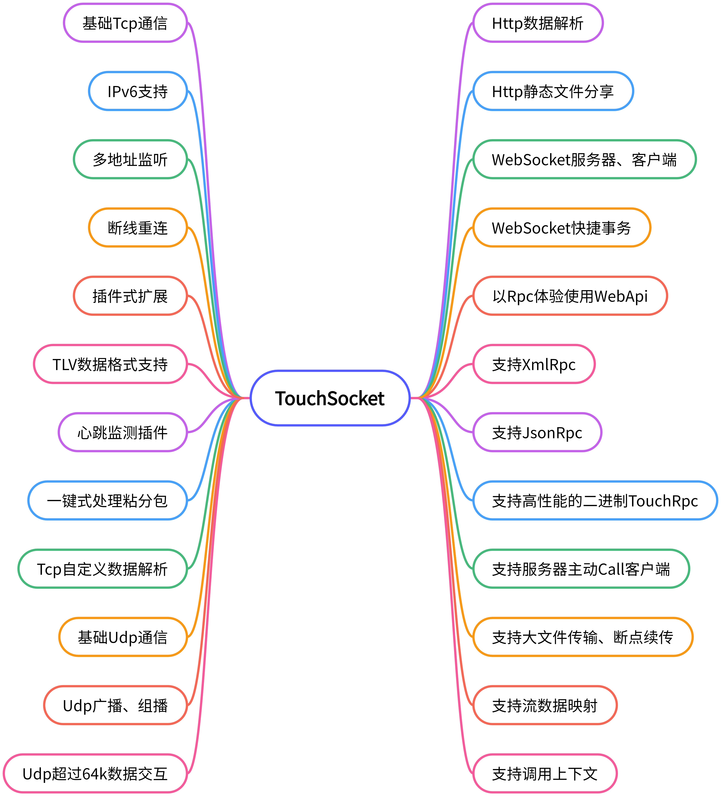

<p></p>
<p></p>
<p align="center">

</p>

 <div align="center"> 

[](https://www.nuget.org/packages/TouchSocket/)
[](https://www.nuget.org/packages/TouchSocket/)
[](https://www.apache.org/licenses/LICENSE-2.0.html)
[](https://gitee.com/RRQM_Home/TouchSocket/stargazers) 
[](https://gitee.com/RRQM_Home/TouchSocket/members)
<a href="https://jq.qq.com/?_wv=1027&k=gN7UL4fw">

</a>
[](https://github.com/RRQM/TouchSocket)
[](https://app.netlify.com/sites/touchsocket/deploys)


</div>  

<div align="center">

三十功名尘与土，八千里路云和月。

</div>

## 🎀描述


【开源版】
| 名称|地址 |描述|
|---|---|---|
|[](https://www.nuget.org/packages/TouchSocket.Core)|[Gitee](https://gitee.com/RRQM_Home/TouchSocket)<br>[Github](https://github.com/RRQM/TouchSocket)<br>[文档](http://rrqm_home.gitee.io/touchsocket)| 这是一个基础服务功能的库，其中包含：内存池、对象池、<br>文件池、流式数据解包器、等待逻辑池、AppMessenger、<br>3DES加密、Xml快速存储、运行时间测量器、<br>文件快捷操作、高性能二进制序列化器、规范日志接口等。|
|[](https://www.nuget.org/packages/TouchSocket.Core)|[Gitee](https://gitee.com/RRQM_Home/TouchSocket)<br>[Github](https://github.com/RRQM/TouchSocket)<br>[文档](http://rrqm_home.gitee.io/touchsocket)| 这是一个为Core中扩展Ioc容器为IServiceCollection的库。|
|[](https://www.nuget.org/packages/TouchSocket)|[Gitee](https://gitee.com/RRQM_Home/TouchSocket)<br>[Github](https://github.com/RRQM/TouchSocket)<br>[文档](http://rrqm_home.gitee.io/touchsocket)| TouchSocket是.Net(包括 C# 、VB.Net、F#)的一个整合性的<br>socket网络通信框架。包含了 tcp、udp、ssl等一系列的通信模块。<br>一键式解决 tcp 黏分包问题，udp大数据包分片组合问题等。<br>使用协议模板，可快速实现「固定包头」、「固定长度」、<br>「区间字符」等一系列的数据报文解析。|
|[](https://www.nuget.org/packages/TouchSocket.Http)|[Gitee](https://gitee.com/RRQM_Home/TouchSocket)<br>[Github](https://github.com/RRQM/TouchSocket)<br>[文档](http://rrqm_home.gitee.io/touchsocket)| 这是一个基于Http1.1协议的组件库。它能提供Http服务器、客户端、<br>以及WebSocket组件。功能上支持大文件下载、上传、<br>以及多线程下载和断点续传，小文件form上传，WebApi声明和执行。<br>所提供的Http客户端是基于连接的，可以捕获连接和断开连接等消息。|
|[](https://www.nuget.org/packages/TouchSocket.NamedPipe)|[Gitee](https://gitee.com/RRQM_Home/TouchSocket)<br>[Github](https://github.com/RRQM/TouchSocket)<br>[文档](http://rrqm_home.gitee.io/touchsocket)| 这是一个基于命名管道的组件库。它模仿Tcp封装了命名管道的服务器<br>和客户端，以及连接、断开连接等消息。功能上实现了多管道名称监听、<br>流式数据解析，以极致接近Tcp的体验使用命名管道。|
|[](https://www.nuget.org/packages/TouchSocket.CodeAnalyzer)|[Gitee](https://gitee.com/RRQM_Home/TouchSocket)<br>[Github](https://github.com/RRQM/TouchSocket)<br>[文档](http://rrqm_home.gitee.io/touchsocket)| 这是一个为TouchSocket全系提供语法分析、<br>源代码生成的库。目前包含Rpc源代理代码生成。|
|[](https://www.nuget.org/packages/TouchSocket.Rpc)|[Gitee](https://gitee.com/RRQM_Home/TouchSocket)<br>[Github](https://github.com/RRQM/TouchSocket)<br>[文档](http://rrqm_home.gitee.io/touchsocket)|这是一个超轻量、高性能、可扩展的Rpc管理平台框架。<br>您可以基于该框架，快速开发出Rpc执行。<br>目前已扩展开发DmtpRpc、XmlRpc、JsonRpc、WebApi部分。|
|[](https://www.nuget.org/packages/TouchSocket.Dmtp)|[Gitee](https://gitee.com/RRQM_Home/TouchSocket)<br>[Github](https://github.com/RRQM/TouchSocket)<br>[文档](http://rrqm_home.gitee.io/touchsocket)|DMTP（Duplex Message Transport Protocol双工消息传输协议）<br>是一个简单易用，便捷高效，且易于扩展的二进制数据协议。<br>目前基于该协议，已实现的功能包括：连接验证、同步Id、<br>Rpc（包括客户端请求服务器，服务器请求客户端、客户端请求客户端）、<br>文件传输（包括客户端向服务器请求文件、客户端向服务器推送文件、<br>服务器向客户端请求文件、服务器向客户端推送文件、<br>客户端之间请求、推送文件）、Redis等。|
|[](https://www.nuget.org/packages/TouchSocket.JsonRpc)|[Gitee](https://gitee.com/RRQM_Home/TouchSocket)<br>[Github](https://github.com/RRQM/TouchSocket)<br>[文档](http://rrqm_home.gitee.io/touchsocket)|这是一个提供JsonRpc服务器和客户端的组件库。<br>可以通过该组件创建基于Tcp、Http、WebSocket协议的<br>JsonRpc服务器和客户端，支持JsonRpc全部功能，<br>可与Web，Android等平台无缝对接。|
|[](https://www.nuget.org/packages/TouchSocket.XmlRpc)|[Gitee](https://gitee.com/RRQM_Home/TouchSocket)<br>[Github](https://github.com/RRQM/TouchSocket)<br>[文档](http://rrqm_home.gitee.io/touchsocket)|这是一个提供XmlRpc服务器和客户端的组件库。<br>可以通过该组件创建XmlRpc服务解析器，<br>完美支持XmlRpc数据类型，类型嵌套，Array等。<br>也能与CookComputing.XmlRpcV2完美对接。<br>不限Web，Android等平台。|
|[](https://www.nuget.org/packages/TouchSocket.WebApi)|[Gitee](https://gitee.com/RRQM_Home/TouchSocket)<br>[Github](https://github.com/RRQM/TouchSocket)<br>[文档](http://rrqm_home.gitee.io/touchsocket)|这是一个提供WebApi服务器和客户端的组件库。<br>可以通过该组件创建WebApi服务解析器和客户端，<br>让桌面端、Web端、移动端可以跨语言调用RPC函数。<br>功能支持自定义路由、Get传参、Post传参等。|
| [](https://www.nuget.org/packages/TouchSocket.AspNetCore)|[Gitee](https://gitee.com/RRQM_Home/TouchSocket)<br>[Github](https://github.com/RRQM/TouchSocket)<br>[文档](http://rrqm_home.gitee.io/touchsocket)| TouchSocket.AspNetCore是适用于AspNetCore的专属版本。|

【企业版】
| 名称|地址 |描述|
|---|---|---|
|[](https://www.nuget.org/packages/TouchSocketPro)|[文档](http://rrqm_home.gitee.io/touchsocket)| TouchSocketPro是TouchSocket的企业版，这在原有基础之上，<br>还有一些企业版功能，详情请看[企业版相关](http://rrqm_home.gitee.io/touchsocket/docs/current/enterprise/)|
|[](https://www.nuget.org/packages/TouchSocketPro.Dmtp)|[文档](http://rrqm_home.gitee.io/touchsocket)|这是基于DMTP的企业版扩展。目前包含功能：<br>多线程文件传输、远程文件访问、远程流访问、<br>路由包传输等。|
| [](https://www.nuget.org/packages/TouchSocketPro.AspNetCore)|[文档](http://rrqm_home.gitee.io/touchsocket)| TouchSocketPro.AspNetCore是适用于AspNetCore的专属版本。|

#### 特别声明

TouchSocket项目已加入[dotNET China](https://gitee.com/dotnetchina) 组织。<br/>


## 🖥支持环境
- .NET Framework4.5及以上。
- .NET 6.0及以上。
- .NET Standard2.0及以上。

## 🥪支持框架
- Console
- WPF
- Winform
- Blazor Server
- Xamarin
- MAUI
- Avalonia 
- Mono
- Unity 3D（除WebGL）
- 其他（即所有C#系）


## 🌴TouchSocket特点速览

#### 传统IOCP和TouchSocket的IOCP模式

TouchSocket的IOCP和传统也不一样，就以微软官方示例为例，他是使用MemoryBuffer开辟一块内存，均分，然后给每个会话分配一个区接收，等收到数据后，再**复制**接收的数据，然后把复制的数据进行处理。而TouchSocket是每次接收之前，从内存池拿一个可用内存块，然后**直接用于接收**，等收到数据以后，直接就把这个内存块抛出处理，这样就避免了**复制操作**，虽然只是细小的设计，但是在传输**10w**次**64kb**的数据时，性能相差了**10倍**。

#### 数据处理适配器

相信大家都使用过其他的Socket产品，那么TouchSocket在设计时也是借鉴了其他产品的优秀设计理念，数据处理适配器就是其中之一，但和其他产品的设计不同的是，TouchSocket的适配器功能更加强大，易用，且灵活。它不仅可以提前解析数据包，还可以解析数据对象，可以随时替换，然后立即生效。例如：可以使用固定包头对数据进行预处理，从而解决**数据分包**、**粘包**的问题。也可以直接解析**HTTP**数据协议、WebSocket数据协议等。

#### 兼容性与适配

TouchSocket提供多种框架模型，能够完全兼容基于TCP、UDP协议的所有协议。例如：TcpService与TcpClient，其基础功能和Socket一模一样，只是增强了框架的**坚固性**和**并发性**，将**连接**和**接收数据**通过事件的形式抛出，让使用者能够更加友好的使用。

## 🔗联系作者

- [CSDN博客主页](https://blog.csdn.net/qq_40374647)
- [哔哩哔哩视频](https://space.bilibili.com/94253567)
- [源代码仓库主页](https://gitee.com/RRQM_Home) 
- 交流QQ群：[234762506](https://jq.qq.com/?_wv=1027&k=gN7UL4fw)

## 🌟说明文档
- [ 文档首页 ](http://rrqm_home.gitee.io/touchsocket)

## 👑功能导图

<p align="center">

</p>

## ✨简单示例

 **_以下仅以最简方式创建示例，更多详情请查看[说明文档](http://rrqm_home.gitee.io/touchsocket)。_** 

 **【TcpService】** 

```
TcpService service = new TcpService();
service.Connecting = (client, e) => {return EasyTask.CompletedTask; };//有客户端正在连接
service.Connected = (client, e) => {return EasyTask.CompletedTask; };//有客户端连接
service.Disconnected = (client, e) => {return EasyTask.CompletedTask; };//有客户端断开连接
service.Received = (client, e) =>
{
    //从客户端收到信息
    string mes = e.ByteBlock.ToString();
    Console.WriteLine($"已从{client.Id}接收到信息：{mes}");
    return EasyTask.CompletedTask;
};
service.Start(7789);//启动
```

 **【TcpClient】** 
```
TcpClient tcpClient = new TcpClient();
tcpClient.Connected = (client, e) => {return EasyTask.CompletedTask; };//成功连接到服务器
tcpClient.Disconnected = (client, e) => {return EasyTask.CompletedTask; };//从服务器断开连接，当连接不成功时不会触发。
tcpClient.Received = (client, e) =>
{
    //从服务器收到信息
    string mes = Encoding.UTF8.GetString(e.ByteBlock.Buffer, 0, e.ByteBlock.Len);
    Console.WriteLine($"接收到信息：{mes}");
    return EasyTask.CompletedTask;
};

tcpClient.Connect("127.0.0.1:7789");
tcpClient.Send("RRQM");
```

 **【TcpClient 断线重连】**
在Config的插件配置中，使用重连插件即可。

```
.ConfigurePlugins(a=> 
{
   a.UseReconnection(5, true, 1000);
});
```

 **【FixedHeaderPackageAdapter包模式】**

该适配器主要解决Tcp粘分包问题，数据格式采用简单而高效的“包头+数据体”的模式，其中包头支持：

- Byte模式（1+n），一次性最大接收255字节的数据。
- Ushort模式（2+n），一次最大接收65535字节。
- Int模式（4+n），一次最大接收2G数据。

以上数据头均采用TouchSocketBitConverter的默认端模式（小端模式），使用者可以根据需求切换默认端模式。

```
TouchSocketBitConverter.DefaultEndianType = EndianType.Little;
```

 **【CustomFixedHeaderDataHandlingAdapter】** 

用户自定义固定包头适配器，主要帮助用户解决具有固定包头的数据帧信息。例如：下列数据格式，仅需要实现几个接口，就能完成解析，详细操作请参照API。

|1|1|1|**********|

 **【CustomUnfixedHeaderDataHandlingAdapter】** 

用户自定义不固定包头适配器，主要帮助用户解决具有包头不固定的数据帧信息。例如：最典型的HTTP数据包，其数据头和数据体由“\r\n”隔开，而数据头又因为请求者的请求信息的不同，头部数据也不固定，而数据体的长度，也是由数据头的ContentLength的值显式指定的，所以可以考虑使用CustomUnfixedHeaderDataHandlingAdapter解析，也是仅通过简单的开发，就能实现。

***

## 致谢

谢谢大家对TouchSocket的支持，如果还有其他问题，请提交Issue，或者加群QQ：[234762506](https://jq.qq.com/?_wv=1027&k=gN7UL4fw)讨论。

感谢下列工具软件的支持

- [Visual Studio](https://visualstudio.microsoft.com/zh-hans/)
- [JetBrains](https://www.jetbrains.com/)
- [Visual Studio Code](https://code.visualstudio.com/)

## 支持作者

[支持入口](https://rrqm_home.gitee.io/touchsocket/docs/donate)
