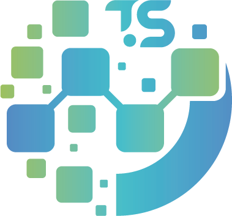

<p></p>
<p></p>
<p align="center">

</p>

 <div align="center"> 

[](https://www.nuget.org/packages/TouchSocket/)
[](https://www.nuget.org/packages/TouchSocket/)
[](https://www.apache.org/licenses/LICENSE-2.0.html)
[](https://gitee.com/dotnetchina/TouchSocket/stargazers) 
[](https://gitee.com/dotnetchina/TouchSocket/members)
<a href="https://jq.qq.com/?_wv=1027&k=gN7UL4fw">

</a>
</div>  

<div align="center">

雄关漫道真如铁，而今迈步从头越。从头越，苍山如海，残阳如血。

</div>

中文 | [English](README.en.md)

## 🎀描述

 **_以下Nuget包，均已在此仓使用Apache License 2.0开源协议开源。_** 

| 名称|地址 |描述|
|---|---|---|
|[](https://www.nuget.org/packages/TouchSocket)|[Gitee](https://gitee.com/dotnetchina/TouchSocket)<br>[Github](https://github.com/RRQM/TouchSocket)| TouchSocket这是一个轻量级的、支持插件的综合网络通信库。<br>基础通信功能包含Tcp、Udp、Ssl、Rpc、Http等。其中http<br>服务器支持WebSocket、静态网页、XmlRpc、WebApi、JsonRpc<br>等扩展插件。和自定义协议的TouchRpc，支持Ssl加密、异步调用、<br>权限管理、错误状态返回、服务回调、分布式调用等。在空载函数<br>执行时，10万次调用仅3.8秒，在不返回状态时，仅0.9秒。|
| [](https://www.nuget.org/packages/TouchSocket.AspNetCore)|[Gitee](https://gitee.com/dotnetchina/TouchSocket)<br>[Github](https://github.com/RRQM/TouchSocket) | TouchSocket.AspNetCore是适用于AspNetCore的专属版本。|

## 🎫企业版描述
 **_以下Nuget包，并未开源，其源代码需要付费购买。_** 
| 名称|地址 |描述|
|---|---|---|
|[](https://www.nuget.org/packages/TouchSocketPro)|[Gitee](https://gitee.com/dotnetchina/TouchSocket)<br>[Github](https://github.com/RRQM/TouchSocket)| TouchSocketPro是TouchSocket的增强企业版。其中<br>未开源的企业版功能，这需要密钥才能使用，可以先试<br>用。所以两者在**基础功能**没有区别，只是在扩展功能上<br>有一定差异性。具体差异请看[企业版相关](https://www.yuque.com/rrqm/touchsocket/80696720a95e415d94c87fa03642513d)|
| [](https://www.nuget.org/packages/TouchSocket.AspNetCore)|[Gitee](https://gitee.com/dotnetchina/TouchSocket)<br>[Github](https://github.com/RRQM/TouchSocket) | TouchSocket.AspNetCore是适用于AspNetCore的专属版本。|


## 🖥支持环境
- .NET Framework4.5及以上。
- .NET Core3.1及以上。
- .NET Standard2.0及以上。

## 🥪支持框架
- WPF
- Winform
- Blazor
- Xamarin
- Mono
- Unity（在IL2cpp编译时，需要导入源码或添加link.xml，亦或者直接安装RRQMSocketFramework，Mono则直接加载dll即可）
- 其他（即所有C#系）

### unity内link.xml设置(放置在Assets文件夹内)
[unity官方文档 托管代码剥离](https://docs.unity3d.com/cn/current/Manual/ManagedCodeStripping.html#LinkXML)
```
<linker>
	<assembly fullname="RRQMCore" />
	<assembly fullname="RRQMSocket" />
</linker>
```


## 🌴RRQMSocket特点速览

#### 传统IOCP和RRQMSocket

RRQMSocket的IOCP和传统也不一样，就以微软官方示例为例，使用MemoryBuffer开辟一块内存，均分，然后给每个会话分配一个区接收，等收到数据后，再**复制**源数据，然后把复制的数据进行处理。而RRQMSocket是每次接收之前，从内存池拿一个可用内存块，然后**直接用于接收**，等收到数据以后，直接就把这个内存块抛出处理，这样就避免了**复制操作**，虽然只是细小的设计，但是在传输**1000w**次**64kb**的数据时，性能相差了**10倍**。

#### 数据处理适配器

相信大家都使用过其他的Socket产品，那么RRQMSocket在设计时也是借鉴了其他产品的优秀设计理念，数据处理适配器就是其中之一，但和其他产品的设计不同的是，RRQMSocket的适配器功能更加强大，它不仅可以提前解析数据包，还可以解析数据对象。例如：可以使用固定包头对数据进行预处理，从而解决**数据分包**、**粘包**的问题。也可以直接解析**HTTP**数据协议、WebSocket数据协议等。

#### 兼容性与适配

RRQMSocket提供多种框架模型，能够完全兼容基于TCP、UDP协议的所有协议。例如：TcpService与TcpClient，其基础功能和Socket一模一样，只是增强了框架的**坚固性**和**并发性**，将**连接**和**接收数据**通过事件的形式抛出，让使用者能够更加友好的使用。

## 🔗联系作者

- [CSDN博客主页](https://blog.csdn.net/qq_40374647)
- [哔哩哔哩视频](https://space.bilibili.com/94253567)
- [源代码仓库主页](https://gitee.com/RRQM_Home) 
- 交流QQ群：234762506

## 🌟说明文档
- [ 文档首页 ](https://www.yuque.com/rrqm/touchsocket/index)

## ✨简单示例

 **_以下仅以最简方式创建示例，更多详情请查看[说明文档](https://www.yuque.com/rrqm/touchsocket/index)。_** 

 **【TcpService】** 

```
TcpService service = new TcpService();
service.Connecting += (client, e) => { };//有客户端正在连接
service.Connected += (client, e) => { };//有客户端连接
service.Disconnected += (client, e) => { };//有客户端断开连接
service.Received += (client, byteBlock, requestInfo) =>
{
    //从客户端收到信息
    string mes = byteBlock.ToString();
    Console.WriteLine($"已从{client.ID}接收到信息：{mes}");

    client.Send(mes);//将收到的信息直接返回给发送方

    //client.Send("id",mes);//将收到的信息返回给特定ID的客户端

    var clients = service.GetClients();
    foreach (var targetClient in clients)//将收到的信息返回给在线的所有客户端。
    {
        if (targetClient.ID != client.ID)
        {
            targetClient.Send(mes);
        }
    }
};

service.Setup(new RRQMConfig()//载入配置     
    .SetListenIPHosts(new IPHost[] { new IPHost("127.0.0.1:7789"), new IPHost(7790) })//同时监听两个地址
    .SetMaxCount(10000)
    .SetThreadCount(100))
    .Start();//启动
```

 **【TcpClient】** 
```
TcpClient tcpClient = new TcpClient();
tcpClient.Connected += (client, e) => { };//成功连接到服务器
tcpClient.Disconnected += (client, e) => { };//从服务器断开连接，当连接不成功时不会触发。
tcpClient.Received += (client, byteBlock, requestInfo) =>
{
    //从服务器收到信息
    string mes = Encoding.UTF8.GetString(byteBlock.Buffer, 0, byteBlock.Len);
    Console.WriteLine($"接收到信息：{mes}");
};

//声明配置
RRQMConfig config = new RRQMConfig();
config.SetRemoteIPHost(new IPHost("127.0.0.1:7789"))
    .UsePlugin()
    .SetBufferLength(1024 * 10);

//载入配置
tcpClient.Setup(config);
tcpClient.Connect();
tcpClient.Send("RRQM");
```

 **【TcpClient 断线重连】** 

```
tcpClient.UseReconnection(tryCount:5,printLog:true);
```

 **【FixedHeaderPackageAdapter包模式】** 

该适配器主要解决TCP粘分包问题，数据格式采用简单而高效的“包头+数据体”的模式，其中包头支持：

- Byte模式（1+n），一次性最大接收255字节的数据。
- Ushort模式（2+n），一次最大接收65535字节。
- Int模式（4+n），一次最大接收2G数据。

以上数据头均采用RRQMBitConverter的默认端模式（小端模式），使用者可以根据需求切换默认端模式。

```
RRQMBitConverter.DefaultEndianType = EndianType.Little;
```

 **【CustomFixedHeaderDataHandlingAdapter】** 

用户自定义固定包头适配器，主要帮助用户解决具有固定包头的数据帧信息。例如：下列数据格式，仅需要实现几个接口，就能完成解析，详细操作请参照API。

|1|1|1|**********|

 **【CustomUnfixedHeaderDataHandlingAdapter】** 

用户自定义不固定包头适配器，主要帮助用户解决具有包头不固定的数据帧信息。例如：最典型的HTTP数据包，其数据头和数据体由“\r\n”隔开，而数据头又因为请求者的请求信息的不同，头部数据也不固定，而数据体的长度，也是由数据头的ContentLength的值显式指定的，所以可以考虑使用CustomUnfixedHeaderDataHandlingAdapter解析，也是仅通过简单的开发，就能实现。


 **【Ssl加密】** 

在[RRQMBox](https://gitee.com/RRQM_Home/RRQMBox/tree/master/Ssl%E8%AF%81%E4%B9%A6%E7%9B%B8%E5%85%B3)中，放置了一个自制Ssl证书，密码为“RRQMSocket”以供测试。使用配置非常方便。

在服务器中只需设置配置SslOption属性和接收模式。

 **服务器配置** 
```
config.SetServerSslOption(new ServiceSslOption() { Certificate = new X509Certificate2("RRQMSocket.pfx", "RRQMSocket"), SslProtocols = SslProtocols.Tls12 });
```

 **客户端配置** 

```
config.SetClientSslOption(new ClientSslOption()
{
    ClientCertificates = new X509CertificateCollection() { new X509Certificate2("RRQMSocket.pfx", "RRQMSocket") },
    SslProtocols = SslProtocols.Tls12,
    TargetHost = "127.0.0.1",
    CertificateValidationCallback = (sender, certificate, chain, sslPolicyErrors) => { return true; }
});
```

## 🧲应用场景模拟
[场景入口](https://www.yuque.com/rrqm/touchsocket/wrwx9k)

***

## 致谢

谢谢大家对RRQM的支持，如果还有其他问题，请加群QQ：234762506讨论。

## 支持作者

[支持入口](https://www.yuque.com/rrqm/touchsocket/a5199820843b324f025633fdeee44394)
