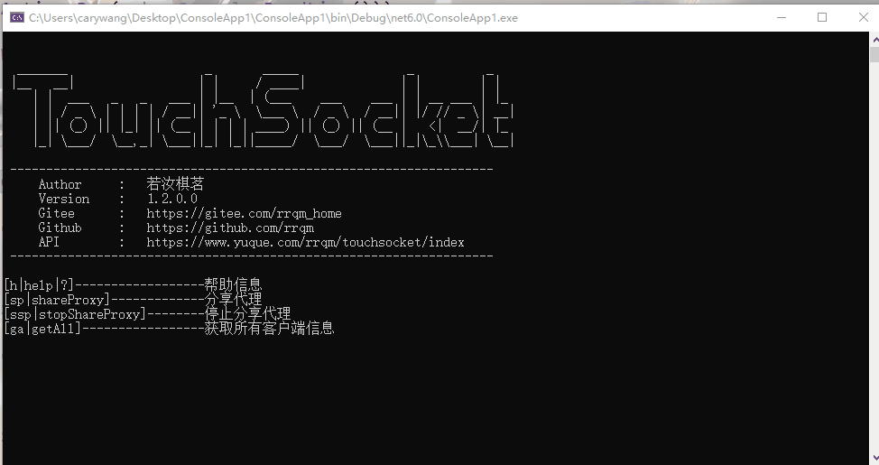

### 定义

命名空间：TouchSocket.Core <br/>
程序集：[TouchSocket.Core.dll](https://www.nuget.org/packages/TouchSocket.Core)


## 一、说明
这是一个很简单的控制台命令器，重要作用就是很方便的实现控制台控制。

## 二、使用
```csharp
ConsoleAction consoleAction = new ConsoleAction("h|help|?");//设置帮助命令
consoleAction.OnException += ConsoleAction_OnException;//订阅执行异常输出

//下列的ShareProxy，StopShareProxy，GetAll均为无参数的方法
consoleAction.Add("sp|shareProxy", "分享代理", ShareProxy);//示例命令
consoleAction.Add("ssp|stopShareProxy", "停止分享代理", StopShareProxy);//示例命令
consoleAction.Add("ga|getAll", "获取所有客户端信息", GetAll);//示例命令
consoleAction.ShowAll();
while (true)
{
    if (!consoleAction.Run(Console.ReadLine()))
    {
        Console.WriteLine("命令不正确，请输入“h|help|?”获得帮助。");
    }
}
```
## 三、效果图

