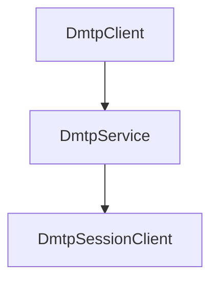

import Tag from "@site/src/components/Tag.js";
import Pro from "@site/src/components/Pro.js";
import BilibiliCard from '@site/src/components/BilibiliCard.js';
import { TouchSocketDmtpDefinition } from "@site/src/components/Definition.js";
import { TouchSocketProDmtpDefinition } from "@site/src/components/Definition.js";
import CardLink from "@site/src/components/CardLink.js";
import CustomCodeBlock from './CodeBlocks/CustomCodeBlock';

<TouchSocketDmtpDefinition />
<TouchSocketProDmtpDefinition />

## 一、说明

`DmtpClient` 是基于 Dmtp 协议的客户端抽象，针对不同的底层传输协议（TCP、UDP、HTTP、WebSocket、NamedPipe）提供了统一的上层 API。无论选择哪种协议，客户端侧的能力、调用方式与插件扩展点都保持一致，便于在多场景下快速迁移与复用。

<BilibiliCard title="新创建Dmtp客户端项目" link="https://www.bilibili.com/cheese/play/ep1726347" isPro="true"/>

## 二、特点

- 简单易用：配置即用，示例开箱即跑。
- 多协议统一：支持 TCP、UDP、HTTP、WebSocket、NamedPipe 多种传输，API 统一。
- 高性能：内存池与多线程设计，传输、RPC、文件等能力性能稳定。
- 可靠通信：内置握手认证、心跳与异常关闭处理，结合重连插件可构建更稳健的连接。
- 插件驱动：基于委托与插件体系，支持全链路 AOP 能力。
- 生态完备：无论使用哪种底层协议，均可使用 Dmtp 的文件传输、RPC 调用、远程访问等高级功能。

### 2.1 与服务器配合

当 `DmtpClient` 连接到服务器后，服务器会为其创建对应的 `SessionClient` 实例，后续的数据交互在两端的 Dmtp 协议栈中完成，上层仅关注统一 API。

## 三、产品应用场景

- 需要跨平台与跨协议的统一通信栈。
- 需要在客户端侧使用 RPC、文件传输、远程访问等高级能力。
- 工业现场设备、IoT 网关、桌面/服务进程等需要稳定长连接通信的场景。
- 微服务/边缘节点作为调用方，向中心服务发起高并发、低时延通信。

## 四、客户端架构

客户端与服务器的关系示意如下：

- 客户端本地维护 Dmtp 协议栈，完成握手、认证、心跳、通道管理等。
- 服务器侧为每个客户端维护一个对应的 `SessionClient`，两端通过 Dmtp 协议进行统一交互。

## 五、可配置项

### 5.1 Dmtp特有配置

#### SetDmtpOption
设置Dmtp相关配置。其中包含：

<CustomCodeBlock region="Dmtp服务器基础配置"/>

- **VerifyToken**：设置验证口令，作用类似账号密码。客户端连接时必须提供正确的Token才能建立连接。
- **VerifyTimeout**：验证连接超时时间。仅用于服务器。意为：当服务器收到基础链接，在指定的时间内如果没有收到握手信息，则直接视为无效链接，直接断开。

### 5.2 底层协议配置

根据不同的底层协议，DmtpService还可以配置相应协议的特有选项：

- **基于TCP时**：支持[TcpService可配置项](./tcpservice.mdx)的所有配置，如SSL、NoDelay、端口复用等。
- **基于UDP时**：支持[UdpSession可配置项](./udpsession.mdx)的所有配置。
- **基于HTTP时**：支持[HttpService可配置项](./httpservice.mdx)的所有配置。
- **基于NamedPipe时**：支持[NamedPipeService可配置项](./namedpipeservice.mdx)的所有配置。
### 5.2 底层协议配置

根据不同的底层协议，客户端还可叠加相应协议的特有配置：

- 基于 TCP 时：支持 [TcpClient 可配置项](./tcpclient.mdx) 的所有配置。
- 基于 UDP 时：支持 [UdpSession 可配置项](./udpsession.mdx) 的所有配置。
- 基于 HTTP 时：支持 [HttpClient 可配置项](./httpclient.mdx) 的所有配置。
- 基于 NamedPipe 时：支持 [NamedPipeClient 可配置项](./namedpipeclient.mdx) 的所有配置。
- 基于 WebSocket 时：参照 WebSocket 客户端的常规配置，保持 Dmtp 上层一致。

## 六、支持插件接口

声明自定义插件类，实现`IPlugin`接口，或者继承`PluginBase`，然后实现所需插件接口，即可实现事务的触发。

|  插件方法 | 功能 |
| --- | --- |
| IDmtpConnectingPlugin | 客户端在验证连接。默认情况下，框架会首先验证连接Token是否正确，如果不正确则直接拒绝。不会有任何投递。用户也可以使用Metadata进行动态验证。 |
| IDmtpConnectedPlugin | 客户端完成握手连接验证 |
| IDmtpReceivedPlugin | 在收到Dmtp格式的数据包时触发 |
| IDmtpRoutingPlugin | 当需要路由数据时触发，并且必须返回e.IsPermitOperation=true时，才允许路由 |
| IDmtpCreatedChannelPlugin | 在收到创建通道的请求时候触发。 |
| IDmtpClosingPlugin | 即将断开连接时触发（仅主动断开时、或收到了Close报文时有效）。 |
| IDmtpClosedPlugin | 在Dmtp连接断开时触发。 |

## 七、创建客户端

### 7.1 TcpDmtpClient

`TcpDmtpClient`对应`TcpDmtpService`服务器。基本创建如下，支持[创建TcpClient](./tcpclient.mdx)的所有配置。

<BilibiliCard title="创建Tcp协议的Dmtp客户端" link="https://www.bilibili.com/cheese/play/ep1726347" isPro="true"/>

<CustomCodeBlock region="创建TcpDmtpClient"/>

### 7.2 UdpDmtp

`UdpDmtp`对应`UdpDmtp`服务器，即`UdpDmtp`即是服务器，又是客户端。基本创建如下，支持[创建UdpSession](./udpsession.mdx)的所有配置。

<BilibiliCard title="创建Udp协议的Dmtp客户端" link="https://www.bilibili.com/cheese/play/ep1726349" isPro="true"/>

<CustomCodeBlock region="创建UdpDmtpClient"/>

:::info 备注

`UdpDmtp`作为客户端时，需要设定默认的`SetRemoteIPHost`，同时需要主动`UseUdpReceive`，以开启udp接收。如果需要固定监听端口，可使用`SetBindIPHost`。

:::  

### 7.3 HttpDmtpClient

`HttpDmtpClient`对应`HttpDmtpService`，或者`HttpMiddlewareDmtpService`服务器。基本创建如下，支持[创建HttpClient](./httpclient.mdx)的所有配置。

<BilibiliCard title="创建Http协议的Dmtp客户端" link="https://www.bilibili.com/cheese/play/ep1726352" isPro="true"/>

<CustomCodeBlock region="创建HttpDmtpClient"/>

### 7.4 WebSocketDmtpClient

<BilibiliCard title="创建WebSocket协议的Dmtp客户端" link="https://www.bilibili.com/cheese/play/ep1726355" isPro="true"/>

<CustomCodeBlock region="创建WebSocketDmtpClient"/>

### 7.5 NamedPipeDmtpClient <Pro/> 

`NamedPipeDmtpClient`对应`NamedPipeDmtpService`服务器。基本创建如下，支持[创建NamedPipeClient](./namedpipeclient.mdx)的所有配置。

<BilibiliCard title="创建NamedPipe协议的Dmtp客户端" link="https://www.bilibili.com/cheese/play/ep1726360" isPro="true"/>

<CustomCodeBlock region="创建NamedPipeDmtpClient"/>

### 7.6 TcpDmtpClientFactory <Pro/> 

DmtpClient工厂工作模式是一种，由多个传输通讯连接组成的连接池。

<CustomCodeBlock region="创建TcpDmtpClientFactory"/>

### 7.7 HttpDmtpClientFactory <Pro/>

DmtpClient工厂工作模式是一种，由多个传输通讯连接组成的连接池。

<CustomCodeBlock region="创建HttpDmtpClientFactory"/>

## 八、示例Demo

<CardLink link="examples/Dmtp"/>