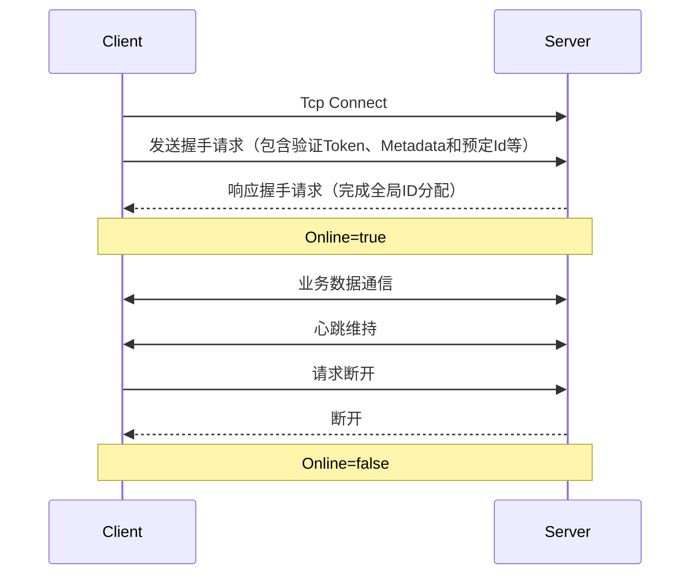

import Pro from "@site/src/components/Pro.js";

### 定义

命名空间：TouchSocket.Dmtp  
程序集：[TouchSocket.Dmtp.dll](https://www.nuget.org/packages/TouchSocket.Dmtp)

## 一、说明

DMTP（Duplex Message Transport Protocol双工消息传输协议）是一个简单易用，便捷高效，且易于扩展的**二进制数据协议**。

【协议格式】

|--Head--|--Flags--|--Length--|-----Data-----|

|----2----|----2----|-----4------|-------n-------|

协议格式非常简单。

- 协议头为2字节，一般为固定值，目前第一版为“dm”。
- 协议标志位为2字节，表示本次协议的标志位。类型是`大端ushort无符号`类型。其中`0-19`的协议框架内部占用。其余的均可被自定义使用
- 再4字节为`大端Int32`**有**符号类型，表示本次协议的载荷数据长度。
- 其余数据为实际载荷数据。

DMTP核心特性：

- **协议简洁**：仅包含协议头、标志位、数据长度及载荷四部分
- **高效扩展**：支持自定义协议标志位（0-19为系统保留，20-65535开放扩展）
- **可靠传输**：基于底层传输协议实现消息确认机制
- **跨协议支持**：可运行于TCP/UDP/HTTP/WebSocket/NamedPipe等多种传输层协议

## 二、协议架构

### 2.1 协议格式

| 字段        | 字节数 | 类型             | 说明                          |
|-------------|--------|------------------|-------------------------------|
| Head        | 2      | ASCII            | 固定标识"dm"                 |
| Flags       | 2      | Big-Endian ushort| 协议标志位（0-65535）         |
| Length      | 4      | Big-Endian int32 | 数据载荷长度（有符号）        |
| Data        | n      | Binary           | 实际传输数据                  |

### 2.2 协议层对比

| 特性                | TCP               | DMTP               |
|---------------------|-------------------|--------------------|
| 传输可靠性          | 连接级可靠        | 消息级可靠         |
| 消息确认机制        | 无                | 支持发送/接收确认  |
| 双工通信            | 基础支持          | 增强型双工支持     |
| 应用层功能          | 无                | 内置ID管理、路由等 |

---

## 三、核心特性

### 3.1 基础服务

- **安全认证**：支持动态Token凭证验证与SSL/TLS加密
- **节点管理**：自动同步全局唯一ID，支持ID重定向
- **协议扩展**：开放65535个协议标志位供业务扩展
- **数据隔离**：支持多通道并行数据传输

### 2.2 高级功能

- **跨协议路由**：支持服务器与客户端、客户端与客户端直连通信
- **微服务支持**：内置反向RPC机制，支持服务网格架构
- **流量控制**：提供QoS服务质量保障机制
- **断线恢复**：支持会话状态保持与断线续传

---

## 三、适用场景

### 3.1 客户端应用

- Unity/WinForm/WPF/MAUI等桌面/移动端应用
- 实时游戏通信（位置同步、状态更新）
- 工业控制系统的指令传输

### 3.2 服务端架构

- 微服务集群内部通信
- 分布式系统节点协调
- 边缘计算节点数据同步

### 3.3 特殊场景

- 进程间通信（NamedPipe版本）
- 浏览器双向通信（WebSocket版本）
- 内网穿透中继服务（UDP版本）

---

## 四、协议实现

### 4.1 版本矩阵

| 版本类型         | 传输协议   | 性能指标 | 可靠性 |
|------------------|------------|----------|--------|
| TCP版           | TCP        | ★★★★★    | 可靠   |
| UDP版           | UDP        | ★★★★☆    | 可选   |
| NamedPipe版 <Pro/>      | 命名管道   | ★★★★★★   | 可靠   |
| Http版          | HTTP       | ★★★☆☆    | 可靠   |
| AspNetCore Http版   <Pro/>      | HTTP       | ★★★☆☆    | 可靠   |
| WebSocket版     | WebSocket  | ★★★☆☆    | 可靠   |

### 4.2 连接生命周期 

---

## 五、最佳实践

### 5.1 协议选择建议

1. **优先选择TCP版**：需要最高性能时
2. **跨进程通信**：使用NamedPipe版本（速度比TCP快3倍）
3. **浏览器集成**：采用WebSocket版本
4. **弱网环境**：使用Http版本穿透复杂网络

### 5.2 可靠性保障

- 始终检查`Online`状态后再进行业务操作
- 配置合理的心跳间隔（默认60秒）

### 5.3 性能优化

- 使用`BlockBlock`处理大数据分片
