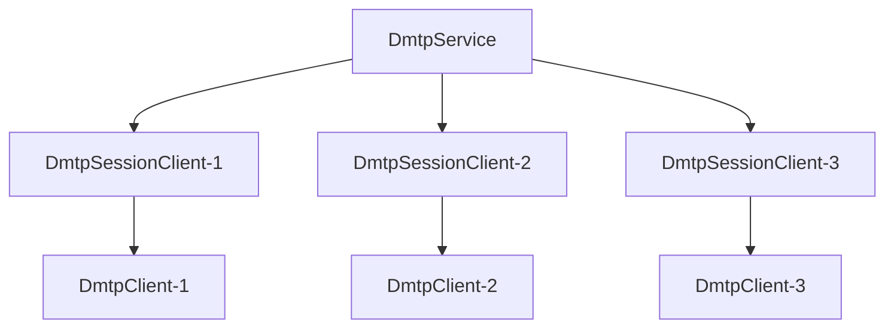

import Tag from "@site/src/components/Tag.js";
import Pro from "@site/src/components/Pro.js";
import BilibiliCard from '@site/src/components/BilibiliCard.js';
import Tabs from "@theme/Tabs";
import TabItem from "@theme/TabItem";
import { TouchSocketDmtpDefinition } from "@site/src/components/Definition.js";
import { TouchSocketProDmtpDefinition } from "@site/src/components/Definition.js";
import CustomCodeBlock from './CodeBlocks/CustomCodeBlock';
import CardLink from "@site/src/components/CardLink.js";

<TouchSocketDmtpDefinition />
<TouchSocketProDmtpDefinition />

## 一、说明

`DmtpService`是基于`Dmtp`协议的服务器基类，它不参与实际的数据交互，只是配置、激活、管理、注销、重建`SessionClient`类实例。而`SessionClient`是当`DmtpClient`（客户端）成功连接服务器以后，由服务器新建的一个实例类，后续的所有通信，也都是通过该实例完成的。

`Dmtp`的服务器有多种形式的host，每种服务器的创建都大同小异，且功能基本一致。基于不同的底层协议（TCP、UDP、HTTP、WebSocket、NamedPipe），提供了统一的`Dmtp`协议接口。

<BilibiliCard title="新创建Dmtp服务器项目" link="https://www.bilibili.com/cheese/play/ep1726345" isPro="true"/>

## 二、特点

- 简单易用。
- 支持多种底层协议（TCP、UDP、HTTP、WebSocket、NamedPipe）。
- 统一的Dmtp协议接口，无论底层协议如何，上层API保持一致。
- 多线程。
- 内存池支持
- 高性能数据传输和RPC调用。
- **多地址监听**（TCP协议时可以一次性监听多个IP及端口）
- 适配器预处理，一键式解决**分包**、**粘包**等问题。
- 超简单的同步发送、异步发送、接收等操作。
- 基于委托、[插件](./pluginsmanager.mdx)驱动，让每一步都能执行AOP。
- 支持文件传输、RPC调用、远程访问等高级功能。

### 2.1 性能测试

Dmtp基于底层协议的性能表现，当使用TCP作为底层协议时，性能与`TcpService`基本一致。同时，Dmtp还提供了更多高级功能如RPC、文件传输等，在保证高性能的同时提供了更丰富的功能。

## 三、产品应用场景

- 需要高级通信功能的场景：RPC调用、文件传输、远程访问等。
- 跨协议统一接口需求：可以轻松在不同底层协议间切换而不改变上层代码。
- 企业级应用：支持认证、路由、通道管理等企业级功能。
- 微服务架构：提供高性能的服务间通信解决方案。

## 四、服务器架构

### 4.1 连接架构

Dmtp服务器的架构与其所属的基础协议架构一致，例如，在基于TCP协议时，其架构就和TCP服务器一致。服务器在收到**新客户端连接**时，会创建一个对应的`SessionClient`派生类实例（如`TcpDmtpSessionClient`），与客户端DmtpClient一一对应，后续的数据通信均由此实例负责。

`SessionClient`在`Service`里面以字典映射。`ID`为键，`SessionClient`本身为值。

### 4.2 Scoped 生命周期

`DmtpService`在[支持Scoped](ioc.mdx)的`IOC`容器中工作时，也是支持`Scoped`区域划分的。

一般情况下，`DmtpService`在`Setup`时，首先会创建一个`Scoped`区域，用于整个`DmtpService`的生命周期。在`DmtpService`释放（`Dispose`）时释放。

然后，当有新客户端连接后，会为每个`SessionClient`的派生类实例也创建一个`Scoped`区域，用于`SessionClient`的生命周期。当连接断开时，会释放此区域。

## 五、可配置项

### 5.1 Dmtp特有配置

#### SetDmtpOption
设置Dmtp相关配置。其中包含：

<BilibiliCard title="新创建Dmtp服务器项目" link="https://www.bilibili.com/cheese/play/ep1726345" isPro="true"/>

<CustomCodeBlock region="Dmtp服务器基础配置"/>

- **VerifyToken**：设置验证口令，作用类似账号密码。客户端连接时必须提供正确的Token才能建立连接。
- **VerifyTimeout**：验证连接超时时间。仅用于服务器。意为：当服务器收到基础链接，在指定的时间内如果没有收到握手信息，则直接视为无效链接，直接断开。

### 5.2 底层协议配置

根据不同的底层协议，DmtpService还可以配置相应协议的特有选项：

- **基于TCP时**：支持[TcpService可配置项](./tcpservice.mdx)的所有配置，如SSL、NoDelay、端口复用等。
- **基于UDP时**：支持[UdpSession可配置项](./udpsession.mdx)的所有配置。
- **基于HTTP时**：支持[HttpService可配置项](./httpservice.mdx)的所有配置。
- **基于NamedPipe时**：支持[NamedPipeService可配置项](./namedpipeservice.mdx)的所有配置。

## 六、支持插件接口

声明自定义插件类，实现`IPlugin`接口，或者继承`PluginBase`，然后实现所需插件接口，即可实现事务的触发。

|  插件方法 | 功能 |
| --- | --- |
| IDmtpConnectingPlugin | 客户端在验证连接。默认情况下，框架会首先验证连接Token是否正确，如果不正确则直接拒绝。不会有任何投递。用户也可以使用Metadata进行动态验证。 |
| IDmtpConnectedPlugin | 客户端完成握手连接验证 |
| IDmtpReceivedPlugin | 在收到Dmtp格式的数据包时触发 |
| IDmtpRoutingPlugin | 当需要路由数据时触发，并且必须返回e.IsPermitOperation=true时，才允许路由 |
| IDmtpCreatedChannelPlugin | 在收到创建通道的请求时候触发。 |
| IDmtpClosingPlugin | 即将断开连接时触发（仅主动断开时、或收到了Close报文时有效）。 |
| IDmtpClosedPlugin | 在Dmtp连接断开时触发。 |

## 七、创建服务器

DmtpService的创建，主要是根据不同的底层协议，创建不同的DmtpService派生类实例。

### 7.1 TcpDmtpService

`TcpDmtpService`是基于`Tcp`协议的Dmtp。在可配置的基础之上，还可以配置与[TcpService可配置项](./tcpservice.mdx)相关的配置。

<BilibiliCard title="创建Tcp协议的Dmtp服务器" link="https://www.bilibili.com/cheese/play/ep1726346" isPro="true"/>

<CustomCodeBlock region="创建TcpDmtpService"/>

### 7.2 UdpDmtp

`UdpDmtp`是基于`Udp`协议Dmtp。在可配置的基础之上，还可以配置与[UdpSession可配置项](./udpsession.mdx)相关的配置。

<BilibiliCard title="创建Udp协议的Dmtp服务器" link="https://www.bilibili.com/cheese/play/ep1726348" isPro="true"/>

<CustomCodeBlock region="创建UdpDmtp"/>

:::info 备注

`UdpDmtp`作为服务器的时候，需要设定`SetBindIPHost`。

:::  

### 7.3 HttpDmtpService

`HttpDmtpService`是基于`Http`升级协议。在该解析器中，配置设置[HttpService](./httpservice.mdx)一致。

<BilibiliCard title="创建Http协议的Dmtp服务器" link="https://www.bilibili.com/cheese/play/ep1726350" isPro="true"/>

<CustomCodeBlock region="创建HttpDmtpService"/>

### 7.4 基于AspNetCore的Websocket协议

具体步骤

1. nuget 安装`TouchSocket.AspNetCore`或者`TouchSocketPro.AspNetCore`。
2. `IServiceCollection`添加`AddWebSocketDmtpService`，并进行相关配置（不用配置端口，会和asp使用同一端口）。
3. `IApplicationBuilder`必须先使用`UseWebSockets`。
4. `IApplicationBuilder`调用`UseWebSocketDmtp`，并传入url设置。

<BilibiliCard title="创建WebSocket协议的Dmtp服务器" link="https://www.bilibili.com/cheese/play/ep1726354" isPro="true"/>

### 7.5 基于AspNetCore的Http协议 <Pro/>

具体步骤

1. nuget 安装`TouchSocketPro.AspNetCore`。
2. `IServiceCollection`添加`AddHttpMiddlewareDmtpService`，并进行相关配置（不用配置端口，会和asp使用同一端口）。
3. `IApplicationBuilder`调用`UseHttpDmtp`。

<BilibiliCard title="创建基于AspNetCore的Http协议的Dmtp服务器" link="https://www.bilibili.com/cheese/play/ep1726353" isPro="true"/>

:::tip 提示

在整个Apsnetcore的Host中，所有组件会共用一个容器。所以建议使用`ConfigureContainer`统一设置。

<CustomCodeBlock region="AspNetCore统一配置容器"/>

:::  

[基于Aspnetcore的Dmtp示例Demo](https://gitee.com/RRQM_Home/TouchSocket/tree/master/examples/Dmtp/DmtpWebApplication)

### 7.6 基于NamedPipe协议 <Pro/> 

这是基于`NamedPipe`的Dmtp。在可配置的基础之上，还可以配置与[NamedPipeService可配置项](./namedpipeservice.mdx)相关的配置。

<BilibiliCard title="创建NamedPipe协议的Dmtp服务器" link="https://www.bilibili.com/cheese/play/ep1726356" isPro="true"/>

<CustomCodeBlock region="创建NamedPipeDmtpService"/>

[基于NamedPipe的Dmtp示例Demo](https://gitee.com/RRQM_Home/TouchSocket/tree/master/examples/Dmtp/NamedPipeDmtpConsoleApp)

## 八、示例Demo

<CardLink link="examples/Dmtp"/>