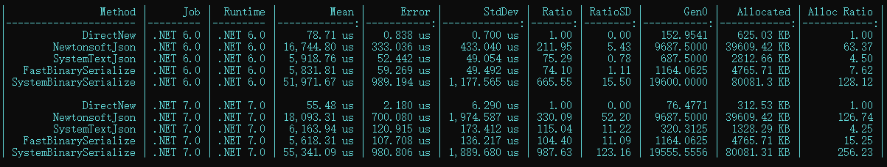
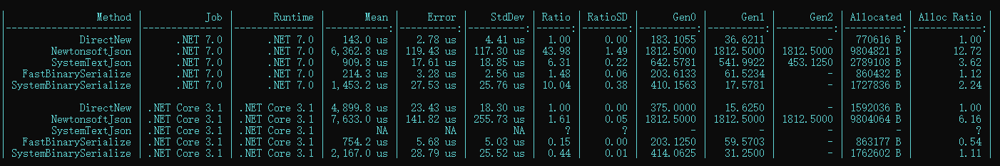

## 一、说明
该序列化以二进制方式进行序列化，不要求序列化与反序列化类型相同，使用体验和兼容性与json相似。支持**基础类型**、**自定义实体类**、**结构体**、**元组**、**数组**、**字典**、**List**等。

## 二、序列化、反序列化
```csharp
var obj = "TouchSocket";
var data = SerializeConvert.FastBinarySerialize(obj);
var newobj = SerializeConvert.FastBinaryDeserialize<string>(data);
```

## 三、自定义转换器

自定义转化器的使用，可以解决**所有类型**的序列化，但是这需要自己编写一些代码。具体操作如下：

1. 声明转换器。
```csharp
/// <summary>
/// 继承<see cref="FastBinaryConverter{T}"/>或者实现<see cref="IFastBinaryConverter"/>
/// </summary>
class StudentFastBinaryConverter : FastBinaryConverter<Student>
{
    protected override Student Read(byte[] buffer, int offset, int len)
    {
        var byteBlock = new ValueByteBlock(buffer);
        byteBlock.Pos = offset;
        var obj = new Student();
        obj.P1 = byteBlock.ReadInt32();
        obj.P2 = byteBlock.ReadString();
        return obj;
    }

    protected override int Write(ByteBlock byteBlock, Student obj)
    {
        //此处可以直接嵌套Json序列化，但是为演示效果，下列将依然使用二进制方式
        int pos = byteBlock.Pos;
        byteBlock.Write(obj.P1);
        byteBlock.Write(obj.P2);
        return byteBlock.Pos - pos;//返回的即是obj所有的字节长度
    }
}
```

2. 附加转换器

```csharp {1}
[FastConverter(typeof(StudentFastBinaryConverter))]
class Student
{
    public int P1 { get; set; }
    public string P2 { get; set; }
}
```

:::tip

当类型已经定义，无法通过特性添加转换器时，可以通过`FastBinaryFormatter.AddFastBinaryConverter(typeof(Student),new StudentFastBinaryConverter());`直接添加。

:::  


## 四、性能测试

### 4.1 简单测试

**待测试类型**

```csharp
[Serializable]
public class MyPackPerson
{
    public int Age { get; set; }
    public string Name { get; set; }
}
```

**结果**

以下测试是执行10000次序列化和反序列的结果。



### 4.2 复杂类型测试

**待测试类**

```csharp
 [Serializable]
public class Student
{
    public int P1 { get; set; }
    public string P2 { get; set; }
    public long P3 { get; set; }
    public byte P4 { get; set; }
    public DateTime P5 { get; set; }
    public double P6 { get; set; }
    public byte[] P7 { get; set; }

    public List<int> List1 { get; set; }
    public List<string> List2 { get; set; }
    public List<byte[]> List3 { get; set; }

    public Dictionary<int, int> Dic1 { get; set; }
    public Dictionary<int, string> Dic2 { get; set; }
    public Dictionary<string, string> Dic3 { get; set; }
    public Dictionary<int, Arg> Dic4 { get; set; }
}

[Serializable]
public class Arg
{
    public Arg(int myProperty)
    {
        this.MyProperty = myProperty;
    }

    public Arg()
    {
        Person person = new Person();
        person.Name = "张三";
        person.Age = 18;
    }

    public int MyProperty { get; set; }
}
[Serializable]
public class Person
{
    public string Name { get; set; }
    public int Age { get; set; }
}
```

**赋值**

```csharp
Student student = new Student();
student.P1 = 10;
student.P2 = "若汝棋茗";
student.P3 = 100;
student.P4 = 0;
student.P5 = DateTime.Now;
student.P6 = 10;
student.P7 = new byte[1024 * 64];

Random random = new Random();
random.NextBytes(student.P7);

student.List1 = new List<int>();
student.List1.Add(1);
student.List1.Add(2);
student.List1.Add(3);

student.List2 = new List<string>();
student.List2.Add("1");
student.List2.Add("2");
student.List2.Add("3");

student.List3 = new List<byte[]>();
student.List3.Add(new byte[1024]);
student.List3.Add(new byte[1024]);
student.List3.Add(new byte[1024]);

student.Dic1 = new Dictionary<int, int>();
student.Dic1.Add(1, 1);
student.Dic1.Add(2, 2);
student.Dic1.Add(3, 3);

student.Dic2 = new Dictionary<int, string>();
student.Dic2.Add(1, "1");
student.Dic2.Add(2, "2");
student.Dic2.Add(3, "3");

student.Dic3 = new Dictionary<string, string>();
student.Dic3.Add("1", "1");
student.Dic3.Add("2", "2");
student.Dic3.Add("3", "3");

student.Dic4 = new Dictionary<int, Arg>();
student.Dic4.Add(1, new Arg(1));
student.Dic4.Add(2, new Arg(2));
student.Dic4.Add(3, new Arg(3));
```

**结果**

Fast的效率比System自带的，快了近7倍，比System.Text.Json快了4倍多，比NewtonsoftJson快了近30倍。


