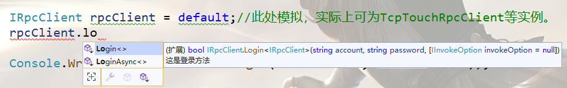

import Tag from "@site/src/components/Tag.js";

## 一、说明

### 1.1 为什么要生成代理？

使用rpc的原则就是像使用本地方法一样，让开发者感觉不到任何的不同。所以就必须把服务代理到本地，常见的方式有三种，**动态代理接口**，**静态织入**，**静态编译**。三种方式殊途同归，最终都是构建本地数据结构，然后和远程通信。三种方式各有优缺，具体如下：

| **优缺点** | **动态代理接口** | **静态织入** | **静态编译** |
| --- | --- | --- | --- |
| **优点** | 动态构建类，灵活、适应性强。 | 静态代码生成，自定义类参数自动生成，修改较灵活，调用效率高 | 自定义类参数自动生成，密封性强，安全性高，调用效率高。 |
| **缺点** | 调用效率较低，自定义类参数须自行构建，实现须IL支持，对调用平台有要求，例如：IOS不允许动态类生成，则不可使用。 | 项目代码管理难统一，强迫症猝死 | 服务一旦有破坏性升级，则必须重新替换dll，灵活性几乎为0。 |


### 1.2 为什么不直接支持接口代理调用？

【原因一】
支持out和ref参数，在使用代理时，效率不高。

【原因二】
需要在参数支持调用上下文，所以无法直接用接口调用。

【原因三】
支持单次调用的调用配置（例如超时时间，取消调用，序列化方式等）

【原因四】
引用问题，当在服务接口中，使用了其他的项目的数据结构的话，在接口调用项目上也需要引用该项目。太麻烦。


### 1.3 TouchRpc源文件代理相比接口代理，有什么优缺点？

源文件代理相比接口代理，几乎没什么缺点。有人会觉得接口代理更整洁、方便？实际上源文件代理只会更整洁、方便。

假设一个场景，你需要开发服务器和客户端，这时，你需要做：

1. 先单独定义一个接口项目
2. 再定义一个实现项目
3. 编译接口项目
4. 引用到客户端

上述步骤中，还不包括，接口项目和实现项目需要引入其他引用的情况，也不包括，接口中包含了其他项目的自定义数据结构。如果包含了的话，客户端还需要引入其他项目。

而且，还需要考虑接口项目的编译目标平台和其他编译参数。最难受的是，如果这些工作，是你和同事合作的话，那可能就是出个bug，同事传你一个dll v1.0版本，再有问题，v1.1修复版，等等。

而最要命的，当属程序集数据泄露。设想一下，如果某个同事在写数据库操作的项目时，把连接信息直接放在了代码里（或某个逻辑），本身如果这个项目只在服务器应用，也没有关系，但是因为你懒，你在接口中使用了该项目的一个数据结构，这就使得你不得不把这个项目一同交给调用方的同事，但你对这些毫无察觉。嗷嚎，黑用户一反编译，直接帮你把数据整理了。

但是如果用生成的源代码，那上述的可怕问题根本不用考虑。其次，会更整洁，更方便。

假设相同场景，你需要开发服务器和客户端，这时，你需要做：

1. 先定义一个服务项目（可以写接口，也能写逻辑，当然也可以分成两个项目）
2. 编译项目，然后导出代理源代码。
3. 引用到客户端

- 不需要考虑数据结构引用问题，因为代理会转写。
- 不需要考虑编译参数问题，因为客户端拿到的也是源码。
- 不需要再让同事一次次发你dll，只需要，他启动服务，你更新引用就ok。
- 不需要怕程序集数据泄露，因为一切都是转写的，而且只转写应用的、公共的部分。


## 二、从服务端获取代理

### 2.1 生成代理

在开发过程中，如果服务器和客户端，都是我们自己开发的话（在同一个电脑），就可以使用本地代理生成。

调用下列代码，会将已注册的所有服务，导出代理为字符串。

RpcStore是**实例**，或者是IRpcParser的**属性**。

```csharp
string code=RpcStore.GetProxyCodes("MyNameSpace"));
```

【示例1】
将代理字符串，写成.cs文件，然后通过链接的形式，将代码添加到客户端项目。

服务器代码，在服务器执行后，会在运行路径下，生成一个**WhisperServers.cs**的文件。

```csharp
var service = new TcpTouchRpcService();
var config = new TouchSocketConfig()//配置
                   .SetListenIPHosts(new IPHost[] { new IPHost(port) })
                   .ConfigureContainer(a =>
                   {
                       a.AddConsoleLogger();
                       a.AddFileLogger();
                   })
                   .ConfigureRpcStore(a =>
                   {
                       a.RegisterServer<MyRpcServer>();//注册服务

#if DEBUG
                       File.WriteAllText("../../../WhisperServers.cs", a.GetProxyCodes("WhisperServers",new Type[] { typeof(TouchRpcAttribute) }));
#endif
                   })
                   .SetVerifyToken("TouchRpc");

            service.Setup(config)
                .Start();
```

然后打开需要引入的客户端解决方案。选择需要添加代理的项目，依次执行：

**右击项目=》添加=》现有项**

**然后选择服务器生成的.cs文件，选择“添加”的下拉框，选择“添加为连接”。**


最后确认文件被正确添加为链接。


**这样，每次当服务有更新的时候，只需要启动一下服务器，代理就会自动刷新。**

实际上在RpcStore完成**服务注册**、**解析器添加**以后，调用`GetProxyInfo`，输入代理类型、即可获得代理信息，然后再通过CodeGenerator.ConvertToCode方法，转换为可以**直接编译**的代码。
此时，你可以复制、或者直接把代理代码写成`源代码`（cs文件）。
然后你可以把这个代码引入到**客户端**。

```csharp
//或者直接本地导出代理文件。
ServerCellCode[] codes = rpcStore.GetProxyInfo(RpcStore.ProxyAttributeMap.Values.ToArray());
string codeString = CodeGenerator.ConvertToCode("RRQMProxy", codes);
```

亦或者，为防止篡改生成的代码，不想把代理代码直接投入使用，那可以考虑将代码单独编译成dll，然后将编译的程序集加载到客户端。

:::tip 提示

上述行为，均是导出所有已注册的服务，当需要在同一个服务端，生成多个不同代理的源码时，可通过CodeGenerator静态类的相关方法直接生成。例如：

```csharp {1}
string codes=CodeGenerator.GetProxyCodes("Namespace",new Type[]{typeof(RpcServer) },new Type[] { typeof(TouchRpcAttribute)});
```


:::  


### 2.2 代理类型添加

> 通过之前的学习，大家可能大概明白了，在RRQMRPC中，客户端与服务器在进行交互时，所需的数据结构不要求是同一类型，仅是[数据类型结构相同](https://gitee.com/RRQM_OS/RRQM/wikis/RRQM%E4%B8%93%E4%B8%9A%E5%90%8D%E7%A7%B0%E8%A7%A3%E9%87%8A?sort_id=4872799)即可。所以在声明了服务以后，服务中所包含的自定义类型，会被复刻成结构相同的类型，但是这也仅仅局限于参数与服务`相同程序集`的时候。如果服务中引入了其他程序集的数据结构，则不会复刻。所以在客户端调用时，需要引入同一程序集。

但是，往往在服务中，会引入其他程序集，例如，我们习惯在项目中建立一个Models程序集，用于存放所有的实体模型，那是不是意味着客户端也必须引入这个程序集才能调用呢？没别的方法了？？
***有，且不只有一种*** <a name="r9HVa"></a>

### 2.2.1 添加代理类型

在服务注册之前，任意时刻，可调用CodeGenerator.AddProxyType静态方法，添加代理类型，同时可传入一个bool值，表明是否深度搜索，比如，假如RpcArgsClassLib.ProxyClass1中还有其他类型，则参数为True时，依然会代理。

```csharp
RPCService rpcService = new RPCService();
CodeGenerator.AddProxyType<RpcArgsClassLib.ProxyClass1>();
CodeGenerator.AddProxyType<RpcArgsClassLib.ProxyClass2>(deepSearch:true);
```

<a name="L9jEG"></a>

### 2.2.2 标记自定义类

在需要代理的类上面声明RpcProxy标签，然后也可以重新指定代理类名。

```csharp
[RpcProxy("MyArgs")]
public class Args
{
}
```

## 三、客户端源代码生成代理 <Tag>企业版</Tag>

### 3.1 生成

前一种方式已经算是几近完美的代理生成方案，但是有时候，当大家协作时，喜欢全部自己敲写。

例如：

对于下列服务，有时候就是喜欢自己写个接口，然后直接调用。

```csharp
public class MyRpcServer : RpcServer
{
    [TouchRpc]
    public bool Login(string account, string password)
    {
        if (account == "123" && password == "abc")
        {
            return true;
        }

        return false;
    }
}
```

```csharp
public interface IMyRpcServer
{
    public bool Login(string account, string password);
}
```

以往来说，实现这种方式的绝大多数，大概是使用IL动态构建一个类，然后动态实现接口代理，伪代码如下：

```csharp
IMyRpcServer myRpcServer=ProxyGenerator.CreateProxy<IMyRpcServer>();
```

但是现在，时代变了，我们有了源代码生成，那么事情将变得无比简单。

同样，我们需要设置接口，如下：

```csharp
/// <summary>
/// GeneratorRpcProxy的标识，表明这个接口应该被生成其他源代码。
/// ConsoleApp2.MyRpcServer参数是整个rpc调用的前缀，即：除方法名的所有，包括服务的类名。
/// </summary>
[GeneratorRpcProxy("ConsoleApp2.MyRpcServer")]
interface IMyRpcServer
{
    [Description("这是登录方法")]//该作用是生成注释
    [GeneratorRpcMethod]//表面该方法应该被代理，也可以通过参数，直接设置调用键
    public bool Login(string account, string password);
}
```

这时候，神奇的一幕发生了，凡是实现IRpcClient的接口的实例，都增加了扩展方法。而这功能，和服务器生成的扩展Rpc方法的功能是一致的。



:::tip 提示

上述功能需要再安装[TouchSocketPro.CodeAnalyzer](https://www.nuget.org/packages/TouchSocketPro.CodeAnalyzer)，该操作不会产生DLL依赖。

:::  

:::tip 提示

大家可能会疑问，源代码生成代理，和服务端生成代理，有什么区别？或者说有什么优点？
实际上没有区别，也没有优点。之所以设计这个，是因为之前有人提过需求，想要完全分离前、后端。即：后端写好服务后，前端自由定义服务接口，和调用参数，仅此而已。

所以，生成代理的方式，按照大家的习惯需求选择就可以。

:::  

[源代码生成代理示例代码](https://gitee.com/RRQM_Home/TouchSocket/tree/master/examples/TouchRpc%E7%AE%80%E5%8D%95%E7%A4%BA%E4%BE%8B/%E6%BA%90%E4%BB%A3%E7%A0%81%E7%94%9F%E6%88%90%E4%BB%A3%E7%90%86/GeneratorRpcProxyConsoleApp)

### 3.2 推荐写法

在TouchSocketPro中，关于Rpc，我们有更为推荐的写法。详细步骤如下：

（1）新建类库项目，命名为`RpcClassLibrary`。然后在该程序集中，定义服务接口，和接口参数实体类。

```csharp
/// <summary>
/// 定义服务接口。
/// </summary>
[GeneratorRpcProxy]
public interface IUserServer:IRpcServer
{
    [GeneratorRpcMethod]
    [TouchRpc]
    LoginResponse Login(LoginRequest request);
}
```

```csharp
public class LoginRequest:RequestBase
{
    public string Account { get; set; }
    public string Password { get; set; }
}

public class LoginResponse : ResponseBase
{
}

//下面两个是请求和响应的基类，可以根据业务增加其他字段
public class RequestBase
{
}

public class ResponseBase
{
    public Result Result { get; set; }
}
```

（2）新建类库项目，命名`RpcImplementationClassLibrary`，引用`RpcClassLibrary`项目，然后用于实现接口。

```csharp
public class UserServer : IUserServer
{
    public LoginResponse Login(LoginRequest request)
    {
        //返回假逻辑
        return new LoginResponse() {  Result=Result.Success};
    }
}
```

(3)新建控制台项目，作为服务器，或客户端都可以，然后如果作为服务器，需要同时引用`RpcImplementationClassLibrary`和`RpcClassLibrary`，如果作为客户端仅引用`RpcClassLibrary`即可。

如果作为服务器，需要按接口注册服务

```csharp
var service = new TcpTouchRpcService();
var config = new TouchSocketConfig()//配置
       .SetListenIPHosts(new IPHost[] { new IPHost(7789) })
       .ConfigureContainer(a =>
       {
           a.AddConsoleLogger();
           a.AddFileLogger();
       })
       .ConfigureRpcStore(a => 
       {
           a.RegisterServer<IUserServer, UserServer>();
       })
       .SetVerifyToken("TouchRpc");//设定连接口令，作用类似账号密码

service.Setup(config)
    .Start();

service.Logger.Info($"{service.GetType().Name}已启动");
```

如果作为客户端，直接调用即可。

```csharp {8}
TcpTouchRpcClient client = new TcpTouchRpcClient();
client.Setup(new TouchSocketConfig()
    .SetRemoteIPHost("127.0.0.1:7789")
    .SetVerifyToken("TouchRpc"));
client.Connect();

//Loging即为在RpcClassLibrary中自动生成的项目
var response = client.Login(new RpcClassLibrary.Models.LoginRequest() { Account= "Account",Password= "Account" });
Console.WriteLine(response.Result);
```

