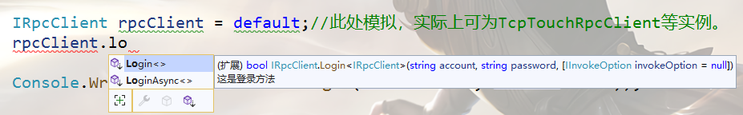

import Tag from "@site/src/components/Tag.js";

## 一、生成代理 <Tag>企业版</Tag>

对于源代码生成代理来说，他可以仅凭一个接口，自己生成代理服务代码，然后再编译到当前程序集中。

例如：对于下列服务

```csharp
public class MyRpcServer : RpcServer
{
    [TouchRpc]
    public bool Login(string account, string password)
    {
        if (account == "123" && password == "abc")
        {
            return true;
        }

        return false;
    }
}
```

```csharp
public interface IMyRpcServer
{
    public bool Login(string account, string password);
}
```

我们需要设置接口，如下：

```csharp
/// <summary>
/// GeneratorRpcProxy的标识，表明这个接口应该被生成其他源代码。
/// ConsoleApp2.MyRpcServer参数是整个rpc调用的前缀，即：除方法名的所有，包括服务的类名。
/// </summary>
[GeneratorRpcProxy(Prefix = "GeneratorRpcProxyConsoleApp.MyRpcServer")]//此处还可以设置其他参数，例如：生成代理的命名空间，是否生成接口等。具体f12查看。
interface IMyRpcServer
{
    [Description("这是登录方法")]//该作用是生成注释
    [GeneratorRpcMethod]//表面该方法应该被代理，也可以通过参数，直接设置调用键
    public bool Login(string account, string password);
}
```

这时候，神奇的一幕发生了，凡是实现**IRpcClient**的接口的实例，都增加了扩展方法。而这功能，和服务器生成的扩展Rpc方法的功能是一致的。



:::info 说明

生成的扩展方法的类名，就是**接口名+Extensions**，命名空间默认在**TouchSocket.Rpc.Generators**下，所以可能需要提前using。

:::  

:::tip 提示

上述功能需要再安装[TouchSocketPro.CodeAnalyzer](https://www.nuget.org/packages/TouchSocketPro.CodeAnalyzer)，该操作不会产生DLL依赖。

:::  

:::tip 提示

大家可能会疑问，源代码生成代理，和服务端生成代理，有什么区别？或者说有什么优点？
实际上没有区别，优点最后会对比。之所以设计这个，是因为之前有人提过需求，想要完全分离前、后端。即：后端写好服务后，前端自由定义服务接口，和调用参数，仅此而已。

所以，生成代理的方式，按照大家的习惯需求选择就可以。

:::  

[源代码生成代理示例代码](https://gitee.com/RRQM_Home/TouchSocket/tree/master/examples/TouchRpc%E7%AE%80%E5%8D%95%E7%A4%BA%E4%BE%8B/%E6%BA%90%E4%BB%A3%E7%A0%81%E7%94%9F%E6%88%90%E4%BB%A3%E7%90%86/GeneratorRpcProxyConsoleApp)

## 二、生成配置

### 2.1 GeneratorRpcProxyAttribute配置

GeneratorRpcProxyAttribute的配置，是对整个接口的总体配置，通过**特性名称**直接配置即可。

```csharp {1}
[GeneratorRpcProxy(Prefix = "RpcClassLibrary")]
public interface IUserServer:IRpcServer
{
    [GeneratorRpcMethod]
    [TouchRpc]
    LoginResponse Login(LoginRequest request);
}
```

可配置项：

#### （1）Prefix

调用前缀。用于配置接口方法的调用键前缀，应包括**命名空间**和**类名**，方法名会自动组合，不区分大小写。

#### （2）GenericConstraintTypes

泛型约束类型。用于约束生成代理的泛型类型，从而让生成的扩展方法只能让特定的类型执行。默认情况下只会约束**IRpcClient**接口。

例如：

```csharp {2}
public static LoginResponse Login<TClient>(this TClient client,LoginRequest request,IInvokeOption invokeOption = default) 
where TClient:IRpcClient
{
    if (client.TryCanInvoke?.Invoke(client)==false)
    {
        throw new RpcException("Rpc无法执行。");
    }
    object[] parameters = new object[]{request};
    RpcClassLibrary.Models.LoginResponse returnData=client.Invoke<RpcClassLibrary.Models.LoginResponse>("rpcclasslibrary.login",invokeOption, parameters);
    return returnData;
}
```

:::caution 注意

泛型约束的总和，必须直接或间接实现**IRpcClient**接口。

:::  

#### （3）MethodInvoke

表示接口的所有方法，均仅通过方法名调用，也就是直接会将方法名设置为调用键，区别大小写。

#### （4） Namespace

表示生成接口，扩展类的命名空间。默认是**TouchSocket.Rpc.Generators**。

#### （5）ClassName

表示生成接口，扩展类的基础名称，例如设为A，则生成的接口是IA，扩展类是AExtensions。默认是**声明接口的名称**（除去“I”）。

#### （6）GeneratorFlag

生成标识，可表示是否生成同步代码，或异步，或不生成接口等等。

例如：下列示例，只会生成**异步扩展**调用，和**异步接口**代码。

```csharp {1}
[GeneratorRpcProxy(GeneratorFlag = CodeGeneratorFlag.ExtensionAsync| CodeGeneratorFlag.InterfaceAsync)]
public interface IUserServer:IRpcServer
{
    [GeneratorRpcMethod]
    [TouchRpc]
    LoginResponse Login(LoginRequest request);
}
```

#### （7） MethodFlags

函数标识，可以声明该函数支持调用上下文，即在生成代理时，会忽略第一个参数项。

```csharp {1,6} 
[GeneratorRpcProxy(MethodFlags = MethodFlags.IncludeCallContext)]
public interface IUserServer:IRpcServer
{
    [GeneratorRpcMethod]
    [TouchRpc]
    LoginResponse Login(ICallContext callContext,LoginRequest request);
}
```

:::tip 提示

该场景的使用，一般是，该接口会作为**服务实现**接口。

:::  

#### （8） InheritedInterface

继承接口，标识生成接口代理时，是否依然保持其他接口的继承实现。

例如：下列示例中，A接口继承了IRpcServer（外部接口），而B和接口又继承了A，所以全部设置为true时，在生成接口中，依然会保持整个继承链。

```csharp {1,7}
[GeneratorRpcProxy(InheritedInterface =true)]
public interface IA:IRpcServer
{
   
}

[GeneratorRpcProxy(InheritedInterface =true)]
public interface IB:IA
{
   
}

```

### 2.2 GeneratorRpcMethodAttribute配置

可配置项：

#### （1）GenericConstraintTypes
#### （2）GeneratorFlag
#### （3）MethodInvoke
#### （4）MethodFlags

:::info 说明

以上项目功能和**GeneratorRpcProxyAttribute**一致，但是当配置时，会优先生效。

:::  

#### （5）InvokeKey

调用键，直接生效，区分大小写。

#### （6）MethodName

方法名称，可以修改生成代理的方法名。