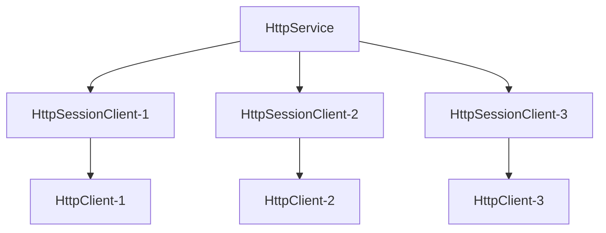

import Tabs from "@theme/Tabs";
import TabItem from "@theme/TabItem";
import CardLink from "@site/src/components/CardLink.js";
import BilibiliCard from '@site/src/components/BilibiliCard.js';
import { TouchSocketHttpDefinition } from "@site/src/components/Definition.js";
import CustomCodeBlock from './CodeBlocks/CustomCodeBlock';

### 定义

<TouchSocketHttpDefinition />


## 一、说明

`HttpService`是`TouchSocket`框架中用于构建高性能HTTP服务的核心组件。它提供了一个轻量级、高效的Web服务解决方案，支持现代Web开发的各种需求。无论是构建`REST API`、`Web服务`还是`文件服务器`，`HttpService`都能提供卓越的性能和简洁的开发体验。

**特别值得注意的是**，`HttpService`拥有业界领先的框架兼容性，从经典的`.NET Framework 4.6.2`到最新的`.NET 9.0`全系列支持，让您的项目无论是升级改造还是全新开发都能享受到统一的开发体验。

<BilibiliCard title="轻量级Web开发框架序章" link="https://www.bilibili.com/cheese/play/ep1618488" isPro="true"/>

## 二、核心特性

`HttpService`具备以下突出特性：

- **🎯 广泛框架支持** - 从`.NET Framework 4.6.2`到`.NET 9.0`全版本支持，兼容性卓越
- **🔐 完整`HTTPS`支持** - 支持`SSL/TLS`加密连接，确保数据传输安全
- **📊 多种数据处理模式** - 灵活处理各种类型的`HTTP`请求数据
- **🌐 多地址监听** - 可同时监听多个`IP`地址和端口，实现灵活部署
- **⚡ 卓越性能表现** - 经过优化的高性能`HTTP`处理引擎
- **🔄 跨域支持(CORS)** - 内置跨域资源共享支持，简化前后端分离开发
- **📦 AOT原生支持** - 支持提前编译，部署体积比AspNetCore小50%，启动更快

<BilibiliCard title="使用JMeter对Http组件进行性能测试" link="https://www.bilibili.com/cheese/play/ep1618489" isPro="true"/>
<BilibiliCard title="Aot发布后与AspNetCore进行对比" link="https://www.bilibili.com/cheese/play/ep1618490" isPro="true"/>

## 三、应用场景

`HttpService` 适用于以下多种场景：

- **🔗 RESTful API服务** - 构建标准的REST风格的`Web API`接口
- **🌍 跨平台Web服务** - 支持`Windows`、`Linux`、`macOS`等多平台部署
- **🏗️ 遗留系统集成** - 完美支持`.NET Framework 4.6.2+`，可无缝集成到现有老项目
- **🚀 现代应用开发** - 全面支持`.NET Core/.NET 5-9`，享受最新框架特性
- **📁 文件服务器** - 高效的文件上传、下载和管理服务
- **🔌 微服务架构** - 轻量级的微服务HTTP通信组件
- **🖥️ 混合应用后端** - 为桌面应用、移动应用提供HTTP服务支持
- **📡 IoT设备通信** - 物联网设备的HTTP接口服务


## 四、架构设计

`HttpService`采用高效的会话管理架构设计：

### 连接管理模型

当HTTP客户端与服务器建立连接时，`HttpService`会为每个连接创建一个专门的`HttpSessionClient`实例。这种设计模式确保了：

- **会话隔离** - 每个客户端连接拥有独立的处理实例
- **并发安全** - 多个客户端可以同时访问服务器而不相互干扰  
- **资源优化** - 合理的连接管理和资源分配



<BilibiliCard title="HttpContext的生命周期" link="https://www.bilibili.com/cheese/play/ep1688270" isPro="true"/>

## 五、插件扩展机制

`HttpService`提供了强大的插件系统，允许开发者通过实现`IHttpPlugin`接口或继承`PluginBase`基类来扩展功能。

### 支持的插件接口

| 插件接口 | 触发时机 | 功能说明 |
| --- | --- | --- |
| `IHttpPlugin` | 接收到HTTP请求时 | 处理所有HTTP请求，支持链式处理 |

### 插件实现方式

1. **接口实现** - 直接实现`IHttpPlugin`接口
2. **基类继承** - 继承`PluginBase`类并重写相应方法
3. **委托方式** - 通过委托函数快速添加处理逻辑


## 六、快速开始

创建`HttpService`的过程简单直观，类似于`TcpService`的配置方式。并且适应[TcpService的所有配置项目](./tcpservice.mdx)

以下是一个完整的创建示例：

<BilibiliCard title="创建Http服务器" link="https://www.bilibili.com/cheese/play/ep1618491" isPro="true"/>

### 6.1 创建Http服务器

<CustomCodeBlock region="创建Http服务器"/>

:::tip 提示

`DefaultHttpServicePlugin`插件建议添加到插件链的末尾，它负责：
- 为找不到匹配路由的请求返回404状态
- 自动处理OPTIONS方法的CORS预检请求

如果不使用此插件，需要自行处理这些默认场景。

:::  

### 6.2 接收并处理请求

在http服务器中，所有的请求处理都通过插件来完成。以下是一个简单的插件示例：

<CustomCodeBlock region="Http服务器使用插件"/>

## 七、请求数据获取

### HttpContext生命周期

每当HTTP客户端与服务器建立连接时，系统会创建：
- 一个`HttpSessionClient`实例 - 负责管理客户端连接
- 一个`HttpContext`实例 - 负责处理HTTP请求/响应上下文

对于同一个连接的所有HTTP请求，都会复用同一个`HttpContext`实例，通过其`Request`和`Response`属性可以访问请求数据和构建响应内容。

```csharp showLineNumbers
var request = e.Context.Request;   //获取HTTP请求对象
var response = e.Context.Response; //获取HTTP响应对象
```

<BilibiliCard title="Http方法解析与使用" link="https://www.bilibili.com/cheese/play/ep1618492" isPro="true"/>

### 7.1 获取Query参数

```csharp showLineNumbers
string value = e.Context.Request.Query["key"];
```

<BilibiliCard title="Query参数及用法" link="https://www.bilibili.com/cheese/play/ep1618493" isPro="true"/>

### 7.2 获取Header参数

```csharp showLineNumbers
string value = e.Context.Request.Headers["key"];
```

亦或者

```csharp showLineNumbers
string value = e.Context.Request.Headers[HttpHeaders.Cookie];
```

<BilibiliCard title="Header参数及用法" link="https://www.bilibili.com/cheese/play/ep1618495" isPro="true"/>

### 7.3 获取Form参数

```csharp showLineNumbers
var multifileCollection =await e.Context.Request.GetFormCollectionAsync();
foreach (var item in multifileCollection)
{
    Console.WriteLine($"key={item.Key},value={item.Value}");
}
```

<BilibiliCard title="Form参数及小文件传输" link="https://www.bilibili.com/cheese/play/ep1618496" isPro="true"/>
<BilibiliCard title="Form-data与x-www-form-urlencod" link="https://www.bilibili.com/cheese/play/ep1618497" isPro="true"/>

### 7.4 获取字符串Body内容

```csharp showLineNumbers
string bodyString = await e.Context.Request.GetBodyAsync();
```

### 7.5 获取小体量字节Body内容

```csharp showLineNumbers
ReadOnlyMemory<byte> content = await e.Context.Request.GetContentAsync();
```

<BilibiliCard title="接收并处理Json、Xml类Body数据" link="https://www.bilibili.com/cheese/play/ep1618500" isPro="true"/>
<BilibiliCard title="接收Binary(小文件)类Body数据" link="https://www.bilibili.com/cheese/play/ep1618501" isPro="true"/>

### 7.6 持续读取Body内容

当数据太大时，可持续读取

```csharp showLineNumbers
while (true)
{
    var buffer = new byte[1024 * 64];

    using (var blockResult = await e.Context.Request.ReadAsync())
    {
        //这里可以一直处理读到的数据。
        blockResult.Memory.CopyTo(buffer);

        if (blockResult.IsCompleted)
        {
            //结束
            break;
        }
    }
}
```

<BilibiliCard title="接收超大文件字节流" link="https://www.bilibili.com/cheese/play/ep1618502" isPro="true"/>

### 7.7 获取Body持续写入Stream中

当数据太大时，可持续读取数据直接到流容器中。

```csharp showLineNumbers
using (var stream = new MemoryStream())
{
    //
    await e.Context.Request.ReadCopyToAsync(stream);
}
```

<BilibiliCard title="接收超大文件时显示进度和速度(1)" link="https://www.bilibili.com/cheese/play/ep1618503" isPro="true"/>
<BilibiliCard title="接收超大文件时显示进度和速度(2)" link="https://www.bilibili.com/cheese/play/ep1618504" isPro="true"/>

### 7.8 获取Body小文件

当Body内容为小文件集合时，可以使用该功能。

```csharp {11,13-19} showLineNumbers
if (e.Context.Request.ContentLength > 1024 * 1024 * 100)//全部数据体超过100Mb则直接拒绝接收。
{
    await e.Context.Response
         .SetStatus(403, "数据过大")
         .AnswerAsync();
    return;
}

//此操作会先接收全部数据，然后再分割数据。
//所以上传文件不宜过大，不然会内存溢出。
var multifileCollection =await e.Context.Request.GetFormCollectionAsync();

foreach (var file in multifileCollection.Files)
{
    var stringBuilder = new StringBuilder();
    stringBuilder.Append($"文件名={file.FileName}\t");
    stringBuilder.Append($"数据长度={file.Length}");
    client.Logger.Info(stringBuilder.ToString());
}

await e.Context.Response
         .SetStatusWithSuccess()
         .FromText("Ok")
         .AnswerAsync();
```
<BilibiliCard title="Form参数及小文件传输" link="https://www.bilibili.com/cheese/play/ep1618496" isPro="true"/>
<BilibiliCard title="Form-data与x-www-form-urlencod" link="https://www.bilibili.com/cheese/play/ep1618497" isPro="true"/>

## 八、响应构建与发送

当接收并处理完HTTP请求后，可以通过`e.Context.Response`对象构建并发送响应数据。

### 响应构建流程

HTTP响应的构建遵循以下基本流程：
1. **设置状态码** - 指定HTTP状态码和状态描述
2. **添加响应头** - 设置必要的HTTP头部信息  
3. **设置响应体** - 添加响应内容数据
4. **发送响应** - 调用`AnswerAsync()`完成响应发送

### 8.1 设置响应状态

```csharp showLineNumbers
e.Context.Response.SetStatus(200,"success");
```

### 8.2 设置响应Header

```csharp showLineNumbers
e.Context.Response.AddHeader("key","value");
```

或者

```csharp showLineNumbers
e.Context.Response.AddHeader(HttpHeaders.Origin, "*");
```

### 8.3 设置响应内容

```csharp showLineNumbers
e.Context.Response.SetContent("hello");
```

或者直接返回`Json`、`Xml`、`Text`等内容。使用此快捷方式，会同时添加对应的`ContentType`Header。

```csharp showLineNumbers
e.Context.Response.FromJson("{}");
```

<BilibiliCard title="从Json格式进行响应" link="https://www.bilibili.com/cheese/play/ep1618507" isPro="true"/>

### 8.4 开始响应内容

当通过上述步骤，完成了响应体的构建后，即可使用`AnswerAsync`直接进行响应。

例如：响应一个`hello`文本内容，代码大致如下

```csharp showLineNumbers
await e.Context.Response
      .SetStatus(200, "success")
      .AddHeader("key", "value")//如需要
      .FromText("hello")
      .AnswerAsync();
```

<BilibiliCard title="从Binary进行响应" link="https://www.bilibili.com/cheese/play/ep1618509" isPro="true"/>

### 8.5 插件响应Get请求

```csharp showLineNumbers
public class MyHttpPlug1 : PluginBase, IHttpPlugin
{
    public async Task OnHttpRequest(IHttpSessionClient client, HttpContextEventArgs e)
    {
        var request = e.Context.Request;//http请求体
        var response = e.Context.Response;//http响应体

        if (request.IsGet()&&request.UrlEquals("/success"))
        {
            //直接响应文字
           await response
                .SetStatus(200, "success")
                .FromText("Success")
                .AnswerAsync();//直接回应
            Console.WriteLine("处理/success");
            return;
        }

        //无法处理，调用下一个插件
        await e.InvokeNext();
    }
}
```

### 8.6 响应文件请求

```csharp showLineNumbers
public class MyHttpPlug2 : PluginBase, IHttpPlugin
{
    public async Task OnHttpRequest(IHttpSessionClient client, HttpContextEventArgs e)
    {
        var request = e.Context.Request;//http请求体
        var response = e.Context.Response;//http响应体
        if (request.IsGet() && request.UrlEquals("/file"))
        {
            try
            {
                //直接回应文件。

                var fileInfo = new FileInfo(@"D:\System\Windows.iso");
                var fileName = fileInfo.Name;//可以重新制定文件名称，届时，header中会添加Content-Disposition内容
                var maxSpeed = 1024 * 1024;//最大传输速度
                var bufferLength = 1024 * 64;//一般该值越大，效率越高，但同时内存占用也更大
                var autoGzip = true;//自动判断是否应用gzip压缩。

                await response
                    .SetStatusWithSuccess()//必须要有状态
                    .FromFileAsync(fileInfo, e.Context.Request, fileName, maxSpeed, bufferLength, autoGzip);

                //或者直接使用HttpContext
                //await e.Context.FromFileAsync(fileInfo, fileName, maxSpeed, bufferLength, autoGzip);
            }
            catch (Exception ex)
            {
                await response.SetStatus(403, "error")
                      .FromText(ex.Message)
                      .AnswerAsync();
            }

            return;
        }
        await e.InvokeNext();
    }
}
```

:::caution 注意

当响应的文件，希望浏览器直接显示时（例如：html，js，css），不应该指定文件名，不然浏览器会调用下载保存操作，而非直接显示。

:::  

:::tip 提示

在响应文件时，传入请求的`request`，主要是当请求包含断点续传时，能成功续传。所以，应当应可能的满足该功能。

:::  

:::tip 提示

该操作支持大型文件，也支持断点续传、支持迅雷加速等。

:::  

<BilibiliCard title="响应小文件" link="https://www.bilibili.com/cheese/play/ep1618510" isPro="true"/>
<BilibiliCard title="响应超大文件" link="https://www.bilibili.com/cheese/play/ep1618511" isPro="true"/>
<BilibiliCard title="响应超大文件并显示进度和速度" link="https://www.bilibili.com/cheese/play/ep1618512" isPro="true"/>


### 8.7 响应页面请求

```csharp showLineNumbers
public class MyHttpPlug3 : PluginBase, IHttpPlugin
{
    public async Task OnHttpRequest(IHttpSessionClient client, HttpContextEventArgs e)
    {
        var request = e.Context.Request;//http请求体
        var response = e.Context.Response;//http响应体
        if (request.IsGet() && request.UrlEquals("/html"))
        {
            //构建html
            var sb = new StringBuilder();
            sb.Append("<!DOCTYPE html>");
            sb.Append("<html lang=\"zh\">");
            sb.Append("<head>");
            sb.Append("    <meta charset=\"UTF-8\">");
            sb.Append("    <title>TouchSocket绚丽展示</title>");
            sb.Append("    <style>");
            sb.Append("        body {");
            sb.Append("            font-family: Arial, sans-serif;");
            sb.Append("            background-color: #f0f0f0;");
            sb.Append("            display: flex;");
            sb.Append("            justify-content: center;");
            sb.Append("            align-items: center;");
            sb.Append("            height: 100vh;");
            sb.Append("            margin: 0;");
            sb.Append("            padding: 0;");
            sb.Append("            color: transparent;");
            sb.Append("        }");
            sb.Append("        h1 {");
            sb.Append("            font-size: 48px;");
            sb.Append("            letter-spacing: 2px;");
            sb.Append("            background-image: linear-gradient(to right, #ff8a00, #ffcd38);");
            sb.Append("            -webkit-background-clip: text;");
            sb.Append("            background-clip: text;");
            sb.Append("            font-weight: bold;");
            sb.Append("        }");
            sb.Append("    </style>");
            sb.Append("</head>");
            sb.Append("<body>");
            sb.Append("    <h1>TouchSocket</h1>");
            sb.Append("</body>");
            sb.Append("</html>");

            //回应html
            await response
                 .SetStatusWithSuccess()//必须要有状态
                 .SetContentTypeByExtension(".html")
                 .SetContent(sb.ToString())
                 .AnswerAsync();
            return;
        }

        await e.InvokeNext();
    }
}
```

<BilibiliCard title="从Xml、Html进行响应" link="https://www.bilibili.com/cheese/play/ep1618508" isPro="true"/>

## 九、进阶响应操作

### 9.1 响应有长度大数据

当响应的数据，在响应时，已知数据长度的话，可以使用此方法。

```csharp showLineNumbers
var request = e.Context.Request;//http请求体
var response = e.Context.Response;//http响应体

//先设置需要响应的地方
response.SetStatus(200, "success");
//然后设置数据总长度
response.ContentLength = 1024 * 1024;

for (int i = 0; i < 1024; i++)
{
    //将数据持续写入
    await response.WriteAsync(new byte[1024]);
}
```

### 9.2 响应不知长度数据（Chunk模式）

当响应的数据，在响应时，不知数据长度的话，可以使用此方法。

```csharp showLineNumbers
var request = e.Context.Request;//http请求体
var response = e.Context.Response;//http响应体

//先设置需要响应的地方
response.SetStatus(200, "success");
//设置使用Chunk模式
response.IsChunk = true;

for (int i = 0; i < 1024; i++)
{
    //将数据持续写入
    await response.WriteAsync(new byte[1024]);
}

//在正式数据传输完成后，调用此方法，客户端才知道数据结束了
await response.CompleteChunkAsync();
```

<BilibiliCard title="使用Chunk编码传输不定长数据" link="https://www.bilibili.com/cheese/play/ep1618513" isPro="true"/>


## 九、HTTPS安全服务

### 启用SSL/TLS加密

HttpService支持完整的HTTPS功能，只需在配置中添加SSL选项即可。HTTPS服务器的配置与HTTP服务器基本相同，仅需增加SSL证书配置。

```csharp showLineNumbers
var service = new HttpService();
await service.SetupAsync(new TouchSocketConfig()
     .SetListenIPHosts(443) //HTTPS默认端口为443
     .SetServiceSslOption(new ServiceSslOption() 
     { 
         Certificate = new X509Certificate2("Socket.pfx", "Socket"), //SSL证书
         SslProtocols = SslProtocols.Tls12 //TLS协议版本
     })
     // ...其他配置
);
```

### SSL配置参数

有关SSL证书的详细配置方法和参数说明，请参考：[TcpService SSL配置](./tcpservice.mdx#ssl配置)

### 注意事项

- **证书格式** - 支持.pfx、.crt等标准证书格式
- **端口选择** - HTTPS服务通常使用443端口
- **混合部署** - 可以同时运行HTTP(80)和HTTPS(443)服务

## 十、示例项目

以下是完整的HttpService使用示例，可以帮助您快速上手：

<CardLink link="examples/Http/HttpServiceConsoleApp"/>
<CardLink link="examples/Http/HttpServiceForCorsConsoleApp"/>