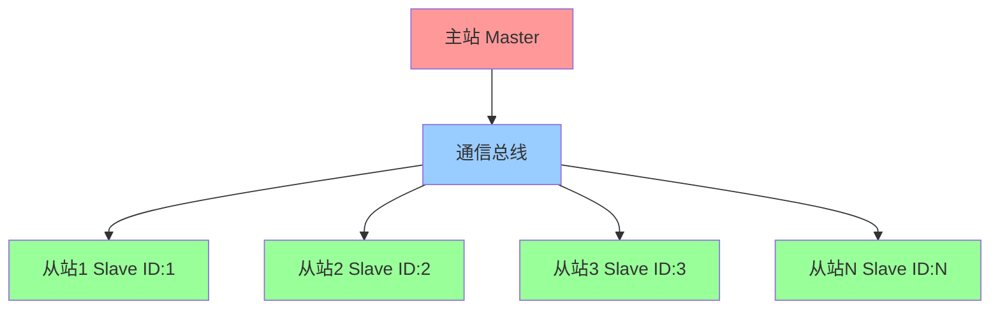
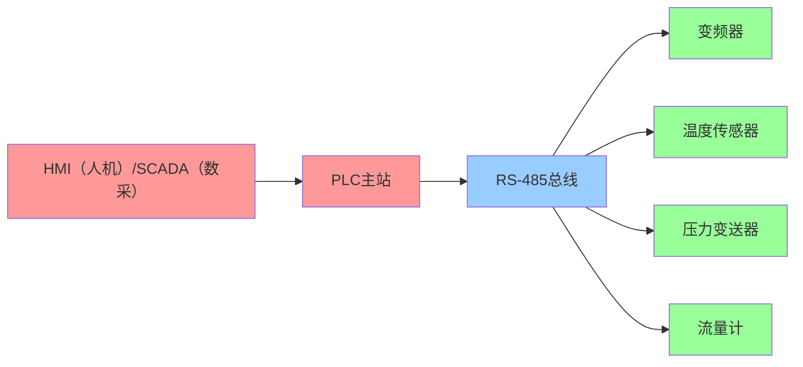
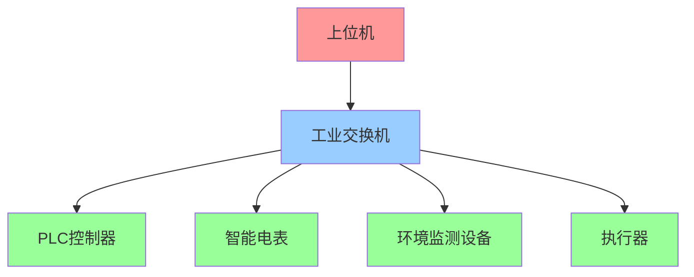
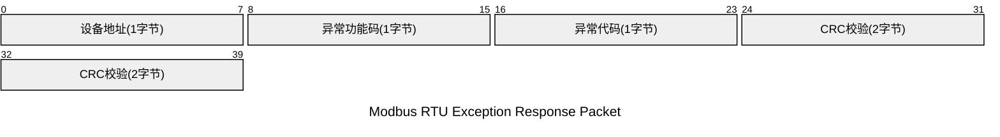
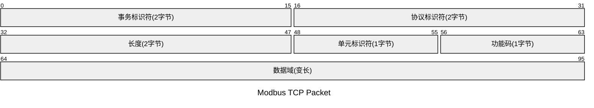
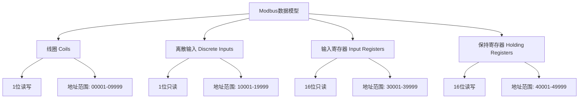
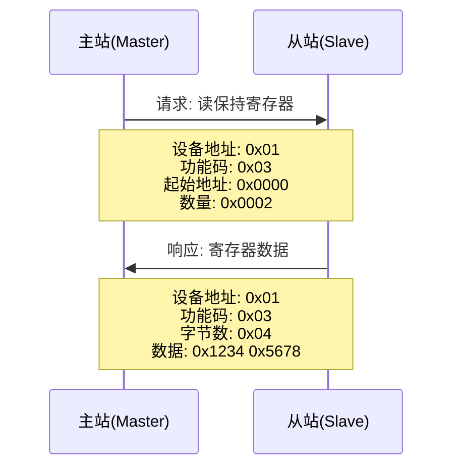
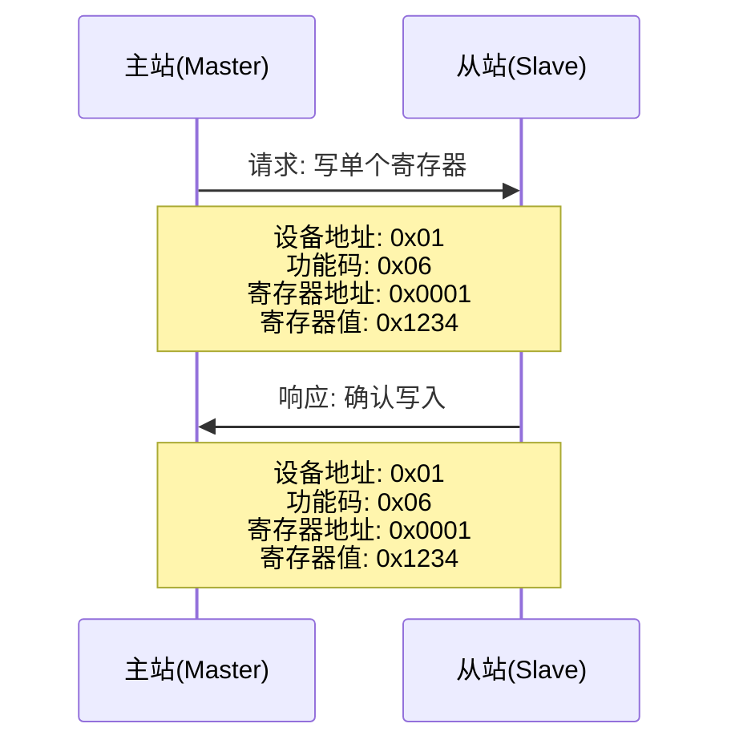

## 一、Modbus协议发展历史

Modbus协议是由Modicon公司（现为施耐德电气的一部分）在1979年开发的一种应用层通信协议。它是工业自动化领域中最早和最广泛使用的通信协议之一。

### 1.1 Modbus总线协议特性

Modbus被称为总线协议，主要基于以下几个核心特征：

#### 1.1.1 主从架构（Master-Slave）
- **单主多从**: 网络中只能有一个主站（Master），可以有多个从站（Slave，最多247个）
- **主站控制**: 只有主站可以主动发起通信，从站只能被动响应
- **轮询机制**: 主站通过轮询方式与各个从站进行通信

#### 1.1.2 共享通信媒介


- **物理总线**: 在串行通信中，所有设备共享同一条物理线路（如RS-485总线）
- **逻辑总线**: 在TCP/IP网络中，通过网络交换机形成逻辑总线结构
- **地址寻址**: 通过设备地址（Slave ID）来区分不同的从站设备

#### 1.1.3 半双工通信特性
- **时分复用**: 同一时刻只能有一个设备发送数据
- **冲突避免**: 严格的主从协议避免了数据冲突
- **确定性通信**: 通信时序完全由主站控制，具有良好的实时性

#### 1.1.4 总线拓扑优势

| 特性 | 说明 | 优势 |
|------|------|------|
| **成本效益** | 单条线路连接多个设备 | 降低布线和硬件成本 |
| **易于扩展** | 可方便地添加或移除从站 | 系统扩展性好 |
| **故障隔离** | 单个从站故障不影响整个网络 | 提高系统可靠性 |
| **标准化** | 统一的协议规范 | 设备互操作性强 |

#### 1.1.5 典型总线应用场景

**串行总线应用（RS-485）**：


**以太网总线应用（TCP/IP）**：


#### 1.1.6 与点对点协议的对比

| 对比项 | Modbus总线协议 | 点对点协议 |
|--------|----------------|------------|
| **连接方式** | 一条线路连接多设备 | 每两个设备间独立连接 |
| **通信模式** | 主从轮询 | 对等通信 |
| **硬件成本** | 低（共享线路） | 高（独立线路） |
| **扩展性** | 易扩展（添加从站） | 复杂（需增加连接） |
| **实时性** | 确定性轮询 | 可能存在冲突 |
| **故障影响** | 局部影响 | 影响对应连接 |

### 1.2 发展历程

- **1979年**: Modicon公司发布了Modbus协议，最初用于其可编程逻辑控制器（PLC）之间的通信
- **1980年代**: 协议逐渐被其他厂商采用，成为事实上的工业标准
- **1996年**: Modbus协议成为开放协议，任何厂商都可以免费使用
- **2004年**: 成立了Modbus组织（Modbus Organization），负责协议的维护和发展
- **至今**: 仍然是工业自动化领域最重要的通信协议之一

## 二、Modbus协议用途

Modbus协议主要用于工业自动化设备之间的通信，具有以下特点和用途：

### 2.1 应用领域

- **工业自动化**: PLC、DCS、SCADA系统之间的通信
- **能源管理**: 电力监控、能耗管理系统
- **楼宇自动化**: 暖通空调、照明控制系统
- **水处理**: 污水处理、供水系统监控
- **交通运输**: 地铁、机场等基础设施监控

### 2.2 协议优势

- **简单易用**: 协议结构简单，易于理解和实现
- **开放免费**: 无需支付授权费用，降低了实施成本
- **广泛支持**: 几乎所有工控设备都支持Modbus协议
- **可靠稳定**: 经过数十年的验证，协议稳定可靠
- **互操作性强**: 不同厂商的设备可以无缝互联

## 三、Modbus协议变体

Modbus协议有三种主要变体：

### 3.1 Modbus RTU
- 基于串行通信（RS-232、RS-485）
- 使用二进制编码
- 数据紧凑，传输效率高

### 3.2 Modbus ASCII
- 基于串行通信
- 使用ASCII字符编码
- 可读性好，便于调试

### 3.3 Modbus TCP/IP
- 基于以太网TCP/IP协议
- 速度快，支持长距离通信
- 易于集成到现代网络环境

## 四、Modbus协议报文格式

### 4.1 Modbus RTU报文格式

Modbus RTU报文格式根据是请求报文、正常响应报文还是异常响应报文而有所不同：

#### 4.1.1 请求报文格式


**请求报文结构表**

| 字节位置 | 字段名称 | 长度 | 说明 | 示例值 |
|----------|----------|------|------|--------|
| 0 | 设备地址 | 1字节 | 从站设备地址，范围1-247，0为广播地址 | 0x01 |
| 1 | 功能码 | 1字节 | 指定要执行的操作类型 | 0x03 |
| 2-5 | 数据域 | 变长 | 包含请求的具体参数（地址、数量等） | 0x00 0x00 0x00 0x02 |
| 6-7 | CRC校验 | 2字节 | 循环冗余校验码，低字节在前 | 0xC4 0x0B |

**读保持寄存器请求报文示例**：
```
01 03 00 00 00 02 C4 0B
```
- `01`: 设备地址
- `03`: 功能码（读保持寄存器）
- `00 00`: 起始地址（0）
- `00 02`: 寄存器数量（2个）
- `C4 0B`: CRC校验

#### 4.1.2 正常响应报文格式

正常响应的格式根据功能码类型而有所不同：

##### 读操作响应（功能码01-04）


**读操作响应结构表**

| 字节位置 | 字段名称 | 长度 | 说明 | 示例值 |
|----------|----------|------|------|--------|
| 0 | 设备地址 | 1字节 | 从站设备地址 | 0x01 |
| 1 | 功能码 | 1字节 | 与请求中的功能码相同 | 0x03 |
| 2 | 数据字节数 | 1字节 | 后续数据内容的字节数 | 0x04 |
| 3-6 | 数据内容 | 变长 | 实际的寄存器或线圈数据 | 0x12 0x34 0x56 0x78 |
| 7-8 | CRC校验 | 2字节 | 循环冗余校验码，低字节在前 | 0x?? 0x?? |

##### 写操作响应（功能码05、06）


**写单个寄存器/线圈响应结构表**

| 字节位置 | 字段名称 | 长度 | 说明 | 示例值 |
|----------|----------|------|------|--------|
| 0 | 设备地址 | 1字节 | 从站设备地址 | 0x01 |
| 1 | 功能码 | 1字节 | 0x05（写单个线圈）或0x06（写单个寄存器） | 0x06 |
| 2-3 | 起始地址 | 2字节 | 写入的寄存器或线圈地址 | 0x00 0x01 |
| 4-5 | 写入值 | 2字节 | 写入的数据值 | 0x12 0x34 |
| 6-7 | CRC校验 | 2字节 | 循环冗余校验码，低字节在前 | 0x?? 0x?? |

##### 写多个操作响应（功能码0F、10）


**写多个寄存器/线圈响应结构表**

| 字节位置 | 字段名称 | 长度 | 说明 | 示例值 |
|----------|----------|------|------|--------|
| 0 | 设备地址 | 1字节 | 从站设备地址 | 0x01 |
| 1 | 功能码 | 1字节 | 0x0F（写多个线圈）或0x10（写多个寄存器） | 0x10 |
| 2-3 | 起始地址 | 2字节 | 写入的起始地址 | 0x00 0x01 |
| 4-5 | 数量 | 2字节 | 写入的寄存器或线圈数量 | 0x00 0x02 |
| 6-7 | CRC校验 | 2字节 | 循环冗余校验码，低字节在前 | 0x?? 0x?? |

#### 4.1.3 异常响应报文格式



**异常响应结构表**

| 字节位置 | 字段名称 | 长度 | 说明 | 示例值 |
|----------|----------|------|------|--------|
| 0 | 设备地址 | 1字节 | 从站设备地址 | 0x01 |
| 1 | 异常功能码 | 1字节 | 原功能码 + 0x80（设置最高位为1） | 0x83 |
| 2 | 异常代码 | 1字节 | 具体的错误代码 | 0x02 |
| 3-4 | CRC校验 | 2字节 | 循环冗余校验码，低字节在前 | 0x?? 0x?? |

**异常响应示例**：
```
01 83 02 ?? ??
```
- `01`: 设备地址
- `83`: 异常功能码（0x03 + 0x80）
- `02`: 异常代码（非法数据地址）
- `?? ??`: CRC校验

### 4.2 Modbus TCP报文格式

Modbus TCP协议在标准Modbus协议的基础上增加了MBAP头（Modbus Application Protocol Header），用于在TCP/IP网络上进行通信。

#### 4.2.1 MBAP头解释

MBAP头是Modbus TCP协议特有的7字节头部，包含以下字段：


**MBAP头字段详解**：

| 字段名称 | 长度 | 作用 | 取值范围 | 说明 |
|----------|------|------|----------|------|
| 事务标识符 | 2字节 | 唯一标识每个事务 | 0x0000-0xFFFF | 客户端生成，用于匹配请求和响应 |
| 协议标识符 | 2字节 | 标识协议类型 | 固定0x0000 | 表示Modbus协议 |
| 长度字段 | 2字节 | 指示后续数据长度 | 0x0001-0x00FF | 不包含MBAP头的前6字节 |
| 单元标识符 | 1字节 | 标识从站设备 | 0x00-0xFF | 相当于串行Modbus的设备地址 |

#### 4.2.2 完整报文格式



#### 4.2.3 报文结构表

| 字节位置 | 字段名称 | 长度 | 所属部分 | 说明 | 示例值 |
|----------|----------|------|----------|------|--------|
| 0-1 | 事务标识符 | 2字节 | MBAP头 | 用于匹配请求和响应，高字节在前 | 0x00 0x01 |
| 2-3 | 协议标识符 | 2字节 | MBAP头 | Modbus协议固定为0x0000 | 0x00 0x00 |
| 4-5 | 长度 | 2字节 | MBAP头 | 后续字节数（单元标识符+功能码+数据域） | 0x00 0x06 |
| 6 | 单元标识符 | 1字节 | MBAP头 | 从站设备地址（0表示忽略） | 0x01 |
| 7 | 功能码 | 1字节 | PDU | 指定要执行的操作类型 | 0x03 |
| 8-11 | 数据域 | 变长 | PDU | 包含请求或响应的具体数据 | 0x00 0x00 0x00 0x02 |

**报文组成说明**：
- **MBAP头** (7字节): Modbus Application Protocol Header，提供事务管理和协议识别
- **PDU** (变长): Protocol Data Unit，包含功能码和数据域，与串行Modbus相同

#### 4.2.4 完整报文示例

**读保持寄存器请求报文**：
```
00 01 00 00 00 06 01 03 00 00 00 02
```

**报文解析**：

**MBAP头部分（前7字节）**：
- `00 01`: 事务标识符（Transaction ID = 1）
- `00 00`: 协议标识符（Protocol ID = 0，表示Modbus协议）
- `00 06`: 长度字段（Length = 6，表示后续有6字节数据）
- `01`: 单元标识符（Unit ID = 1，目标从站地址）

**PDU部分（后5字节）**：
- `03`: 功能码（读保持寄存器）
- `00 00`: 起始地址（从地址0开始）
- `00 02`: 寄存器数量（读取2个寄存器）

**响应报文示例**：
```
00 01 00 00 00 07 01 03 04 12 34 56 78
```
- MBAP头：`00 01 00 00 00 07 01`（事务ID=1，长度=7）
- PDU：`03 04 12 34 56 78`（功能码03，4字节数据，寄存器值0x1234和0x5678）

## 五、常用功能码

### 5.1 读操作功能码

| 功能码 | 名称 | 说明 |
|--------|------|------|
| 0x01 | 读线圈状态 | 读取离散输出线圈的ON/OFF状态 |
| 0x02 | 读离散输入状态 | 读取离散输入的ON/OFF状态 |
| 0x03 | 读保持寄存器 | 读取保持寄存器中的数据 |
| 0x04 | 读输入寄存器 | 读取输入寄存器中的数据 |

### 5.2 写操作功能码

| 功能码 | 名称 | 说明 |
|--------|------|------|
| 0x05 | 写单个线圈 | 设置单个离散输出线圈的状态 |
| 0x06 | 写单个寄存器 | 设置单个保持寄存器的值 |
| 0x0F | 写多个线圈 | 设置多个离散输出线圈的状态 |
| 0x10 | 写多个寄存器 | 设置多个保持寄存器的值 |

### 5.3 功能码响应格式详解

根据TouchSocket的实现，不同功能码的响应格式处理方式如下：

#### 5.3.1 读操作响应（功能码01-04及17）

对于读操作功能码（0x01-0x04）和读写多寄存器功能码（0x17），响应包含数据字节数字段：

```csharp
if ((byte)functionCode <= 4 || functionCode == FunctionCode.ReadWriteMultipleRegisters)
{
    bodyLength = ReaderExtension.ReadValue<TReader, byte>(ref reader) + 2;
    // +2 是因为还要加上CRC的2个字节
}
```

**响应格式**：
- 设备地址(1字节) + 功能码(1字节) + **数据字节数(1字节)** + 数据内容(变长) + CRC(2字节)

#### 5.3.2 写单个操作响应（功能码05、06）

对于写单个线圈（0x05）和写单个寄存器（0x06），响应格式固定：

```csharp
else if (functionCode == FunctionCode.WriteSingleCoil || functionCode == FunctionCode.WriteSingleRegister)
{
    bodyLength = 6; // 固定长度：地址(2) + 数据(2) + CRC(2) = 6字节
}
```

**响应格式**：
- 设备地址(1字节) + 功能码(1字节) + 起始地址(2字节) + 写入值(2字节) + CRC(2字节)

#### 5.3.3 写多个操作响应（功能码0F、10）

对于写多个线圈（0x0F）和写多个寄存器（0x10），响应格式固定：

```csharp
else if (functionCode == FunctionCode.WriteMultipleCoils || functionCode == FunctionCode.WriteMultipleRegisters)
{
    bodyLength = 6; // 固定长度：地址(2) + 数量(2) + CRC(2) = 6字节
}
```

**响应格式**：
- 设备地址(1字节) + 功能码(1字节) + 起始地址(2字节) + 数量(2字节) + CRC(2字节)

#### 5.3.4 数据长度计算规则

| 功能码范围 | 数据长度字段 | 总长度计算 | 说明 |
|------------|-------------|------------|------|
| 0x01-0x04, 0x17 | 有(1字节) | 3 + 数据字节数 + 2 | 数据字节数字段 + 实际数据 + CRC |
| 0x05, 0x06 | 无 | 固定8字节 | 地址 + 功能码 + 起始地址 + 数据值 + CRC |
| 0x0F, 0x10 | 无 | 固定8字节 | 地址 + 功能码 + 起始地址 + 数量 + CRC |
| 异常响应 | 无 | 固定5字节 | 地址 + 异常功能码 + 异常代码 + CRC |

## 六、数据模型

Modbus协议定义了四种基本数据类型：



## 七、典型通信流程

### 7.1 读保持寄存器示例



### 7.2 写单个寄存器示例



## 八、错误处理

### 8.1 异常响应处理

Modbus协议的异常响应格式在前面的4.1.3节中已经详细描述。异常响应的关键特征：
- **异常功能码**: 原功能码的最高位设置为1（原功能码 + 0x80）
- **异常代码**: 1字节的错误代码，指明具体的错误类型

### 8.2 功能码识别

在代码实现中，通过检查功能码的最高位来判断是否为异常响应：

```csharp
var code = ReaderExtension.ReadValue<TReader, byte>(ref reader);
if ((code & 0x80) == 0)
{
    // 正常响应
    functionCode = (FunctionCode)code;
}
else
{
    // 异常响应
    code = code.SetBit(7, false);  // 清除最高位
    functionCode = (FunctionCode)code;
    isError = true;
}
```

### 8.3 标准异常代码

| 异常代码 | 名称 | 说明 |
|----------|------|------|
| 0x01 | 非法功能码 | 从站不支持请求的功能码 |
| 0x02 | 非法数据地址 | 请求的数据地址不存在 |
| 0x03 | 非法数据值 | 请求中包含非法的数据值 |
| 0x04 | 从站设备故障 | 从站设备发生不可恢复的错误 |
| 0x05 | 确认 | 从站已接受请求但需要长时间处理 |
| 0x06 | 从站设备忙 | 从站正忙于处理其他命令 |

### 8.4 TouchSocket特有错误处理

TouchSocket框架在Modbus协议实现中还增加了额外的错误处理机制：

#### 8.4.1 CRC校验错误处理

```csharp
if (crc == newCrc)
{
    // CRC校验成功，正常处理
    request = new ModbusRtuResponse() { ... };
}
else
{
    // CRC校验失败，返回内存验证错误
    request = new ModbusRtuResponse()
    {
        SlaveId = slaveId,
        FunctionCode = functionCode,
        ErrorCode = ModbusErrorCode.ResponseMemoryVerificationError,
    };
}
```

#### 8.4.2 TouchSocket扩展错误代码

| 错误代码 | 名称 | 说明 |
|----------|------|------|
| ResponseMemoryVerificationError | 响应内存验证错误 | CRC校验失败时返回的自定义错误 |

#### 8.4.3 错误处理策略

TouchSocket在处理CRC校验失败时采用了更加友好的策略：
- **旧版本**: CRC验证失败时直接抛出异常
- **新版本**: CRC验证失败时不再抛出错误，而是返回特定的错误代码(`ResponseMemoryVerificationError`)

这种改进使得错误处理更加优雅，避免了因网络干扰导致的程序异常终止。

## 九、总结

Modbus协议作为工业自动化领域的经典协议，凭借其简单、可靠、开放的特点，在过去40多年中一直占据着重要地位。无论是传统的串行通信还是现代的以太网通信，Modbus协议都能很好地满足工业现场的通信需求。

TouchSocket框架提供了完整的Modbus协议实现，支持Modbus RTU、Modbus ASCII和Modbus TCP三种变体，为开发者提供了便捷的工业通信解决方案。