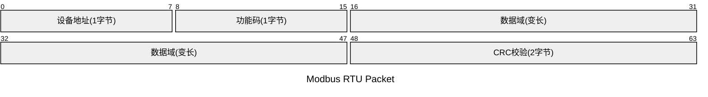
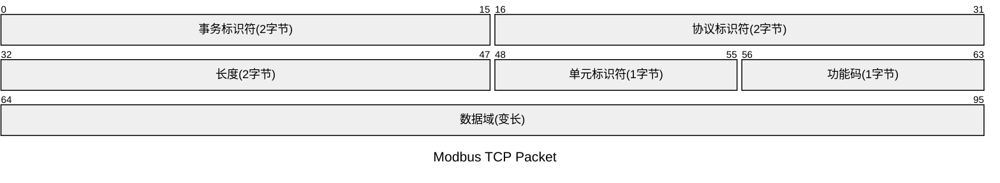
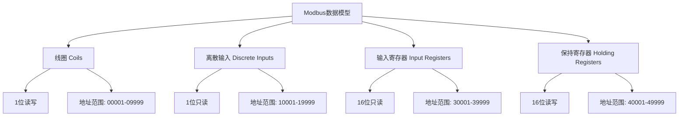
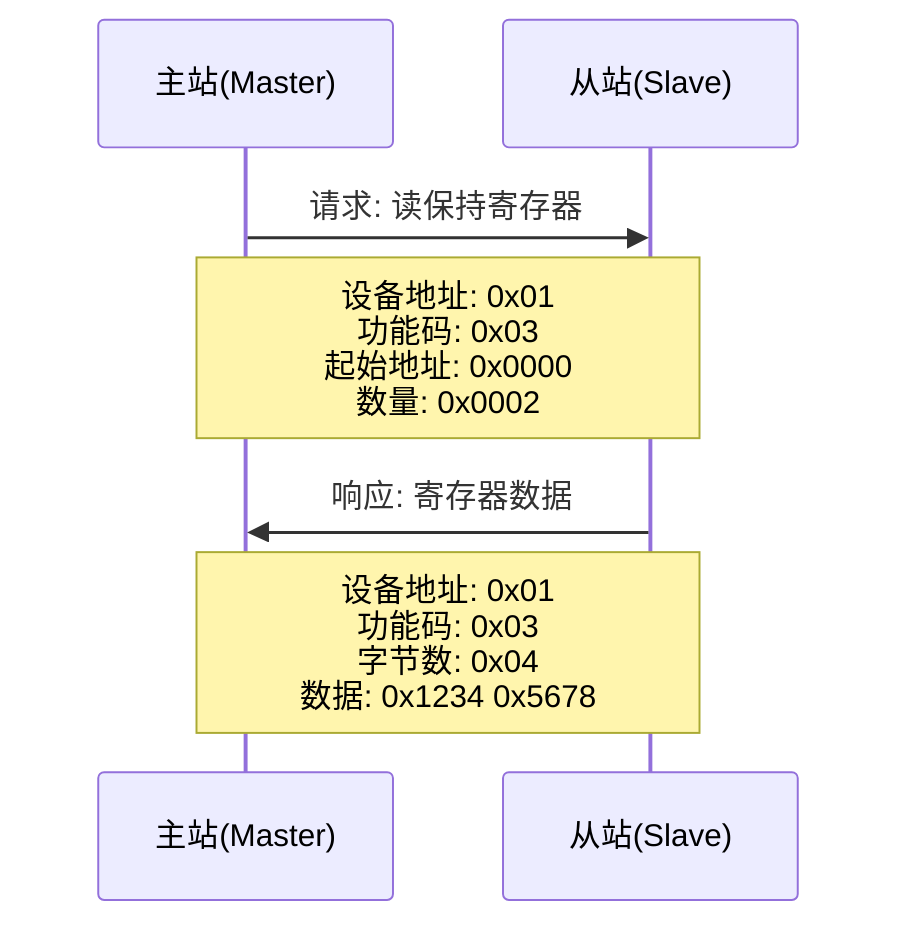
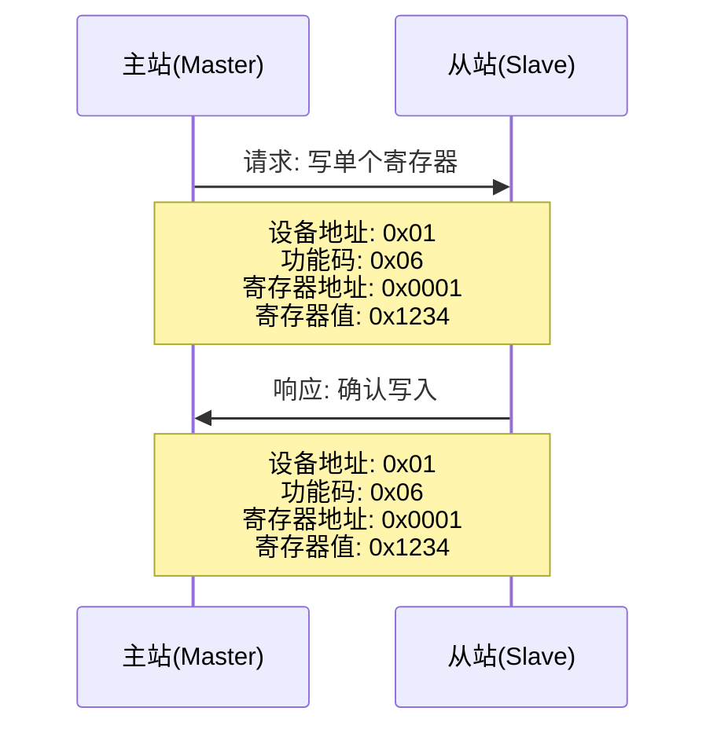
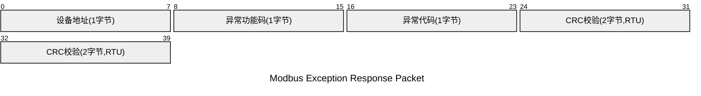

## 一、Modbus协议发展历史

Modbus协议是由Modicon公司（现为施耐德电气的一部分）在1979年开发的一种应用层通信协议。它是工业自动化领域中最早和最广泛使用的通信协议之一。

### 1.1 发展历程

- **1979年**: Modicon公司发布了Modbus协议，最初用于其可编程逻辑控制器（PLC）之间的通信
- **1980年代**: 协议逐渐被其他厂商采用，成为事实上的工业标准
- **1996年**: Modbus协议成为开放协议，任何厂商都可以免费使用
- **2004年**: 成立了Modbus组织（Modbus Organization），负责协议的维护和发展
- **至今**: 仍然是工业自动化领域最重要的通信协议之一

## 二、Modbus协议用途

Modbus协议主要用于工业自动化设备之间的通信，具有以下特点和用途：

### 2.1 应用领域

- **工业自动化**: PLC、DCS、SCADA系统之间的通信
- **能源管理**: 电力监控、能耗管理系统
- **楼宇自动化**: 暖通空调、照明控制系统
- **水处理**: 污水处理、供水系统监控
- **交通运输**: 地铁、机场等基础设施监控

### 2.2 协议优势

- **简单易用**: 协议结构简单，易于理解和实现
- **开放免费**: 无需支付授权费用，降低了实施成本
- **广泛支持**: 几乎所有工控设备都支持Modbus协议
- **可靠稳定**: 经过数十年的验证，协议稳定可靠
- **互操作性强**: 不同厂商的设备可以无缝互联

## 三、Modbus协议变体

Modbus协议有三种主要变体：

### 3.1 Modbus RTU
- 基于串行通信（RS-232、RS-485）
- 使用二进制编码
- 数据紧凑，传输效率高

### 3.2 Modbus ASCII
- 基于串行通信
- 使用ASCII字符编码
- 可读性好，便于调试

### 3.3 Modbus TCP/IP
- 基于以太网TCP/IP协议
- 速度快，支持长距离通信
- 易于集成到现代网络环境

## 四、Modbus协议报文格式

### 4.1 Modbus RTU报文格式


```mermaid
---
title: "Modbus RTU Packet"
---
packet-beta
0-7: "设备地址(1字节)"
8-15: "功能码(1字节)"
16-47: "数据域(变长)"
48-63: "CRC校验(2字节)"
```

#### 报文结构表

| 字节位置 | 字段名称 | 长度 | 说明 | 示例值 |
|----------|----------|------|------|--------|
| 0 | 设备地址 | 1字节 | 从站设备地址，范围1-247，0为广播地址 | 0x01 |
| 1 | 功能码 | 1字节 | 指定要执行的操作类型 | 0x03 |
| 2-N | 数据域 | 变长 | 包含请求或响应的具体数据 | 0x00 0x00 0x00 0x02 |
| N+1-N+2 | CRC校验 | 2字节 | 循环冗余校验码，低字节在前 | 0xC4 0x0B |

#### 完整报文示例

**读保持寄存器请求报文**：
```
01 03 00 00 00 02 C4 0B
```
- `01`: 设备地址
- `03`: 功能码（读保持寄存器）
- `00 00`: 起始地址（0）
- `00 02`: 寄存器数量（2个）
- `C4 0B`: CRC校验

### 4.2 Modbus TCP报文格式


```mermaid
---
title: "Modbus TCP Packet"
---
packet-beta
0-15: "事务标识符(2字节)"
16-31: "协议标识符(2字节)"
32-47: "长度(2字节)"
48-55: "单元标识符(1字节)"
56-63: "功能码(1字节)"
64-95: "数据域(变长)"
```

#### 报文结构表

| 字节位置 | 字段名称 | 长度 | 说明 | 示例值 |
|----------|----------|------|------|--------|
| 0-1 | 事务标识符 | 2字节 | 用于匹配请求和响应，高字节在前 | 0x00 0x01 |
| 2-3 | 协议标识符 | 2字节 | Modbus协议固定为0x0000 | 0x00 0x00 |
| 4-5 | 长度 | 2字节 | 后续字节数（单元标识符+功能码+数据域） | 0x00 0x06 |
| 6 | 单元标识符 | 1字节 | 从站设备地址 | 0x01 |
| 7 | 功能码 | 1字节 | 指定要执行的操作类型 | 0x03 |
| 8-N | 数据域 | 变长 | 包含请求或响应的具体数据 | 0x00 0x00 0x00 0x02 |

#### 完整报文示例

**读保持寄存器请求报文**：
```
00 01 00 00 00 06 01 03 00 00 00 02
```
- `00 01`: 事务标识符
- `00 00`: 协议标识符
- `00 06`: 长度（6字节）
- `01`: 单元标识符
- `03`: 功能码（读保持寄存器）
- `00 00`: 起始地址（0）
- `00 02`: 寄存器数量（2个）

## 五、常用功能码

### 5.1 读操作功能码

| 功能码 | 名称 | 说明 |
|--------|------|------|
| 0x01 | 读线圈状态 | 读取离散输出线圈的ON/OFF状态 |
| 0x02 | 读离散输入状态 | 读取离散输入的ON/OFF状态 |
| 0x03 | 读保持寄存器 | 读取保持寄存器中的数据 |
| 0x04 | 读输入寄存器 | 读取输入寄存器中的数据 |

### 5.2 写操作功能码

| 功能码 | 名称 | 说明 |
|--------|------|------|
| 0x05 | 写单个线圈 | 设置单个离散输出线圈的状态 |
| 0x06 | 写单个寄存器 | 设置单个保持寄存器的值 |
| 0x0F | 写多个线圈 | 设置多个离散输出线圈的状态 |
| 0x10 | 写多个寄存器 | 设置多个保持寄存器的值 |

## 六、数据模型

Modbus协议定义了四种基本数据类型：


```mermaid
graph TB
    A[Modbus数据模型] --> B[线圈 Coils]
    A --> C[离散输入 Discrete Inputs]
    A --> D[输入寄存器 Input Registers]
    A --> E[保持寄存器 Holding Registers]
    
    B --> B1[1位读写]
    B --> B2[地址范围: 00001-09999]
    
    C --> C1[1位只读]
    C --> C2[地址范围: 10001-19999]
    
    D --> D1[16位只读]
    D --> D2[地址范围: 30001-39999]
    
    E --> E1[16位读写]
    E --> E2[地址范围: 40001-49999]
```

## 七、典型通信流程

### 7.1 读保持寄存器示例


```mermaid
sequenceDiagram
    participant M as 主站(Master)
    participant S as 从站(Slave)
    
    M->>S: 请求: 读保持寄存器
    Note over M,S: 设备地址: 0x01<br/>功能码: 0x03<br/>起始地址: 0x0000<br/>数量: 0x0002
    
    S->>M: 响应: 寄存器数据
    Note over M,S: 设备地址: 0x01<br/>功能码: 0x03<br/>字节数: 0x04<br/>数据: 0x1234 0x5678
```

### 7.2 写单个寄存器示例


```mermaid
sequenceDiagram
    participant M as 主站(Master)
    participant S as 从站(Slave)
    
    M->>S: 请求: 写单个寄存器
    Note over M,S: 设备地址: 0x01<br/>功能码: 0x06<br/>寄存器地址: 0x0001<br/>寄存器值: 0x1234
    
    S->>M: 响应: 确认写入
    Note over M,S: 设备地址: 0x01<br/>功能码: 0x06<br/>寄存器地址: 0x0001<br/>寄存器值: 0x1234
```

## 八、错误处理

### 8.1 异常响应格式

当从站无法处理请求时，会返回异常响应：


```mermaid
---
title: "Modbus Exception Response Packet"
---
packet-beta
0-7: "设备地址(1字节)"
8-15: "异常功能码(1字节)"
16-23: "异常代码(1字节)"
24-39: "CRC校验(2字节,RTU)"
```

### 8.2 常见异常代码

| 异常代码 | 名称 | 说明 |
|----------|------|------|
| 0x01 | 非法功能码 | 从站不支持请求的功能码 |
| 0x02 | 非法数据地址 | 请求的数据地址不存在 |
| 0x03 | 非法数据值 | 请求中包含非法的数据值 |
| 0x04 | 从站设备故障 | 从站设备发生不可恢复的错误 |
| 0x05 | 确认 | 从站已接受请求但需要长时间处理 |
| 0x06 | 从站设备忙 | 从站正忙于处理其他命令 |

## 九、总结

Modbus协议作为工业自动化领域的经典协议，凭借其简单、可靠、开放的特点，在过去40多年中一直占据着重要地位。无论是传统的串行通信还是现代的以太网通信，Modbus协议都能很好地满足工业现场的通信需求。

TouchSocket框架提供了完整的Modbus协议实现，支持Modbus RTU、Modbus ASCII和Modbus TCP三种变体，为开发者提供了便捷的工业通信解决方案。