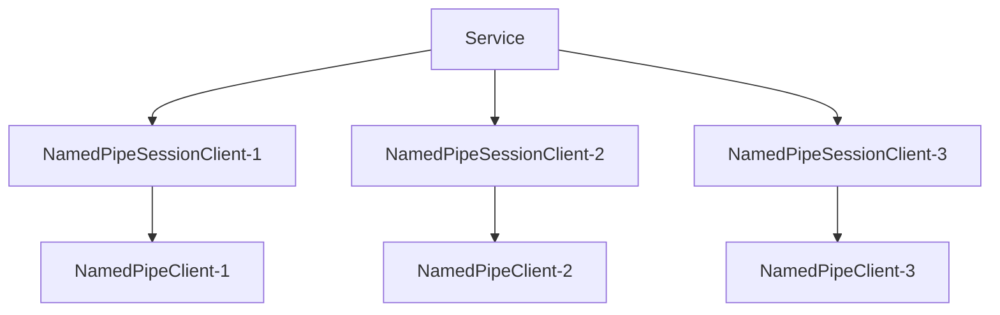

import Tag from "@site/src/components/Tag.js";
import Tabs from "@theme/Tabs";
import TabItem from "@theme/TabItem";
import { TouchSocketNamedPipeDefinition } from "@site/src/components/Definition.js";
import CustomCodeBlock from './CodeBlocks/CustomCodeBlock';
import CardLink from "@site/src/components/CardLink.js";

<TouchSocketNamedPipeDefinition />

## 一、说明

`NamedPipeService`是命名管道系服务器基类，它不参与实际的数据交互，只是配置、激活、管理、注销、重建`NamedPipeSessionClient`类实例。而`NamedPipeSessionClient`是当`NamedPipeClient`（客户端）成功连接服务器以后，由服务器新建的一个实例类，后续的所有通信，也都是通过该实例完成的。

## 二、特点

- 简单易用。
- 异步执行。
- 内存池支持
- 高性能（实测服务器单客户端单线程，每秒可接收数据流量可达6.5GB/s）。
- **多管道名称监听**（可以一次性监听多个管道名称）
- 适配器预处理，一键式解决**分包**、**粘包**、对象解析等（即适用于Tcp的一切适配器）。
- 超简单的同步发送、异步发送、接收等操作。
- 基于委托、[插件](./pluginsmanager.mdx)驱动，让每一步都能执行AOP。

## 三、产品应用场景

- 所有本机IPC(进程通讯)基础使用场景：可跨平台、跨语言使用。
- 高性能进程间通信：无需网络开销，直接在本机进程间传输数据。

## 四、服务器架构

### 4.1 连接架构

服务器在收到**新客户端连接**时，会创建一个`NamedPipeSessionClient`的派生类实例，与客户端`NamedPipeClient`一一对应，后续的数据通信均由此实例负责。

`NamedPipeSessionClient`在`Service`里面以字典映射。`ID`为键，`NamedPipeSessionClient`本身为值。

### 4.2 Scoped 生命周期

`NamedPipeService`在[支持Scoped](ioc.mdx)的`IOC`容器中工作时，也是支持`Scoped`区域划分的。

一般情况下，`NamedPipeService`在`Setup`时，首先会创建一个`Scoped`区域，用于整个`NamedPipeService`的生命周期。在`NamedPipeService`释放（`Dispose`）时释放。

然后，当有新客户端连接后，会为每个`NamedPipeSessionClient`的派生类实例也创建一个`Scoped`区域，用于`NamedPipeSessionClient`的生命周期。当连接断开时，会释放此区域。

## 五、可配置项

### 5.1 配置监听

简单情况下，直接设置管道名称进行监听。

<CustomCodeBlock region="示例简单NamedPipe服务器监听"/>

简单设置时，无法进行更加个性化的配置。例如：使用何种适配器等。

所以，可以使用`SetNamedPipeListenOptions`方法，进行个性化监听配置。

<CustomCodeBlock region="示例个性化NamedPipe服务器监听"/>

:::info 温馨提示

`SetPipeName`可以和`SetNamedPipeListenOptions`可以同时使用，但是需要注意的是，Config的全局配置仅会对`SetPipeName`单独生效的。`SetNamedPipeListenOptions`的地址配置均是单独配置的。

:::  

### 5.2 Id分配策略

`NamedPipeService`会在每次新建`NamedPipeSessionClient`时，分配一个Id。默认情况下，Id是随机分配的。
如果需要自定义Id分配策略，可以使用`SetGetDefaultNewId`方法。

<CustomCodeBlock region="服务器设置Id生成策略"/>

### 5.3 设置最大连接数量

`NamedPipeService`的最大连接数可以通过`SetMaxCount`方法设置。默认情况下，最大连接数为10000。

<CustomCodeBlock region="服务器最大连接数"/>

### 5.4 服务器名称

`NamedPipeService`支持设置服务器名称，可以通过`SetServerName`方法设置。默认情况下，服务器名称为Null。

<CustomCodeBlock region="服务器名称设置"/>

## 六、支持插件

|  插件方法| 功能 |
| --- | --- |
| INamedPipeConnectingPlugin | 此时管道实际上已经完成连接，但是并没有启动接收，然后触发。 |
| INamedPipeConnectedPlugin | 同意连接，且成功启动接收后触发 |
| INamedPipeClosingPlugin | 当客户端主动调用Close时触发 |
| INamedPipeClosedPlugin | 当客户端断开连接后触发 |
| INamedPipeReceivingPlugin | 在收到原始数据时触发，所有的数据均在ByteBlock里面。 |
| INamedPipeReceivedPlugin | 在收到适配器数据时触发，根据适配器类型，数据可能在ByteBlock或者IRequestInfo里面。 |
| INamedPipeSendingPlugin | 当即将发送数据时，调用该方法在适配器之后，接下来即会发送数据。 |
| IIdChangedPlugin | 当NamedPipeSessionClient的Id发生改变时触发。 |

## 七、创建NamedPipeService

### 7.1 简单创建

直接初始化NamedPipeService，会使用默认的**NamedPipeSessionClient**。
简单的处理逻辑可通过**Connecting**、**Connected**、**Received**等委托直接实现。

代码如下：

<CustomCodeBlock region="创建NamedPipeService"/>

:::info 温馨提示

Service.StartAsync()方法并不会阻塞当前运行，所以当在控制台运行时，可能需要使用Console.ReadKey()等操作进行阻塞。

:::  

### 7.2 泛型创建

通过泛型创建服务器，可以实现很多有意思，且能**重写**一些有用的功能。下面就演示，如何通过泛型创建自定义服务器。

代码如下：

（1）建立NamedPipeSessionClient继承类。

<CustomCodeBlock region="自定义NamedPipe服务器通讯会话"/>

（2）建立`NamedPipeService`继承类。使用**NamedPipeService的泛型**直接创建。

<CustomCodeBlock region="自定义NamedPipe服务器"/>

（3）启动服务器。

自定义服务器的配置和启动与普通服务器一致。

<CustomCodeBlock region="创建MyNamedPipeService服务器"/>

:::tip 建议

由上述代码可以看出，通过继承，可以更加灵活的实现扩展。如有必要，还可以直接从`NamedPipeServiceBase<>`继承，这样可以实现更底层的功能。

:::  

## 八、动态添加、移除监听配置

服务器支持在运行时，动态添加，和移除监听配置，这极大的为灵活监听提供了方便，并且还不影响现有连接。可以轻量级的实现Stop操作。

<CustomCodeBlock region="NamedPipe动态添加移除监听配置"/>

:::info 信息

在移除监听配置时，已完成连接的客户端不受影响。

:::  

## 九、接收数据

在NamedPipeService中，接收数据的方式有很多种。多种方式可以组合使用。

### 9.1 Received委托处理

当使用NamedPipeService（非泛型）创建服务器时，内部已经定义好了一个外置委托Received，可以通过该委托直接接收数据。

<CustomCodeBlock region="NamedPipe服务器使用Received异步委托接收数据"/>

### 9.2 重写NamedPipeSessionClient处理

正如7.2所示，可以直接在`MyNamedPipeSessionClient`的重写`OnNamedPipeReceived`中直接处理数据。

### 9.3 插件处理 <Tag>推荐</Tag>

按照`TouchSocket`的设计理念，使用插件处理数据，是一项非常简单，且高度解耦的方式。步骤如下：

（1）声明插件

插件可以先继承`PluginBase`，然后再实现需要的功能插件接口，可以按需选择泛型或者非泛型实现。

如果已经有继承类，直接实现`IPlugin`接口即可。

<CustomCodeBlock region="NamedPipe服务器使用插件接收"/>

（2）配置使用插件处理的服务器

<CustomCodeBlock region="NamedPipe服务器配置插件"/>

:::info 信息

当接收数据时，`Memory`与`RequestInfo`的值会根据适配器类型不同而不同。

:::  

### 9.4 异步阻塞接收

异步阻塞接收，即使用`await`的方式接收数据。其特点是能在代码上下文中，直接获取到收到的数据。

只是在服务器使用异步阻塞时，建议直接在`Connected`触发时相关使用。

下列将以插件为例：

<CustomCodeBlock region="NamedPipe服务器异步阻塞接收"/>

在异步阻塞接收时，当接收的数据不满足解析条件时，还可以缓存起来，下次一起处理。

例如：下列将演示接收字符串，当没有发现“\r\n”时，将缓存数据，直到发现重要字符。

:::tip 提示

异步阻塞接收，在等待接收数据时，不会阻塞线程资源，所以即使大量使用，也不会影响性能。

:::  

## 十、发送数据

按照架构图，每个客户端成功连接后，**服务器**都会创建一个派生自`NamedPipeSessionClient`的实例，并将其存以生成的`Id`为键，存在一个字典中。

所以，可以直接使用`NamedPipeSessionClient`直接发送。

例如，在`Received`委托中，直接回应数据：

<CustomCodeBlock region="NamedPipe服务器使用Received异步委托接收数据"/>

或者，如果你知道目标客户端的`Id`，那么可以使用`NamedPipeService`的`SendAsync`方法直接发送数据。

例如：

<CustomCodeBlock region="NamedPipe服务器按目标Id直接回应"/>

亦或者，可以先用id查到对应的`NamedPipeSessionClient`，然后用其提供的方法直接发送。

例如：

<CustomCodeBlock region="NamedPipe服务器按目标Id先查找再回应"/>

:::caution 注意

由于`NamedPipeSessionClient`的生命周期是由框架控制的，所以最好尽量不要直接引用该实例，可以引用`NamedPipeSessionClient.Id`，然后再通过服务器查找。

:::  

:::caution 注意

所有的发送，框架内部实际上**只实现了异步发送**，但是为了兼容性，仍然保留了同步发送的扩展。但是强烈建议如有可能，请**务必使用异步发送来提高效率**。

:::  

## 十一、清理和释放

### 11.1 清理（断开）连接

可以使用`Clear`方法，清理所有连接。

<CustomCodeBlock region="NamedPipe清理当前所有连接"/>

或者，如果你知道目标客户端的`Id`，那么可以使用`Close`方法，清理指定连接。

<CustomCodeBlock region="NamedPipe清理指定连接"/>

### 11.2 移除监听

可以使用`RemoveListen`方法，停止指定命名管道监听器。

<CustomCodeBlock region="NamedPipe服务器停止监听"/>

:::tip 提示

停止监听时，已完成连接的客户端不受影响。

:::  

### 11.3 停止服务器

可以使用`Stop`方法，停止服务器。

<CustomCodeBlock region="NamedPipe停止服务器"/>

:::info

停止服务器时，会断开连接的所有客户端。随后可以重新启动服务器。

:::  

### 11.4 释放资源

可以使用`Dispose`方法，释放服务器资源。

<CustomCodeBlock region="NamedPipe释放服务器资源"/>

## 十二、重置Id

每个客户端在连接时，服务器都会为连接的客户端**新分配**一个唯一的`Id`。也就是说，在服务器中`Id`与`NamedPipeSessionClient`实例就是一一对应的。

### 12.1 配置初始Id策略

默认情况下服务器都会根据**历史连接数量**，为连接的客户端新分配`Id`。也就是说，第1个连接的，其Id就是1（表现形式为`01-00-00-00`），以此类推。

当然我们可以自由的定义`Id`策略，只需要在`Config`配置中。

<CustomCodeBlock region="NamedPipe服务器设置Id生成策略"/>

### 12.3 即时修改Id

上述修改Id的方式，应该还不足以应对所有情况。有时候我们希望，在该连接完成，且经过某种验证之后再设置新的Id，那么我们可以通过`ResetIdAsync`的方法，来实现需求。

#### 12.3.1 通过Service直接修改

<CustomCodeBlock region="服务器重置Id"/>

#### 12.3.2 通过NamedPipeSessionClient修改

首先，需要获取到`NamedPipeSessionClient`。

一般使用`Service`，或者在插件中，都可以获取到`NamedPipeSessionClient`。

然后需要判断该`NamedPipeSessionClient`是否实现了`IIdClient`接口。一般服务器端的终端，都会实现`IIdClient`接口。

<CustomCodeBlock region="服务器通过SessionClient重置Id"/>

:::note 备注

上述的Id标识，仅仅是服务器`NamedPipeService`和辅助客户端`NamedPipeSessionClient`之间的关联。与客户端`NamedPipeClient`是没有任何关系的。

:::  

## 十三、示例Demo

<CardLink link="examples/NamedPipe"/>

