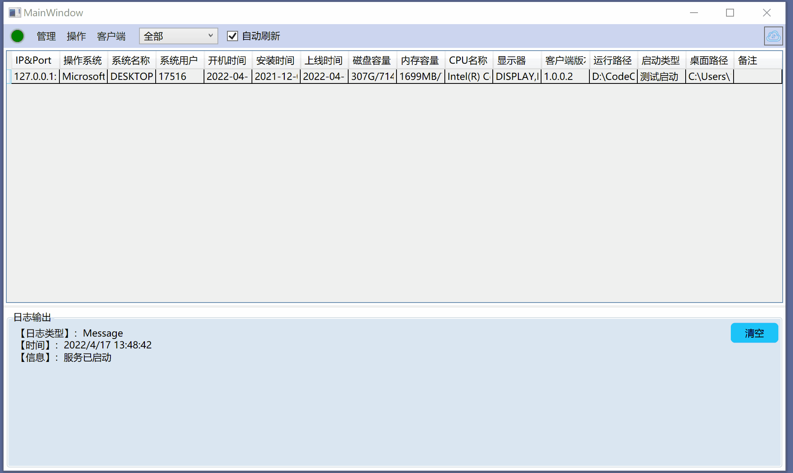

## 定制方
网友 
## 说明
应该网友要求，基本完成了预定的所有功能，包括远程更新、远程屏幕监测、屏幕操作、远程文件资源管理器、远程控制台、远程注册表操作、远程文件操作（删除、复制、重命名、压缩）、等等。

## 技术点

- 整体界面：应定制方要求，界面使用原始控件。
- 各种远程操作：均采用的是RRQM通信框架。
## 效果
【客户端——被控制端】

客户端是个winform的无界面程序。

【服务器——管理端】

