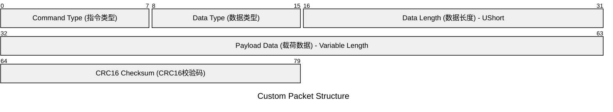

import BilibiliCard from '@site/src/components/BilibiliCard.js';
import CardLink from "@site/src/components/CardLink.js";
import { TouchSocketCoreDefinition } from "@site/src/components/Definition.js";
import CustomCodeBlock from './CodeBlocks/CustomCodeBlock';

<TouchSocketCoreDefinition />

## 概述

单线程流式适配器是`TouchSocket`框架中用于处理流式数据流的核心组件，主要用于解决网络、管道、串口等通信等流式数据中的粘包、分包问题。

在流式数据通信中，由于数据传输的连续性和网络传输特性，经常会遇到数据粘包和分包的问题。粘包是指发送方发送的多个数据包在接收方被合并成一个数据包接收；分包则是指一个完整的数据包被拆分成多个片段进行传输。这些问题会导致接收方无法正确解析数据结构，影响应用程序的正常运行。

TouchSocket框架提供了一套完整的适配器解决方案来处理这些问题。适配器作为数据处理的中间层，位于原始数据流和应用逻辑之间，负责将连续的字节流按照特定的协议规则解析成完整的数据包。

本文档涵盖了TouchSocket框架中所有类型的单线程流式适配器，从最基础的原始适配器到高度封装的模板解析适配器，每种适配器都有其特定的使用场景和优势。通过合理选择和使用这些适配器，开发者可以轻松处理各种复杂的数据协议，确保数据的完整性和准确性。

适配器的主要优势包括：

- **自动化处理**：无需手动处理复杂的数据拆分和组合逻辑
- **高性能**：采用内存池和零拷贝技术，最大化传输效率
- **灵活性**：支持自定义数据格式和解析规则
- **可靠性**：内置错误检测和恢复机制
- **易用性**：提供多种现成的模板适配器，满足常见的数据协议需求

## 示例说明

为了更好地理解和使用单线程流式适配器，本文档将通过一个具体的示例来说明适配器的实现和应用。

假设我们有一个简单的自定义协议，数据格式如下：

- 第1个字节表示指令类型
- 第2字节表示数据类型
- 第3字节表示后续数据的长度。使用ushort大端表示，最大长度为65535
- 后续字节表示载荷数据
- 最后2字节表示CRC16校验码

包结构如下：

## 一、使用适配器

单线程流式适配器可以配置在所有流式组件中，例如：Tcp客户端和服务器、管道客户端和服务器、串口等。

### 1.1 配置使用

在`TouchSocketConfig`配置中，使用`SetTcpDataHandlingAdapter`、`SetNamedPipeDataHandlingAdapter`、`SetSerialDataHandlingAdapter`等方法进行配置。

<CustomCodeBlock region="配置使用Tcp适配器"/>
<CustomCodeBlock region="配置使用NamedPipe适配器"/>
<CustomCodeBlock region="配置使用Serial适配器"/>

:::caution 注意

适配器在配置时，必须使用`new`关键字创建**新实例**，不能使用单例模式。

:::  

### 1.2 直接设置

可以在任意时刻，例如在连接成功后，直接通过`SetAdapter`方法直接进行配置。

<CustomCodeBlock region="示例Tcp客户端直接设置适配器"/>

:::info 信息

1. `SetAdapter`是非公共方法，必须在继承后才可使用。
2. 一般建议在连接初始化（例如：OnTcpConnecting）时进行配置，避免在数据处理中途更换适配器，导致数据异常。

:::  

## 二、使用原始适配器解析数据

### 2.1 说明

原始适配器则是直接从`SingleStreamDataHandlingAdapter`继承，能够在第一时间，第一手接触到流式源数据。
可以自定实现数据的继续投递方式。

例如：对于最开始假设的数据格式。我们可以这样解析：

<BilibiliCard title="原始适配器" link="https://www.bilibili.com/cheese/play/ep1522770" isPro="true"/>

<CustomCodeBlock region="使用原始数据适配器解析"/>

### 2.2 示例Demo

<CardLink link="examples/Adapter/AdapterConsoleApp"/>

## 二、内置包适配器

### 2.1 说明

内置包适配器，是框架内置的，用于直接解决粘、分包问题的现成适配器。

它需要客户端和服务器配套使用，能一键式解决粘、分包问题。

目前内置的包适配器有以下几种：

### 2.2 固定包头数据处理适配器

1. 最有力的解决粘包。分包问题。
2. 是自定义协议的不二选择。
3. 支持指定包头长度，`Byte`、`Ushort`、`Int`三种类型作为包头。
4. 最好在客户端与服务器均使用`TouchSocket`组件时使用。不然就需要非`TouchSocket`的一方适配包头算法。

<BilibiliCard title="内置包适配器之固定包头适配器" link="https://www.bilibili.com/cheese/play/ep1510469" isPro="true"/>

#### 2.2.1 固定包头算法解释

- Byte包头算法：以第一个字节作为后续整个数据的长度，整个数据长度区间为[0,255]。
- Ushort包头算法：前2个字节，且为[默认端序（小端）](./touchsocketbitconverter.mdx)的排列，作为后续整个数据的长度，整个数据长度区间为[0,65535]。
- Int包头算法（默认配置）：前4个字节，且为[默认端序（小端）](./touchsocketbitconverter.mdx)排列，作为后续整个数据的长度，整个数据长度区间为[0,2^31]。

#### 2.2.2 使用

<CustomCodeBlock region="示例内置固定包头适配器"/>

#### 2.2.3 接收数据

固定包头数据处理适配器会把数据通过`Memory`进行投递，所以在`Received`中，直接解析`Memory`即可。

<CustomCodeBlock region="内置包适配器按Memory解析"/>

:::tip 提示

固定包头数据处理适配器会对发送的数据进行处理，添加包头。

:::  

### 2.3 固定长度数据处理适配器

1. 无论何时，发送与接收的数据长度永远为设定值。
2. 算法简单，可以比较轻松的实现跨语言、跨框架。
3. 一般适用于业务数据固定场景，

<BilibiliCard title="内置包适配器之固定长度适配器" link="https://www.bilibili.com/cheese/play/ep1522720" isPro="true"/>

#### 2.3.1 固定长度数据处理算法

固定长度数据处理算法比较简单，就是事先约定发送数据的长度无论何时都是一致的。

#### 2.3.2 使用

<CustomCodeBlock region="示例内置固定长度适配器"/>

#### 2.3.3 接收数据

固定长度数据处理适配器会把数据通过`Memory`进行投递，所以在`Received`中，直接解析`Memory`即可。

<CustomCodeBlock region="内置包适配器按Memory解析"/>

:::tip 提示

固定长度数据处理适配器会对发送的数据进行检查，如果长度不符合要求，则会抛出异常。

:::

### 2.4 终止因子数据处理适配器

1. 最适用于字符串类（`Json`，`Xml`等）的信息交互。
2. 算法简单，非常容易实现跨语言、跨框架。
3. 发送普通流数据时，有很小的概率发生提前终止的情况（可设置复杂终止因子来解决）。

<BilibiliCard title="内置包适配器之终止因子适配器" link="https://www.bilibili.com/cheese/play/ep1522721" isPro="true"/>

#### 2.4.1 终止因子分割数据算法

终止因子分割数据算法，就是通过事先约定，发送的数据是以特定数据的组合作为结束的。例如：`redis`协议，就是以`\r\n`作为结束。不过值得注意的是，框架内置的不仅可以用字符串作为终止字符，还能以16进制甚至二进制作为终止字符。

#### 2.4.2 使用

<CustomCodeBlock region="示例内置终止字符适配器"/>

#### 2.4.3 接收数据

终止因子数据处理适配器会把数据通过`Memory`进行投递，所以在`Received`中，直接解析`Memory`即可。

<CustomCodeBlock region="内置包适配器按Memory解析"/>

### 2.5 周期数据处理适配器

1. 可处理任意数据。
2. 只能解决分包问题，无法解决粘包问题。
3. 处理效率会有一定延迟。

<BilibiliCard title="内置包适配器之周期时间适配器" link="https://www.bilibili.com/cheese/play/ep1522723" isPro="true"/>

#### 2.5.1 周期数据算法

周期数据处理适配器，就是通过判断收到数据的时间间隔，将极短时间内收到的数据进行合并。能够一定程度的解决分包问题。

#### 2.5.2 使用

<CustomCodeBlock region="示例内置周期时间适配器"/>

#### 2.5.3 接收数据

周期数据处理适配器会把数据通过`Memory`进行投递，所以在`Received`中，直接解析`Memory`即可。

<CustomCodeBlock region="内置包适配器按Memory解析"/>

### 2.6 Json格式数据处理适配器

1. 能够处理任意标准`Json`数据。
2. 能够提取出信息中的杂质数据。
3. 支持单个`Object`数据、或者`Array`数据。
4. 支持类型嵌套格式。

<BilibiliCard title="内置包适配器之Json包适配器" link="https://www.bilibili.com/cheese/play/ep1522730" isPro="true"/>

#### 2.6.1 Json格式数据处理算法

Json格式数据处理算法，就是对接收的字符串进行大括号和中括号的计数，当成对的括号组合，来确定一个完整的json数据。

#### 2.6.2 使用

<CustomCodeBlock region="示例内置Json适配器"/>

#### 2.6.3 接收数据

Json格式数据处理适配器会把数据通过`IRequestInfo`进行投递，所以在`Received`中，需要把`IRequestInfo`转为`JsonPackage`。

<CustomCodeBlock region="内置包Json适配器按JsonPackage解析"/>

:::tip 提示

`Json`格式数据处理适配器不对发送的数据做处理，仅仅对接收到的数据做处理。

:::  

### 2.7 示例Demo
<CardLink link="examples/Adapter/PackageAdapterConsoleApp"/>

## 三、用户自定义适配器

### 3.1 说明

用户自定义适配器，是为了解决当用户的数据是其他情况的问题。不过和原始适配器相比，用户自定义适配器（**CustomDataHandlingAdapter**）要简单很多。因为他提供了很多指令可以组合处理不同情况，而你只需要简单调用即可。

<BilibiliCard title="用户自定义适配器(1)" link="https://www.bilibili.com/cheese/play/ep1522768" isPro="true"/>
<BilibiliCard title="用户自定义适配器(2)" link="https://www.bilibili.com/cheese/play/ep1522769" isPro="true"/>

### 3.2 运行逻辑

返回指令类型：

- FilterResult.Cache：将Reader中的可读数据进行缓存，用于和下次接收数据做拼接。
- FilterResult.Success：完成本次数据解析，向`Received`投递`IRequestInfo`对象。在返回之前，请一定确保已经消费过数据。不然会发生无限循环的危险情况。
- FilterResult.GoOn：从当前可读的数据重新投递，所以在返回之前，请一定确保已经推进过至少1位数据。不然会发生无限循环的危险情况。

:::danger 注意

返回`Success`或者`GoOn`指令时，请一定确保推进过至少1位数据。不然会发生无限循环的危险情况。

:::  

### 3.3 创建适配器

还是以最开始数据为例：

<CustomCodeBlock region="用户自定义适配器"/>

### 3.4 使用自定义适配器接收数据

<CustomCodeBlock region="使用自定义适配器接收数据"/>

### 3.5 示例Demo
<CardLink link="examples/Adapter/CustomAdapterConsoleApp"/>

## 四、模板解析"固定包头"数据适配器

### 4.1 说明

和用户自定义适配器相比，使用模板解析将会更加简单流程。

例如在上节所说的数据格式，由于前4个字节总是固定，且至少需要4个字节才能继续解析，所以我们把类似这样的数据格式，叫做"**固定包头**"数据，那么，他就可以使用固定包头数据解析模板。

一般来说，绝大多数数据协议都是**固定包头长度**的，例如：modbus协议，或者文本即将解析的数据格式。他们都是经典的固定包头格式，具有Header+Body的明显分割点。但有时候，也有一些数据有好几段，例如：具有Crc校验的数据，也就是Header+Body+Crc的格式，这时候，我们可以把Body+Crc看做一段数据，然后从Header解析BodyLength以后，加上Crc的长度。最后会在OnParsingBody时，将Body和Crc一起投递，届时做好数据分割即可。

所以，学会观察数据，是使用模板解析的前提。

<BilibiliCard title="用户适配器之固定包头模板适配器" link="https://www.bilibili.com/cheese/play/ep1522741" isPro="true"/>

### 4.2 特点

1. 可以自由适配**99%**的数据协议（例如：`modbus`，电力控制协议等）。
2. 可以随意定制数据协议。
3. 可以与**任意语言、框架**对接数据。

### 4.3 创建适配器

<CustomCodeBlock region="创建自定义固定包头适配器"/>

### 4.4 使用

<CustomCodeBlock region="接收自定义固定包头适配器"/>

### 4.5 示例Demo
<CardLink link="examples/Adapter/CustomFixedHeaderConsoleApp"/>

## 五、模板解析"大数据固定包头"数据适配器

### 5.1 说明

大数据固定包头，是对固定的包头模板的补充，一般来是，固定包头适配器，不能工作于超过2G的数据，但是在少数情况下，会有大量的数据传输需求。所以这部分的业务，可以用大数据固定包头实现。

<BilibiliCard title="用户适配器之大数据固定包头模板适配器" link="https://www.bilibili.com/cheese/play/ep1522755" isPro="true"/>

### 5.2 特点

1. 可以随意定制数据协议。
2. 可以与**任意语言、框架**对接数据。
3. 可以接收**理论无限大**的数据。

### 5.3 创建适配器

<CustomCodeBlock region="创建自定义大数据固定包头适配器"/>

### 5.4 使用

<CustomCodeBlock region="接收自定义大数据固定包头适配器"/>

### 5.5 示例Demo
<CardLink link="examples/Adapter/CustomBigFixedHeaderConsoleApp"/>

## 六、模板解析"不固定包头"数据适配器

### 6.1 说明

有时候，我们需要解析的数据的包头是不定的，例如：`HTTP`数据格式，其数据头和数据体由`\r\n`隔开，而数据头又因为请求者的请求信息的不同，头部数据量不固定，而数据体的长度，也是由数据头的`ContentLength`的值显式指定的，所以，可以考虑使用`CustomUnfixedHeaderDataHandlingAdapter`解析。

<BilibiliCard title="用户适配器之非固定包头模板适配器" link="https://www.bilibili.com/cheese/play/ep1522756" isPro="true"/>

### 6.2 特点

1. 可以自由适配**所有**的数据协议。
2. 可以随意定制数据协议。
3. 可以与**任意语言、框架**对接数据。

### 6.3 创建适配器

<CustomCodeBlock region="创建自定义非固定包头适配器"/>

### 6.4 使用

<CustomCodeBlock region="接收自定义非固定包头适配器"/>

### 6.5 示例Demo
<CardLink link="examples/Adapter/CustomUnfixedHeaderConsoleApp"/>

## 七、模板解析"大数据不固定包头"数据适配器

### 7.1 说明

大数据不固定包头，是对不固定的包头模板的补充，一般来是，不固定包头适配器，不能工作于超过2G的数据，但是在少数情况下，会有大量的数据传输需求。所以这部分的业务，可以用大数据不固定包头实现。

<BilibiliCard title="用户适配器之大数据非固定包头模板适配器" link="https://www.bilibili.com/cheese/play/ep1522757" isPro="true"/>

### 7.2 特点

1. 可以随意定制数据协议。
2. 可以与**任意语言、框架**对接数据。
3. 可以接收**理论无限大**的数据。

### 7.3 创建适配器
<CustomCodeBlock region="创建自定义大数据非固定包头适配器"/>
### 7.4 使用
<CustomCodeBlock region="接收自定义大数据非固定包头适配器"/>

### 7.5 示例Demo
<CardLink link="examples/Adapter/CustomBigUnfixedHeaderConsoleApp"/>

## 八、模板解析"区间数据"数据适配器

### 8.1 说明

区间适配器，一般用于字符串类的消息，类似"\*\*Hello##"，该数据，以\*\*开头，以##结尾。当然，区间适配器也能用于二进制数据，但是会有概率发生标识重复的情况。所以，用于二进制时，应当设置较复杂的区间标识。

该适配器与[终止因子分割适配器](./packageadapter.mdx)相比，可以设置开头的字符区间。

<BilibiliCard title="用户适配器之区间字符模板适配器" link="https://www.bilibili.com/cheese/play/ep1522752" isPro="true"/>

### 8.2 特点

1. 可以自由适配**很多**的字符串数据协议。
2. 可以随意定制数据协议。
3. 可以与**任意语言、框架**对接数据。

### 8.3 创建适配器

<CustomCodeBlock region="创建自定义区间适配器"/>

### 8.4 使用

<CustomCodeBlock region="接收自定义区间适配器"/>

### 8.5 示例Demo
<CardLink link="examples/Adapter/BetweenAndConsoleApp"/>

## 九、模板解析"固定数量分隔符"数据适配器

### 9.1 说明

固定数量分隔符数据适配器，用于解析固定数量分隔符的数据。在此适配器中，我们使用固定数量分隔符来解析数据。相比于区间分隔符数据适配器，此适配器可以处理更复杂的数据。

<BilibiliCard title="用户适配器之固定数量分隔符适配器" link="https://www.bilibili.com/cheese/play/ep1522753" isPro="true"/>

### 9.2 特点

1. 可以自由适配**很多**的字符串数据协议。
2. 可以与**任意语言、框架**对接数据。

### 9.3 创建适配器
<CustomCodeBlock region="创建自定义固定数量分隔符适配器"/>

### 9.4 使用
<CustomCodeBlock region="接收自定义固定数量分隔符适配器"/>

### 9.5 示例Demo
<CardLink link="examples/Adapter/CustomCountSpliterDataHandlingAdapterConsoleApp"/>

## 十、模板解析"Json"数据适配器

### 10.1 说明

Json适配器，一般用于Json字符串类的消息。可以直接通过Json串解析出对应的数据协议。

<BilibiliCard title="用户适配器之Json模板适配器" link="https://www.bilibili.com/cheese/play/ep1522754" isPro="true"/>

### 10.2 特点

1. 可以自由适配**很多**的字符串数据协议。
2. 可以与**任意语言、框架**对接数据。

### 10.3 创建适配器
<CustomCodeBlock region="创建自定义Json适配器"/>

### 10.4 使用
<CustomCodeBlock region="接收自定义Json适配器"/>

### 10.5 示例Demo
<CardLink link="examples/Adapter/CustomJsonDataHandlingAdapterConsoleApp"/>

## 十一、适配器可设置参数

|  属性   | 描述  |默认值  |
|  ----  | ----  |----  |
| MaxPackageSize  | 适配器能接收的最大数据包长度 |1024\*1024\*1024字节|
| CanSendRequestInfo  | 是否允许发送IRequestInfo对象 |false|
| CacheTimeoutEnable  | 是否启用缓存超时。 |true|
| CacheTimeout  | 缓存超时时间。 |1秒|

<BilibiliCard title="适配器参数之缓存超时设置" link="https://www.bilibili.com/cheese/play/ep1522790" isPro="true"/>
<BilibiliCard title="适配器参数之最大(小)包设置" link="https://www.bilibili.com/cheese/play/ep1522791" isPro="true"/>
<BilibiliCard title="全局设置适配器参数" link="https://www.bilibili.com/cheese/play/ep1522799" isPro="true"/>

## 十二、结语

通过本文档的详细介绍，我们全面了解了TouchSocket框架中单线程流式适配器的完整体系和使用方法。从最基础的原始适配器到高度封装的模板解析适配器，每种适配器都为不同的应用场景提供了优雅的解决方案。

### 12.1 适配器选择指南

在实际开发中，选择合适的适配器至关重要：

- **性能优先**：需要最高性能和最大灵活性时，使用**原始适配器**，直接处理字节流
- **快速开发**：对于常见协议格式，优先选择**内置包适配器**（固定包头、终止因子等）
- **自定义协议**：当数据格式复杂但有规律时，使用**模板解析适配器**
- **特殊需求**：对于非标准格式或复杂逻辑，采用**用户自定义适配器**

### 12.2 最佳实践总结

1. **统一性**：确保客户端和服务器使用相同的适配器配置
2. **性能优化**：合理设置最大包长度和缓存超时参数
3. **错误处理**：在适配器中实施完善的错误检测和恢复机制  
4. **测试验证**：使用框架提供的`DataHandlerTester`工具验证适配器正确性
5. **文档记录**：为自定义适配器编写详细的协议文档

### 12.3 发展前景

TouchSocket的适配器系统不仅解决了网络通信中的粘包分包问题，更为构建可靠、高效的分布式系统奠定了坚实基础。随着物联网、边缘计算等领域的快速发展，这套完善的适配器解决方案将在更多场景中发挥重要作用。

掌握了这些适配器的使用方法，您就拥有了处理各种复杂网络协议的强大工具。无论是传统的TCP/IP通信，还是现代的IoT设备互联，TouchSocket的适配器都能为您提供稳定可靠的数据处理能力。

:::tip 提示

上述创建的适配器客户端与服务器均适用。如有疑问，请参考相关示例Demo或访问官方社区获取技术支持。

:::  
