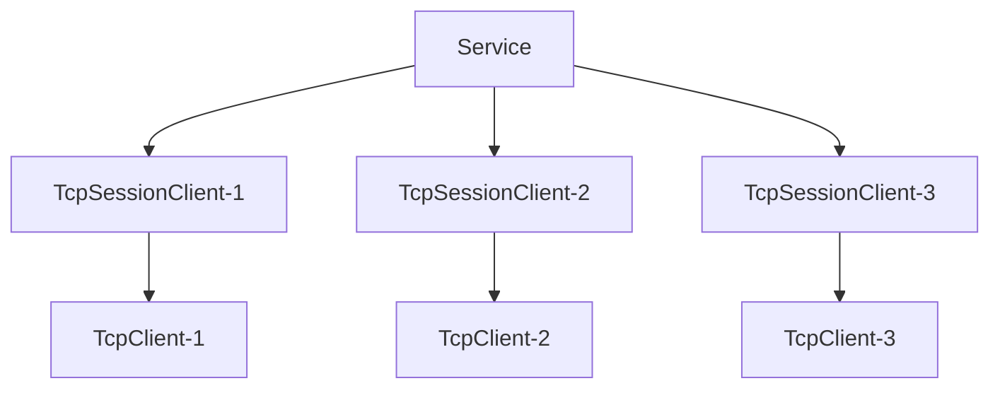

import Tag from "@site/src/components/Tag.js";
import BilibiliCard from '@site/src/components/BilibiliCard.js';
import Tabs from "@theme/Tabs";
import TabItem from "@theme/TabItem";
import { TouchSocketDefinition } from "@site/src/components/Definition.js";
import CustomCodeBlock from './CodeBlocks/CustomCodeBlock';
import CardLink from "@site/src/components/CardLink.js";

### 定义

<TouchSocketDefinition />


## 一、说明

`TcpService`是`Tcp`系服务器基类，它不参与实际的数据交互，只是配置、激活、管理、注销、重建`SessionClient`类实例。而`SessionClient`是当`TcpClient`（客户端）成功连接服务器以后，由服务器新建的一个实例类，后续的所有通信，也都是通过该实例完成的。

## 二、特点

- 简单易用。
- `IOCP`多线程。
- 内存池支持
- 高性能（实测服务器单客户端单线程，每秒可接收200w条8字节的信息，接收数据流量可达3GB/s）。
- **多地址监听**（可以一次性监听多个IP及端口）
- 适配器预处理，一键式解决**分包**、**粘包**、对象解析(如HTTP，Json)等。
- 超简单的同步发送、异步发送、接收等操作。
- 基于委托、[插件](./pluginsmanager.mdx)驱动，让每一步都能执行AOP。

### 2.1 吞吐量性能测试

如下图所示，使用最简单数据接收，不做任何处理。数据吞吐量可达3Gb。 [测试Demo示例](https://gitee.com/RRQM_Home/TouchSocket/tree/master/performancetest/Tcp/TcpFlowStressTestingConsoleApp)


### 2.2 连接性能测试

如下图所示，使用最简单连接测试，不做任何处理。建立1000本地连接仅需0.1秒。 [测试Demo示例](https://gitee.com/RRQM_Home/TouchSocket/tree/master/performancetest/Tcp/TcpConnectStressTestingConsoleApp)


## 三、产品应用场景

- 所有Tcp基础使用场景：可跨平台、跨语言使用。
- 自定义协议解析场景：可解析任意数据格式的TCP数据报文。

## 四、服务器架构

### 4.1 连接架构

服务器在收到**新客户端连接**时，会创建一个`SessionClient`的派生类实例，与客户端TcpClient一一对应，后续的数据通信均由此实例负责。

`SessionClient`在`Service`里面以字典映射。`ID`为键，`SessionClient`本身为值。



### 4.2 Scoped 生命周期

`TcpService`在[支持Scoped](ioc.mdx)的`IOC`容器中工作时，也是支持`Scoped`区域划分的。

一般情况下，`TcpService`在`Setup`时，首先会创建一个`Scoped`区域，用于整个`TcpService`的生命周期。在`TcpService`释放（`Dispose`）时释放。

然后，当有新客户端连接后，会为每个`SessionClient`的派生类实例也创建一个`Scoped`区域，用于`SessionClient`的生命周期。当连接断开时，会释放此区域。

<BilibiliCard title="TCP服务器线程模型解析" link="https://www.bilibili.com/cheese/play/ep1510437" isPro="true"/>

## 五、可配置项

### 5.1 配置监听

简单情况下，直接设置统一的监听IP和端口号组，可以一次性设置多个地址。 

<CustomCodeBlock region="示例简单Tcp服务器监听"/>

简单设置时，无法进行更加个性化的配置。例如：是否启用Ssl加密、使用何种适配器等。

所以，可以使用`SetListenOptions`方法，进行个性化监听配置。

<CustomCodeBlock region="示例个性化Tcp服务器监听"/>

所有配置监听的项，都是从`IPHost`类创建而来。

`IPHost`支持以下格式创建：

- 端口：直接按`int`入参，该操作一般在监听`Ipv4`时使用。
- IPv4：按"127.0.0.1:7789"入参。
- IPv6：按"[\*::\*]:7789"入参。

<BilibiliCard title="服务器监听配置" isPro="true" link="https://www.bilibili.com/cheese/play/ep1541394"/>

:::caution 注意

在监听时，只能使用IP地址和端口号进行监听，不能使用域名。例如：

✅ "127.0.0.1:7789"

❌ "https://touchsocket.net/"

:::  

### 5.2 Id分配策略

`TcpService`会在每次新建`SessionClient`时，分配一个Id。默认情况下，Id是随机分配的。
如果需要自定义Id分配策略，可以使用`SetGetDefaultNewId`方法。

<BilibiliCard title="服务器设置Id生成策略" link="https://www.bilibili.com/cheese/play/ep1541404" isPro="true"/>

<CustomCodeBlock region="服务器设置Id生成策略"/>

### 5.3 Tcp半连接队列

`TcpService`的半连接队列是指在服务器端，等待完成三次握手的连接请求队列。可以通过`SetBacklogProperty`方法设置。
<BilibiliCard title="服务器设置半连接数量" link="https://www.bilibili.com/cheese/play/ep1541411" isPro="true"/>

<CustomCodeBlock region="服务器设置半连接数量"/>

### 5.4 设置最大连接数量

`TcpService`的最大连接数可以通过`SetMaxCount`方法设置。默认情况下，最大连接数为10000。
<BilibiliCard title="服务器最大连接数" link="https://www.bilibili.com/cheese/play/ep1541412" isPro="true"/>

<CustomCodeBlock region="服务器最大连接数"/>

### 5.5 Ssl配置
`TcpService`支持Ssl配置，可以通过`SetServiceSslOption`方法设置。默认情况下，Ssl配置为Null，不启用Ssl加密。
<BilibiliCard title="SSL加密设置" link="https://www.bilibili.com/cheese/play/ep1541413" isPro="true"/>
<CustomCodeBlock region="SSL加密设置"/>

### 5.6 设置Socket的NoDelay属性

`TcpService`支持设置Socket的NoDelay属性，可以通过`UseNoDelay`方法设置。默认情况下，NoDelay属性为false。

<BilibiliCard title="配置NoDelay算法" link="https://www.bilibili.com/cheese/play/ep1541414" isPro="true"/>

<CustomCodeBlock region="配置NoDelay算法"/>

### 5.7 启用端口复用

`TcpService`支持启用端口复用，可以通过`UseReuseAddress`方法设置。默认情况下，端口复用为false。

<BilibiliCard title="服务器端口复用" link="https://www.bilibili.com/cheese/play/ep1541415" isPro="true"/>
<BilibiliCard title="复现服务器端口复用需求场景" link="https://www.bilibili.com/cheese/play/ep1541416" isPro="true"/>

<CustomCodeBlock region="服务器端口复用"/>

### 5.8 设置最大、最小缓存容量

`TcpService`支持设置最大、最小缓存容量，可以通过`SetMaxBufferSize`、`SetMinBufferSize`方法设置。默认情况下，最大缓存容量为自动，最小缓存容量为自动。

<BilibiliCard title="最大(小)接收缓存池的设定场景" link="https://www.bilibili.com/cheese/play/ep1541425" isPro="true"/>

<CustomCodeBlock region="接收缓存池的设定场景"/>

### 5.9 服务器名称

`TcpService`支持设置服务器名称，可以通过`SetServerName`方法设置。默认情况下，服务器名称为Null。

<CustomCodeBlock region="服务器名称设置"/>


## 六、支持插件

|  插件方法| 功能 |
| --- | --- |
| ITcpConnectingPlugin | 此时Socket实际上已经完成连接，但是并没有启动接收，然后触发。 |
| ITcpConnectedPlugin | 同意连接，且成功启动接收后触发 |
| ITcpClosingPlugin | 当客户端主动调用Close时触发 |
| ITcpClosedPlugin | 当客户端断开连接后触发 |
| ITcpReceivingPlugin | 在收到原始数据时触发，所有的数据均在ByteBlock里面。 |
| ITcpReceivedPlugin | 在收到适配器数据时触发，根据适配器类型，数据可能在ByteBlock或者IRequestInfo里面。 |
| ITcpSendingPlugin | 当即将发送数据时，调用该方法在适配器之后，接下来即会发送数据。 |
| IIdChangedPlugin | 当SessionClient的Id发生改变时触发。 |

## 七、创建TcpService

### 7.1 简单创建

直接初始化TcpService，会使用默认的**SessionClient**。
简单的处理逻辑可通过**Connecting**、**Connected**、**Received**等委托直接实现。

<BilibiliCard title="创建Tcp服务器" link="https://www.bilibili.com/cheese/play/ep1501990" isPro="true"/>

代码如下：

<CustomCodeBlock region="创建TcpService"/>

:::info 温馨提示

Service.StartAsync()方法并不会阻塞当前运行，所以当在控制台运行时，可能需要使用Console.ReadKey()等操作进行阻塞。

:::  

### 7.2 泛型创建

通过泛型创建服务器，可以实现很多有意思，且能**重写**一些有用的功能。下面就演示，如何通过泛型创建自定义服务器。

代码如下：

（1）建立SessionClient继承类。

<CustomCodeBlock region="自定义Tcp服务器通讯会话"/>

（2）建立`TcpService`继承类。使用**TcpService的泛型**直接创建。

<CustomCodeBlock region="自定义Tcp服务器"/>

（3）启动服务器。

自定义服务器的配置和启动与普通服务器一致。

<CustomCodeBlock region="创建MyService服务器"/>


:::tip 建议

由上述代码可以看出，通过继承，可以更加灵活的实现扩展。如有必要，还可以直接从`TcpServiceBase<>`继承，这样可以实现更底层的功能。

:::  

## 八、动态添加、移除监听配置

服务器支持在运行时，动态添加，和移除监听配置，这极大的为灵活监听提供了方便，并且还不影响现有连接。可以轻量级的实现Stop操作。

<CustomCodeBlock region="动态添加移除监听配置"/>

<BilibiliCard title="服务器动态监听" link="https://www.bilibili.com/cheese/play/ep1541399" isPro="true"/>

:::info 信息

在移除监听配置时，已完成连接的客户端不受影响。

:::  

## 九、接收数据

在TcpService中，接收数据的方式有很多种。多种方式可以组合使用。

### 9.1 Received委托处理

<BilibiliCard title="订阅事件完成基本通信" link="https://www.bilibili.com/cheese/play/ep1502002" isPro="true"/>

当使用TcpService（非泛型）创建服务器时，内部已经定义好了一个外置委托Received，可以通过该委托直接接收数据。

<CustomCodeBlock region="Tcp服务器使用Received异步委托接收数据"/>

### 9.2 重写TcpSessionClient处理

正如7.2所示，可以直接在`MySessionClient`的重写`OnTcpReceived`中直接处理数据。

### 9.3 插件处理 <Tag>推荐</Tag>

<Tabs
    defaultValue="tab1"
    values=
    {[
        { label: "文档",value: "tab1"},
        { label: "视频", value: "tab2" }
    ]}
>
<TabItem value="tab1">

按照`TouchSocket`的设计理念，使用插件处理数据，是一项非常简单，且高度解耦的方式。步骤如下：

（1）声明插件

插件可以先继承`PluginBase`，然后再实现需要的功能插件接口，可以按需选择泛型或者非泛型实现。

如果已经有继承类，直接实现`IPlugin`接口即可。

<CustomCodeBlock region="Tcp服务器使用插件接收"/>

（2）配置使用插件处理的服务器

```csharp
.ConfigurePlugins(a =>
{
    a.Add<TcpServiceReceivedPlugin>();
})
```

:::info 信息

当接收数据时，`Memory`与`RequestInfo`的值会根据适配器类型不同而不同。

:::  


</TabItem>
<TabItem value="tab2">
<BilibiliCard title="使用插件接收消息" link="https://www.bilibili.com/cheese/play/ep1504559" isPro="true"/>
<BilibiliCard title="注册插件的三种方式" link="https://www.bilibili.com/cheese/play/ep1504563" isPro="true"/>
<BilibiliCard title="插件的封装性和扩展性详解" link="https://www.bilibili.com/cheese/play/ep1504564" isPro="true"/>
<BilibiliCard title="插件的链式调用机制详解(1)" link="https://www.bilibili.com/cheese/play/ep1504565" isPro="true"/>
<BilibiliCard title="插件的链式调用机制详解(2)" link="https://www.bilibili.com/cheese/play/ep1504567" isPro="true"/>
<BilibiliCard title="在插件中获取IOC服务" link="https://www.bilibili.com/cheese/play/ep1504569" isPro="true"/>
<BilibiliCard title="插件的卸载" link="https://www.bilibili.com/cheese/play/ep1504575" isPro="true"/>
</TabItem>
</Tabs>


### 9.4 异步阻塞接收

异步阻塞接收，即使用`await`的方式接收数据。其特点是能在代码上下文中，直接获取到收到的数据。

只是在服务器使用异步阻塞时，建议直接在`Connected`触发时相关使用。

下列将以插件为例：

<CustomCodeBlock region="Tcp服务器异步阻塞接收"/>


:::tip 提示

异步阻塞接收，在等待接收数据时，不会阻塞线程资源，所以即使大量使用，也不会影响性能。

:::  

## 十、发送数据

按照架构图，每个客户端成功连接后，**服务器**都会创建一个派生自`TcpSessionClient`的实例，并将其存以生成的`Id`为键，存在一个字典中。

所以，可以直接使用`TcpSessionClient`直接发送。

例如，在`Received`委托中，直接回应数据：

<CustomCodeBlock region="Tcp服务器使用Received异步委托接收数据并回应"/>

或者，如果你知道目标客户端的`Id`，那么可以使用`TcpService`的`SendAsync`方法直接发送数据。

例如：

<CustomCodeBlock region="Tcp服务器按目标Id直接回应"/>

亦或者，可以先用id查到对应的`TcpSessionClient`，然后用其提供的方法直接发送。

例如：

<CustomCodeBlock region="Tcp服务器按目标Id先查找再回应"/>

:::caution 注意

由于`TcpSessionClient`的生命周期是由框架控制的，所以最好尽量不要直接引用该实例，可以引用`TcpSessionClient.Id`，然后再通过服务器查找。

:::  

:::caution 注意

所有的发送，框架内部实际上**只实现了异步发送**，但是为了兼容性，仍然保留了同步发送的扩展。但是强烈建议如有可能，请**务必使用异步发送来提高效率**。

:::  


## 十一、清理和释放

### 11.1 清理（断开）连接

可以使用`Clear`方法，清理所有连接。

<CustomCodeBlock region="Tcp清理当前所有连接"/>

或者，如果你知道目标客户端的`Id`，那么可以使用`Close`方法，清理指定连接。

<CustomCodeBlock region="Tcp清理指定连接"/>

### 11.2 移除监听

可以使用`RemoveListen`方法，停止指定Tcp监听器。

<CustomCodeBlock region="Tcp服务器停止监听"/>

:::tip 提示

停止监听时，已完成连接的客户端不受影响。

:::  

### 11.3 停止服务器

可以使用`Stop`方法，停止服务器。

<CustomCodeBlock region="Tcp停止服务器"/>

:::info

停止服务器时，会断开连接的所有客户端。随后可以重新启动服务器。

:::  

### 11.4 释放资源

可以使用`Dispose`方法，释放服务器资源。

<CustomCodeBlock region="Tcp释放服务器资源"/>

## 十二、重置Id

每个客户端在连接时，服务器都会为连接的客户端**新分配**一个唯一的`Id`。也就是说，在服务器中`Id`与`SessionClient`实例就是一一对应的。

<BilibiliCard title="服务器在任意时刻重置Id" link="https://www.bilibili.com/cheese/play/ep1541409" isPro="true"/>

### 12.1 配置初始Id策略

默认情况下服务器都会根据**历史连接数量**，为连接的客户端新分配`Id`。也就是说，第1个连接的，其Id就是1（表现形式为`01-00-00-00`），以此类推。

当然我们可以自由的定义`Id`策略，只需要在`Config`配置中。

<CustomCodeBlock region="服务器设置Id生成策略"/>

### 12.2 创建能代表连接的Id

上述这种`Id`规范，是与连接信息没有任何关联的，这也就意味着，这种方式是无法关联`SessionClient`的。

但往往，有时候，我们希望，`SessionClient`的`Id`，能一定程度的代表一些信息。例如：以客户端的IP和端口，作为唯一id。

那这时候，**服务器**可以订阅**Connecting**，然后，为新连接的`SessionClient`，设置与之有关联信息的id。

<CustomCodeBlock region="Tcp服务器连接时以IPPort作为Id"/>

### 12.3 即时修改Id

上述修改Id的方式，应该还不足以应对所有情况。有时候我们希望，在该连接完成，且经过某种验证之后再设置新的Id，那么我们可以通过`ResetIdAsync`的方法，来实现需求。

#### 12.3.1 通过Service直接修改

<CustomCodeBlock region="Tcp服务器重置Id"/>

#### 12.3.2 通过SessionClient修改

首先，需要获取到`SessionClient`。

一般使用`Service`，或者在插件中，都可以获取到`SessionClient`。

然后需要判断该`SessionClient`是否实现了`IIdClient`接口。一般服务器端的终端，都会实现`IIdClient`接口。

<CustomCodeBlock region="Tcp服务器通过SessionClient重置Id"/>

:::note 备注

上述的Id标识，仅仅是服务器`TcpService`和辅助客户端`SessionClient`之间的关联。与客户端`TcpClient`是没有任何关系的。

:::  

## 十三、AOT支持

Tcp使用AOT模式，即在编译时将Tcp的代码全部编译到程序中，而不是在运行时动态加载。

实际上，Tcp是完全支持AOT模式，

### 13.1 项目配置

.Net8以上对AOT支持比较好，所以最好使用.Net8以上。然后对项目配置一般如下：

```xml {3,4}
<PropertyGroup>
  ...
  <PublishAot>true</PublishAot>
  <InvariantGlobalization>true</InvariantGlobalization>
</PropertyGroup>
```

## 十四、示例Demo

<CardLink link="examples/Tcp"/>


