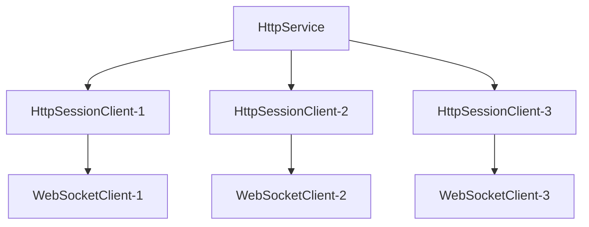

import Tag from "@site/src/components/Tag.js";
import BilibiliCard from '@site/src/components/BilibiliCard.js';
import Tabs from "@theme/Tabs";
import TabItem from "@theme/TabItem";
import { TouchSocketHttpDefinition } from "@site/src/components/Definition.js";
import CustomCodeBlock from './CodeBlocks/CustomCodeBlock';
import CardLink from "@site/src/components/CardLink.js";

### 定义

<TouchSocketHttpDefinition />

## 一、说明

`WebSocket`服务器是基于`HTTP`协议升级而来的长连接通信协议服务器。它继承自`HttpService`，在完成HTTP握手后，通过协议升级建立WebSocket连接。每个成功连接的客户端都会在服务器端创建一个对应的`HttpSessionClient`实例，后续的所有WebSocket通信都通过该实例完成。

## 二、特点

- 基于HTTP协议升级，支持标准WebSocket协议。
- 支持文本、二进制以及其他Type数据传输。
- 内置心跳机制（Ping/Pong）。
- 支持数据帧分包和组合。
- 支持WSS（WebSocket Secure）加密连接。
- 支持多种连接验证方式。
- 高性能异步处理。
- 基于插件驱动，支持AOP编程。

## 三、产品应用场景

- 实时通信应用：聊天室、在线客服、实时协作等。
- 实时数据推送：股票行情、游戏数据、监控数据等。
- 物联网设备通信：传感器数据上报、设备控制等。
- Web应用实时交互：在线编辑器、实时画板等。

## 四、服务器架构

### 4.1 连接架构

WebSocket服务器基于HTTP服务器，当收到WebSocket握手请求时，会将HTTP连接升级为WebSocket连接。每个WebSocket连接对应一个`HttpSessionClient`实例。

### 4.2 协议升级流程

1. 客户端发送HTTP握手请求
2. 服务器验证握手请求
3. 服务器响应握手成功
4. 连接升级为WebSocket协议
5. 开始WebSocket数据帧通信

## 五、可配置项

继承[HttpService](./httpservice.mdx)的所有配置项，无特殊配置。

## 六、支持插件接口

|  插件方法| 功能 |
| --- | --- |
| IWebSocketConnectingPlugin | 当收到握手请求之前，可以进行连接验证等 |
| IWebSocketConnectedPlugin | 当成功握手响应之后 |
| IWebSocketReceivedPlugin | 当收到Websocket的数据报文 |
| IWebSocketClosingPlugin | 当收到关闭请求时触发。如果对方直接断开连接，则此方法则不会触发。 |
| IWebSocketClosedPlugin | 当WebSocket连接断开时触发，无论是否正常断开。但如果是断网等操作，可能不会立即执行，需要结合心跳操作和CheckClear插件来进行清理。 |

## 七、创建WebSocket服务器

### 7.1 简单直接创建

最简单的方式是使用`WebSocket`插件，直接指定`URL`路由来接收`WebSocket`连接。

<BilibiliCard title="创建WebSocket服务器和客户端" link="https://www.bilibili.com/cheese/play/ep1709021" isPro="true"/>

<CustomCodeBlock region="创建WebSocket服务器"/>

### 7.2 验证连接

可以对连接的`URL`、`Query`参数、`Header`等进行验证，决定是否允许WebSocket连接。

<BilibiliCard title="使用WebApi等多种方法验证ws连接" link="https://www.bilibili.com/cheese/play/ep1709022" isPro="true"/>
<CustomCodeBlock region="WebSocket连接验证"/>

:::tip 提示

在验证过程中，如果`url`不匹配，或者不包含升级协议头的话，一般不需要额外处理，直接返回`false`即可。随后这个请求会被当作普通的`HTTP`请求处理。

如果`url`正确，但是其他鉴权没通过时，才需要直接进行`Http`响应。

:::  

### 7.3 其他方式创建

实际上，只要在升级协议后，能访问到`HttpContext`，即可通过`SwitchProtocolToWebSocketAsync`方式创建`WebSocket`连接更加灵活，可以方便地获取HTTP参数，实现多个URL的连接路由。

<CustomCodeBlock region="自定义转换WebSocket"/>

:::info 信息

`SwitchProtocolToWebSocketAsync`后的`WebSocket`实例还是会放置在所在的`HttpSessionClient`中，可以通过`HttpSessionClient.WebSocket`获取到。

:::  

### 7.4 创建基于SSL的WebSocket服务（WSS）

创建WSS（WebSocket Secure）服务器，只需在配置中添加SSL选项。详情： [Http服务器配置Ssl](./httpservice.mdx)

## 八、接收消息

WebSocket服务器有多种接收消息的方式，可以根据不同的使用场景选择合适的方法。

<BilibiliCard title="使用ws完成基本的数据接收和发送" link="https://www.bilibili.com/cheese/play/ep1709023" isPro="true"/>

### 8.1 插件方式接收消息

使用插件接收消息是最推荐的方式，它提供了高度解耦和灵活的数据处理能力。

**（1）定义插件：**

<CustomCodeBlock region="创建WebSocket接收插件"/>

**（2）配置使用插件：**

<CustomCodeBlock region="使用WebSocket接收插件"/>

:::tip 提示

在服务器端，默认情况下插件的所有函数都可能被并发执行，因此应当做好线程安全处理。更多详情请参考：[插件开发使用指南](./pluginsmanager.mdx)

:::

### 8.2 异步阻塞接收

异步阻塞接收是通过直接调用`WebSocket`的`ReadAsync`方法来同步阻塞式读取数据。这种方式的特点是能在代码上下文中直接获取数据，便于处理复杂的数据逻辑。

一般的，在`IWebSocketConnectedPlugin`插件中（即刚连接成功）调用`ReadAsync`方法来接收数据。

<BilibiliCard title="使用ReadAsync的方式读取ws数据" link="https://www.bilibili.com/cheese/play/ep1709028" isPro="true"/>

<CustomCodeBlock region="WebSocket服务器使用ReadAsync读取数据"/>

:::info 信息

`ReadAsync`方式是**异步非阻塞**的接收方式，不会占用线程资源，只会阻塞当前`Task`。因此可以大量使用，不需要考虑性能问题。

:::

:::caution 注意

使用`ReadAsync`方式会阻塞`IWebSocketConnectedPlugin`的插件传递链，在收到`WebSocket`消息时不会触发`IWebSocketReceivedPlugin`插件。

:::

### 8.3 接收中继数据

WebSocket在接收大数据时，可能会分包接收。可以通过`WSDataFrame.Opcode`的值是不是`WSDataType.Cont`来判断是不是分包数据。

分包数据的处理方式有很多，下面提供一种内存缓存的方式：

<CustomCodeBlock region="WebSocket处理中继数据"/>

:::caution 注意

内存缓存的方式适合数据量不大的场景，如果数据量较大，建议使用其他缓存等方式。

:::  

## 九、发送数据

按照`WebSocket`服务器架构，每个成功连接的客户端都会在服务器端创建一个`HttpSessionClient`实例。要发送WebSocket消息，需要通过这些实例进行操作。

### 9.1 获取客户端实例

一般的，如果在插件中收到信息时，可以直接拿到`HttpSessionClient`实例。或者`IWebSocket`对象。此时直接操作即可。

如果在服务器的其他地方想要发送消息，可以通过下面代码获取所有在线客户端，然后选择需要发送的客户端。

<CustomCodeBlock region="WebSocket服务器遍历所有连接并发送数据"/>

### 9.2 发送文本消息

<CustomCodeBlock region="WebSocket发送文本"/>

### 9.3 发送二进制消息

<CustomCodeBlock region="WebSocket发送二进制"/>

### 9.4 发送自定义数据帧

<CustomCodeBlock region="WebSocket发送自定义消息"/>

### 9.5 发送Ping、Pong消息

<CustomCodeBlock region="WebSocket发送Ping或者Pong消息"/>

<BilibiliCard title="ws的Ping和Pong的使用" link="https://www.bilibili.com/cheese/play/ep1709027" isPro="true"/>

### 9.7 发送大数据（分包）

发送大数据时，需要分包发送，可以使用`SendAsync`的重载方法，设置`FIN`标志。

<CustomCodeBlock region="WebSocket发送分包数据"/>

## 十、连接管理

### 10.1 主动关闭连接

在使用`WebSocket`时，如果想主动关闭连接，可以使用`CloseAsync`方法，同时可以携带一个关闭原因。

默认关闭状态码为1000。意为：正常关闭。

<CustomCodeBlock region="WebSocket关闭连接"/>

<BilibiliCard title="主动处理ws的Close报文" link="https://www.bilibili.com/cheese/play/ep1709025" isPro="true"/>

## 十一、示例Demo

<CardLink link="examples/WebSocket/WebSocketConsoleApp"/>
