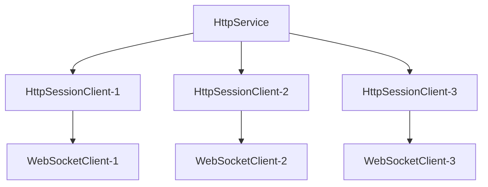

import Tag from "@site/src/components/Tag.js";
import BilibiliCard from '@site/src/components/BilibiliCard.js';
import Tabs from "@theme/Tabs";
import TabItem from "@theme/TabItem";
import { TouchSocketHttpDefinition } from "@site/src/components/Definition.js";
import CustomCodeBlock from './CodeBlocks/CustomCodeBlock';
import CardLink from "@site/src/components/CardLink.js";

### 定义

<TouchSocketHttpDefinition />


## 一、说明

`WebSocket`服务器是基于`HTTP`协议升级而来的长连接通信协议服务器。它继承自`HttpService`，在完成HTTP握手后，通过协议升级建立WebSocket连接。每个成功连接的客户端都会在服务器端创建一个对应的`HttpSessionClient`实例，后续的所有WebSocket通信都通过该实例完成。

## 二、特点

- 基于HTTP协议升级，支持标准WebSocket协议。
- 支持文本、二进制以及其他Type数据传输。
- 内置心跳机制（Ping/Pong）。
- 支持数据帧分包和组合。
- 支持WSS（WebSocket Secure）加密连接。
- 支持多种连接验证方式。
- 高性能异步处理。
- 基于插件驱动，支持AOP编程。

## 三、产品应用场景

- 实时通信应用：聊天室、在线客服、实时协作等。
- 实时数据推送：股票行情、游戏数据、监控数据等。
- 物联网设备通信：传感器数据上报、设备控制等。
- Web应用实时交互：在线编辑器、实时画板等。

## 四、服务器架构

### 4.1 连接架构

WebSocket服务器基于HTTP服务器，当收到WebSocket握手请求时，会将HTTP连接升级为WebSocket连接。每个WebSocket连接对应一个`HttpSessionClient`实例。



### 4.2 协议升级流程

1. 客户端发送HTTP握手请求
2. 服务器验证握手请求
3. 服务器响应握手成功
4. 连接升级为WebSocket协议
5. 开始WebSocket数据帧通信

## 五、可配置项

继承[HttpService](./httpservice.mdx)的所有配置项，无特殊配置。

## 六、支持插件接口

|  插件方法| 功能 |
| --- | --- |
| IWebSocketHandshakingPlugin | 当收到握手请求之前，可以进行连接验证等 |
| IWebSocketHandshakedPlugin | 当成功握手响应之后 |
| IWebSocketReceivedPlugin | 当收到Websocket的数据报文 |
| IWebSocketClosingPlugin | 当收到关闭请求时触发。如果对方直接断开连接，则此方法则不会触发。 |
| IWebSocketClosedPlugin | 当WebSocket连接断开时触发，无论是否正常断开。但如果是断网等操作，可能不会立即执行，需要结合心跳操作和CheckClear插件来进行清理。 |

## 七、创建WebSocket服务器

### 7.1 简单直接创建

最简单的方式是使用WebSocket插件，直接指定URL路由来接收WebSocket连接。

<BilibiliCard title="创建WebSocket服务器和客户端" link="https://www.bilibili.com/cheese/play/ep1709021" isPro="true"/>

```csharp showLineNumbers
var service = new HttpService();
await service.SetupAsync(new TouchSocketConfig()
    .SetListenIPHosts(7789)
    .ConfigureContainer(a =>
    {
        a.AddConsoleLogger();
    })
    .ConfigurePlugins(a =>
    {
        a.UseWebSocket()//添加WebSocket功能
         .SetWSUrl("/ws")//设置URL路径
         .UseAutoPong();//启用自动Pong响应
    }));

await service.StartAsync();
service.Logger.Info("WebSocket服务器已启动，地址: ws://127.0.0.1:7789/ws");
```

### 7.2 验证连接

可以对连接的`URL`、`Query`参数、`Header`等进行验证，决定是否允许WebSocket连接。

<BilibiliCard title="使用WebApi等多种方法验证ws连接" link="https://www.bilibili.com/cheese/play/ep1709022" isPro="true"/>

```csharp showLineNumbers
var service = new HttpService();
await service.SetupAsync(new TouchSocketConfig()
    .SetListenIPHosts(7789)
    .ConfigureContainer(a =>
    {
        a.AddConsoleLogger();
    })
    .ConfigurePlugins(a =>
    {
        a.UseWebSocket()
         .SetVerifyConnection(VerifyConnection)
         .UseAutoPong();
    }));

await service.StartAsync();
service.Logger.Info("WebSocket服务器已启动");
```

**验证函数实现：**

```csharp showLineNumbers
/// <summary>
/// 验证WebSocket连接
/// </summary>
/// <param name="client">HTTP会话客户端</param>
/// <param name="context">HTTP上下文</param>
/// <returns>返回true允许连接，false拒绝连接</returns>
private static async Task<bool> VerifyConnection(IHttpSessionClient client, HttpContext context)
{
    // 检查是否为协议升级请求
    if (!context.Request.IsUpgrade())
    {
        return false;
    }
    
    // 根据不同URL路径进行验证
    if (context.Request.UrlEquals("/ws"))
    {
        // 直接允许连接
        return true;
    }
    else if (context.Request.UrlEquals("/wsquery"))
    {
        // 需要token参数验证
        if (context.Request.Query.Get("token") == "123456")
        {
            return true;
        }
        else
        {
            await context.Response
                .SetStatus(403, "token不正确")
                .AnswerAsync();
            return false;
        }
    }
    else if (context.Request.UrlEquals("/wsheader"))
    {
        // 需要Header中的token验证
        if (context.Request.Headers.Get("token") == "123456")
        {
            return true;
        }
        else
        {
            await context.Response
                .SetStatus(403, "token不正确")
                .AnswerAsync();
            return false;
        }
    }
    
    return false;
}
```

### 7.3 通过WebApi创建

通过WebApi方式创建WebSocket连接更加灵活，可以方便地获取HTTP参数，实现多个URL的连接路由。

**实现步骤：**

1. 配置WebApi相关功能，详情请参考[WebApi](./webapi.mdx)
2. 在WebApi方法中处理WebSocket连接

```csharp showLineNumbers
var service = new HttpService();
await service.SetupAsync(new TouchSocketConfig()
    .SetListenIPHosts(7789)
    .ConfigureContainer(a =>
    {
        a.AddConsoleLogger();
        // 注册WebApi服务
        a.AddRpcStore(store =>
        {
            store.RegisterServer<MyApiServer>();
        });
    })
    .ConfigurePlugins(a =>
    {
        a.UseWebApi(); // 启用WebApi功能
    }));

await service.StartAsync();
service.Logger.Info("WebSocket服务器已启动");
```

**WebApi服务器实现：**

```csharp showLineNumbers
public class MyApiServer : SingletonRpcServer
{
    private readonly ILog m_logger;

    public MyApiServer(ILog logger)
    {
        this.m_logger = logger;
    }

    [Router("/[api]/[action]")]
    [WebApi(Method = HttpMethodType.Get)]
    public async Task ConnectWS(IWebApiCallContext callContext)
    {
        if (callContext.Caller is HttpSessionClient sessionClient)
        {
            var result = await sessionClient.SwitchProtocolToWebSocketAsync(callContext.HttpContext);
            if (result.IsSuccess)
            {
                m_logger.Info("WebSocket通过WebApi成功连接");
                // 连接成功后可以获取WebSocket对象
                var webSocket = sessionClient.WebSocket;
                // 在这里可以进行后续的WebSocket处理
            }
        }
    }
}
```

### 7.4 创建基于SSL的WebSocket服务（WSS）

创建WSS（WebSocket Secure）服务器，只需在配置中添加SSL选项。以下示例使用了测试证书"RRQMSocket.pfx"，密码为"RRQMSocket"。

```csharp showLineNumbers
var service = new HttpService();
await service.SetupAsync(new TouchSocketConfig()
    .SetListenIPHosts(7789)
    .SetServiceSslOption(new ServiceSslOption() // SSL配置
    {
        Certificate = new X509Certificate2("RRQMSocket.pfx", "RRQMSocket"),
        SslProtocols = SslProtocols.Tls12
    })
    .ConfigureContainer(a =>
    {
        a.AddConsoleLogger();
    })
    .ConfigurePlugins(a =>
    {
        a.UseWebSocket()
         .SetWSUrl("/ws")
         .UseAutoPong();
    }));

await service.StartAsync();
service.Logger.Info("WSS服务器已启动，地址: wss://127.0.0.1:7789/ws");
```

:::info 信息

当配置了SSL选项后，WebSocket服务器将支持WSS协议，客户端需要使用`wss://`前缀进行连接。

:::

## 八、接收消息

WebSocket服务器有多种接收消息的方式，可以根据不同的使用场景选择合适的方法。

<BilibiliCard title="使用ws完成基本的数据接收和发送" link="https://www.bilibili.com/cheese/play/ep1709023" isPro="true"/>

### 8.1 插件方式接收消息 <Tag>推荐</Tag>

<Tabs
    defaultValue="tab1"
    values=
    {[
        { label: "文档",value: "tab1"},
        { label: "视频", value: "tab2" }
    ]}
>
<TabItem value="tab1">

使用插件接收消息是最推荐的方式，它提供了高度解耦和灵活的数据处理能力。

**（1）定义插件：**

```csharp showLineNumbers
public class MyWebSocketPlugin : PluginBase, IWebSocketReceivedPlugin
{
    private readonly ILog m_logger;

    public MyWebSocketPlugin(ILog logger)
    {
        this.m_logger = logger;
    }

    public async Task OnWebSocketReceived(IWebSocket client, WSDataFrameEventArgs e)
    {
        switch (e.DataFrame.Opcode)
        {
            case WSDataType.Cont:
                m_logger.Info($"收到分包数据，长度：{e.DataFrame.PayloadLength}");
                break;

            case WSDataType.Text:
                var textMessage = e.DataFrame.ToText();
                m_logger.Info($"收到文本消息：{textMessage}");

                // 回复消息（服务器端）
                if (!client.Client.IsClient)
                {
                    await client.SendAsync($"服务器收到：{textMessage}");
                }
                break;

            case WSDataType.Binary:
                if (e.DataFrame.FIN)
                {
                    m_logger.Info($"收到二进制数据，长度：{e.DataFrame.PayloadLength}");
                }
                else
                {
                    m_logger.Info($"收到分包二进制数据，长度：{e.DataFrame.PayloadLength}");
                }
                break;

            case WSDataType.Close:
                m_logger.Info("收到关闭请求");
                await client.CloseAsync("正常关闭");
                break;

            case WSDataType.Ping:
                m_logger.Info("收到Ping消息");
                // 框架会自动处理Pong响应（如果启用了UseAutoPong）
                break;

            case WSDataType.Pong:
                m_logger.Info("收到Pong响应");
                break;

            default:
                m_logger.Info($"收到未知类型数据：{e.DataFrame.Opcode}");
                break;
        }

        await e.InvokeNext();
    }
}
```

**（2）配置使用插件：**

```csharp showLineNumbers
var service = new HttpService();
await service.SetupAsync(new TouchSocketConfig()
    .SetListenIPHosts(7789)
    .ConfigureContainer(a =>
    {
        a.AddConsoleLogger();
    })
    .ConfigurePlugins(a =>
    {
        a.UseWebSocket()
         .SetWSUrl("/ws")
         .UseAutoPong();
        
        // 添加自定义WebSocket插件
        a.Add<MyWebSocketPlugin>();
    }));

await service.StartAsync();
service.Logger.Info("WebSocket服务器已启动");
```

:::tip 提示

插件的所有函数都可能被并发执行，因此应当做好线程安全处理。

:::

</TabItem>
<TabItem value="tab2">

<BilibiliCard title="使用插件接收消息" link="https://www.bilibili.com/cheese/play/ep1504559" isPro="true"/>
<BilibiliCard title="注册插件的三种方式" link="https://www.bilibili.com/cheese/play/ep1504563" isPro="true"/>
<BilibiliCard title="插件的封装性和扩展性详解" link="https://www.bilibili.com/cheese/play/ep1504564" isPro="true"/>

</TabItem>
</Tabs>

### 8.2 异步阻塞接收

异步阻塞接收是通过直接调用`WebSocket`的`ReadAsync`方法来同步阻塞式读取数据。这种方式的特点是能在代码上下文中直接获取数据，便于处理复杂的数据逻辑。

<BilibiliCard title="使用ReadAsync的方式读取ws数据" link="https://www.bilibili.com/cheese/play/ep1709028" isPro="true"/>

```csharp showLineNumbers
public class MyReadWebSocketPlugin : PluginBase, IWebSocketHandshakedPlugin
{
    private readonly ILog m_logger;

    public MyReadWebSocketPlugin(ILog logger)
    {
        this.m_logger = logger;
    }

    public async Task OnWebSocketHandshaked(IWebSocket client, HttpContextEventArgs e)
    {
        // 启用异步读取模式
        client.AllowAsyncRead = true;
        
        m_logger.Info("WebSocket连接已建立，开始读取数据");

        try
        {
            while (true)
            {
                using var tokenSource = new CancellationTokenSource(TimeSpan.FromSeconds(30));
                using var receiveResult = await client.ReadAsync(tokenSource.Token);

                if (receiveResult.IsCompleted)
                {
                    // WebSocket连接已断开
                    break;
                }

                var dataFrame = receiveResult.DataFrame;

                // 检查是否为完整数据包
                if (dataFrame.FIN)
                {
                    switch (dataFrame.Opcode)
                    {
                        case WSDataType.Text:
                            var textMessage = dataFrame.ToText();
                            m_logger.Info($"收到完整文本消息：{textMessage}");
                            
                            // 回复消息
                            await client.SendAsync($"收到消息：{textMessage}");
                            break;

                        case WSDataType.Binary:
                            m_logger.Info($"收到完整二进制数据，长度：{dataFrame.PayloadLength}");
                            break;

                        case WSDataType.Close:
                            m_logger.Info("收到关闭请求");
                            return;

                        default:
                            m_logger.Info($"收到其他类型数据：{dataFrame.Opcode}");
                            break;
                    }
                }
                else
                {
                    // 分包数据，需要继续接收
                    m_logger.Info($"收到分包数据，类型：{dataFrame.Opcode}，长度：{dataFrame.PayloadLength}");
                }
            }
        }
        catch (OperationCanceledException)
        {
            m_logger.Info("WebSocket读取超时");
        }
        catch (Exception ex)
        {
            m_logger.Exception(ex);
        }
        finally
        {
            m_logger.Info("WebSocket连接已断开");
        }

        await e.InvokeNext();
    }
}
```

:::info 信息

`ReadAsync`方式是**异步非阻塞**的接收方式，不会占用线程资源，只会阻塞当前`Task`。因此可以大量使用，不需要考虑性能问题。

:::

:::caution 注意

使用`ReadAsync`方式会阻塞`IWebSocketHandshakedPlugin`的插件传递链，在收到WebSocket消息时不会触发`IWebSocketReceivedPlugin`插件。

:::

## 九、发送数据

按照WebSocket服务器架构，每个成功连接的客户端都会在服务器端创建一个`HttpSessionClient`实例。要发送WebSocket消息，需要通过这些实例进行操作。

### 9.1 获取客户端实例

**（1）直接获取所有在线客户端：**

```csharp showLineNumbers
var clients = service.Clients;
foreach (var client in clients)
{
    if (client.Protocol == Protocol.WebSocket)//先判断是不是websocket协议
    {
        if (client.Id == "id")//再按指定id发送，或者直接广播发送
        {
            await client.WebSocket.SendAsync("hello");
        }
    }
}
```

**（2）通过Id获取：**

```csharp showLineNumbers
string[] ids = service.GetIds();
if (service.TryGetClient(ids[0], out HttpSessionClient sessionClient))
{
    await sessionClient.WebSocket.SendAsync("hello");
}
```

### 9.2 发送文本消息

```csharp showLineNumbers
await webSocket.SendAsync("Text");
```

### 9.3 发送二进制消息

```csharp showLineNumbers
await webSocket.SendAsync(new byte[10]);
```

### 9.4 发送自定义数据帧

```csharp showLineNumbers
using (var frame = new WSDataFrame())
{
    frame.Opcode = WSDataType.Text;
    frame.FIN = true;
    frame.RSV1 = true;
    frame.RSV2 = true;
    frame.RSV3 = true;
    frame.AppendText("I");
    frame.AppendText("Love");
    frame.AppendText("U");
    await webSocket.SendAsync(frame);
} 
```

### 9.5 发送Ping消息

```csharp showLineNumbers
await webSocket.PingAsync();
```

<BilibiliCard title="ws的Ping和Pong的使用" link="https://www.bilibili.com/cheese/play/ep1709027" isPro="true"/>

### 9.6 发送Pong响应

```csharp showLineNumbers
await webSocket.PongAsync();
```

### 9.7 发送大数据（分包）

发送大数据时，需要分包发送，可以使用`SendAsync`的重载方法，设置`FIN`标志。

```csharp showLineNumbers
// 发送 "hello" 消息 100 次，最后一次设置 FIN 标志  
var i = 0;
while (true)
{
    if (i++ == 100)
    {
        await sessionClient.WebSocket.SendAsync("hello", true);
        break;
    }
    await sessionClient.WebSocket.SendAsync("hello", false);
}
```

## 十、连接管理

### 10.1 主动关闭连接

在使用`WebSocket`时，如果想主动关闭连接，可以使用`CloseAsync`方法，同时可以携带一个关闭原因。

默认关闭状态码为1000。意为：正常关闭。

```csharp showLineNumbers
await webSocket.CloseAsync("关闭");
```

如果你想使用其他状态码，可以参考如下代码。

```csharp showLineNumbers
await webSocket.CloseAsync(WebSocketCloseStatus.EndpointUnavailable,"关闭");//状态码为1001，意为：服务端不可用。
```

<BilibiliCard title="主动处理ws的Close报文" link="https://www.bilibili.com/cheese/play/ep1709025" isPro="true"/>

## 十一、示例Demo

<CardLink link="examples/WebSocket/WebSocketConsoleApp"/>
