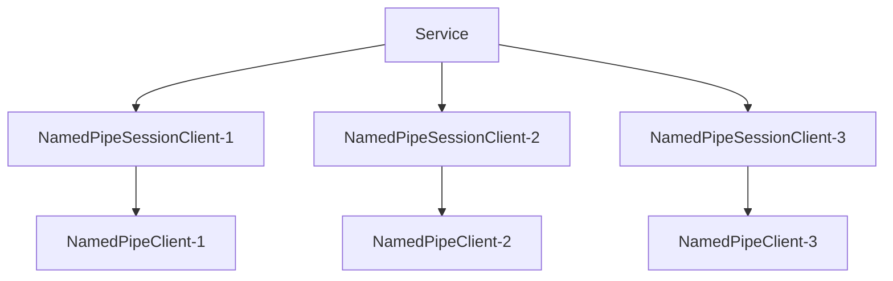

import Tag from "@site/src/components/Tag.js";

### 定义

命名空间：TouchSocket.NamedPipe <br/>
程序集：[TouchSocket.NamedPipe.dll](https://www.nuget.org/packages/TouchSocket.NamedPipe)

## 一、说明

NamedPipeService是命名管道系服务器基类，它不参与实际的数据交互，只是配置、激活、管理、注销、重建**NamedPipeSessionClient**类实例。而**NamedPipeSessionClient**是当**NamedPipeClient（客户端）**成功连接服务器以后，由服务器新建的一个实例类，后续的所有通信，也都是通过该实例完成的。

## 二、特点

- 简单易用。
- 异步执行。
- 内存池支持
- 高性能（实测服务器单客户端单线程，每秒可接收数据流量可达6.5GB/s）。
- **多管道名称监听**（可以一次性监听多个管道名称）
- 适配器预处理，一键式解决**分包**、**粘包**、对象解析等（即适用于Tcp的一切适配器）。
- 超简单的同步发送、异步发送、接收等操作。
- 基于委托、[插件](./pluginsmanager.mdx)驱动，让每一步都能执行AOP。

## 三、产品应用场景

- 所有本机IPC(进程通讯)基础使用场景：可跨平台、跨语言使用。

## 四、服务器架构

服务器在收到**新客户端连接**时，会创建一个`NamedPipeSessionClient`的派生类实例，与客户端`NamedPipeClient`一一对应，后续的数据通信均由此实例负责。

`NamedPipeSessionClient`在Service里面以字典映射。Id为键，`NamedPipeSessionClient`本身为值。



## 五、可配置项

<details>
<summary>可配置项</summary>
<div>

#### SetMaxPackageSize
数据包最大值（单位：byte），默认1024×1024×10。该值会在适当时间，直接作用DataHandlingAdapter.MaxPackageSize。 

#### SetPipeName
设置管道名称。 

#### SetNamedPipeListenOptions
设置独立的管道监听，可以独立控制当前监听的个性化配置。 

#### SetServerName
服务器标识名称，无实际使用意义。

#### SetMaxCount
最大可连接数，默认为10000 

</div>
</details>


## 六、支持插件

|  插件方法| 功能 |
| --- | --- |
| INamedPipeConnectingPlugin | 此时管道实际上已经完成连接，但是并没有启动接收，然后触发。 |
| INamedPipeConnectedPlugin | 同意连接，且成功启动接收后触发 |
| INamedPipeClosingPlugin | 当客户端主动调用Close时触发 |
| INamedPipeClosedPlugin | 当客户端断开连接后触发 |
| INamedPipeReceivingPlugin | 在收到原始数据时触发，所有的数据均在ByteBlock里面。 |
| INamedPipeReceivedPlugin | 在收到适配器数据时触发，根据适配器类型，数据可能在ByteBlock或者IRequestInfo里面。 |
| INamedPipeSendingPlugin | 当即将发送数据时，调用该方法在适配器之后，接下来即会发送数据。 |
| IIdChangedPlugin | 当NamedPipeSessionClient的Id发生改变时触发。 |

## 七、创建NamedPipeService

### 7.1 简单创建

直接初始化NamedPipeService，会使用默认的**NamedPipeSessionClient**。
简单的处理逻辑可通过**Connecting**、**Connected**、**Received**等委托直接实现。

代码如下：

```csharp showLineNumbers
var service = new NamedPipeService();
service.Connecting = (client, e) => { return EasyTask.CompletedTask; };//有客户端正在连接
service.Connected = (client, e) => { return EasyTask.CompletedTask; };//有客户端成功连接
service.Closing = (client, e) => { return EasyTask.CompletedTask; };//有客户端正在断开连接，只有当主动断开时才有效。
service.Closed = (client, e) => { return EasyTask.CompletedTask; };//有客户端断开连接
service.Received = async (client, e) =>
{
    //从客户端收到信息
    string mes = e.ByteBlock.Span.ToString(Encoding.UTF8);
    client.Logger.Info($"已从{client.Id}接收到信息：{mes}");

    await client.SendAsync(mes);//将收到的信息直接返回给发送方

    //await client.SendAsync("id",mes);//将收到的信息返回给特定ID的客户端

    ////将收到的信息返回给在线的所有客户端。
    ////注意：这只是个设计建议，实际上群发应该使用生产者消费者的设计模式
    //var ids = service.GetIds();
    //foreach (var clientId in ids)
    //{
    //    if (clientId != client.Id)//不给自己发
    //    {
    //        await service.SendAsync(clientId, mes);
    //    }
    //}
};

await service.SetupAsync(new TouchSocketConfig()//载入配置
     .SetPipeName("TouchSocketPipe")//设置命名管道名称
     .ConfigureContainer(a =>
     {
         a.AddConsoleLogger();//添加一个控制台日志注入（注意：在maui中控制台日志不可用）
     })
     .ConfigurePlugins(a =>
     {
         //a.Add();//此处可以添加插件
     }));

await service.StartAsync();//启动
```

:::info 温馨提示

Service.StartAsync()方法并不会阻塞当前运行，所以当在控制台运行时，可能需要使用Console.ReadKey()等操作进行阻塞。

:::  

### 7.2 泛型创建

通过泛型创建服务器，可以实现很多有意思，且能**重写**一些有用的功能。下面就演示，如何通过泛型创建服务器。

代码如下：

（1）建立`NamedPipeSessionClient`继承类。

```csharp showLineNumbers
public class MySessionClient : NamedPipeSessionClient
{
    protected override async Task OnNamedPipeReceived(ReceivedDataEventArgs e)
    {
        //此处逻辑单线程处理。

        //此处处理数据，功能相当于Received委托。
        string mes = e.ByteBlock.Span.ToString(Encoding.UTF8);
        Console.WriteLine($"已接收到信息：{mes}");
        await base.OnNamedPipeReceived(e);
    }
}
```

（2）建立`NamedPipeService`继承类。实际上如果业务不涉及服务器配置的话，可以省略该步骤，使用**NamedPipeService的泛型**直接创建。

```csharp showLineNumbers
public class MyService : NamedPipeService<MySessionClient>
{
    protected override void LoadConfig(TouchSocketConfig config)
    {
        //此处加载配置，用户可以从配置中获取配置项。
        base.LoadConfig(config);
    }

    protected override MySessionClient NewClient()
    {
        return new MySessionClient();
    }

    protected override Task OnNamedPipeConnecting(MySessionClient socketClient, ConnectingEventArgs e)
    {
        //此处逻辑会多线程处理。

        //e.Id:对新连接的客户端进行ID初始化，默认情况下是按照设定的规则随机分配的。
        //但是按照需求，您可以自定义设置，例如设置为其IP地址。但是需要注意的是id必须在生命周期内唯一。

        //e.IsPermitOperation:指示是否允许该客户端链接。
        return base.OnNamedPipeConnecting(socketClient, e);
    }
}
```

（3）创建服务器（包含MyService）。

```csharp showLineNumbers
var service = new MyService();
await service.StartAsync("TouchSocketPipe");//设置命名管道名称，启动
```

:::tip 建议

由上述代码可以看出，通过继承，可以更加灵活的实现扩展。但实际上，很多业务我们希望大家能通过插件完成。

:::  

## 八、配置监听

### 8.1 Config直接配置

服务器在配置监听时，有多种方式实现。其中最简单、最常见的配置方式就是通过Config直接配置。

```csharp showLineNumbers
var service = new NamedPipeService();
await service.SetupAsync(new TouchSocketConfig()//载入配置
     .SetPipeName("TouchSocketPipe"));//设置命名管道名称

await service.StartAsync();//启动
```

### 8.2 直接添加监听配置

直接添加监听配置是更加个性化的监听配置，它可以单独控制指定监听地址的具体配置，例如：使用何种适配器等。

```csharp showLineNumbers
var service = new NamedPipeService();
await service.SetupAsync(new TouchSocketConfig()//载入配置
     .SetPipeName("TouchSocketPipe")//设置默认命名管道名称
     .SetNamedPipeListenOptions(list =>
     {
         //如果想实现多个命名管道的监听，即可这样设置，一直Add即可。
         list.Add(new NamedPipeListenOption()
         {
             Adapter = () => new NormalDataHandlingAdapter(),
             Name = "TouchSocketPipe2"//管道名称
         });

         list.Add(new NamedPipeListenOption()
         {
             Adapter = () => new NormalDataHandlingAdapter(),
             Name = "TouchSocketPipe3"//管道名称
         });
     })
     .ConfigureContainer(a =>//容器的配置顺序应该在最前面
     {
         a.AddConsoleLogger();//添加一个控制台日志注入（注意：在maui中控制台日志不可用）
     })
     .ConfigurePlugins(a =>
     {
         //a.Add();//此处可以添加插件
     }));

await service.StartAsync();//启动
```

:::info 温馨提示

`SetPipeName`可以和`SetNamedPipeListenOptions`可以同时使用，但是需要注意的是，Config的全局配置仅会对`SetPipeName`单独生效的。`SetNamedPipeListenOptions`的地址配置均是单独配置的。

:::  


### 8.3 动态添加、移除监听配置

服务器支持在运行时，动态添加，和移除监听配置，这极大的为灵活监听提供了方便，并且还不影响现有连接。可以轻量级的实现Stop操作。

```csharp {5,16}
var service = new NamedPipeService();
await service.SetupAsync(new TouchSocketConfig());

await service.StartAsync();//启动

service.AddListen(new NamedPipeListenOption()//在Service运行时，可以调用，直接添加监听
{
    Name = "TouchSocketPipe4",//名称用于区分监听
    Adapter = () => new FixedHeaderPackageAdapter(),//可以单独对当前地址监听，配置适配器，还有其他可配置项，都是单独对当前地址有效。
});

foreach (var item in service.Monitors)
{
    service.RemoveListen(item);//在Service运行时，可以调用，直接移除现有监听
}
```

## 九、接收数据

在NamedPipeService中，接收数据的方式有很多种。多种方式可以组合使用。

### 9.1 Received委托处理

当使用NamedPipeService（非泛型）创建服务器时，内部已经定义好了一个外置委托Received，可以通过该委托直接接收数据。

```csharp showLineNumbers
var service = new NamedPipeService();
service.Received = (client, e) =>
{
    //从客户端收到信息
    string mes = e.ByteBlock.Span.ToString(Encoding.UTF8);
    client.Logger.Info($"已从{client.Id}接收到信息：{mes}");
    return EasyTask.CompletedTask;
};

await service.StartAsync("TouchSocketPipe");//启动
```

### 9.2 重写NamedPipeSessionClient处理

正如6.2所示，可以直接在MySessionClient的重写**ReceivedData**中直接处理数据。

### 9.3 插件处理 <Tag>推荐</Tag>

按照TouchSocket的设计理念，使用插件处理数据，是一项非常简单，且高度解耦的方式。步骤如下：

（1）声明插件

插件可以先继承`PluginBase`，然后再实现需要的功能插件接口，可以按需选择泛型或者非泛型实现。

如果已经有继承类，直接实现`IPlugin`接口即可。

```csharp showLineNumbers
class MyNamedPipePlugin : PluginBase, INamedPipeConnectedPlugin, INamedPipeClosedPlugin, INamedPipeReceivedPlugin
{
    private readonly ILog m_logger;

    public MyNamedPipePlugin(ILog logger)
    {
        this.m_logger = logger;
    }

    public async Task OnNamedPipeClosed(INamedPipeSession client, ClosedEventArgs e)
    {
        this.m_logger.Info("Disconnected");
        await e.InvokeNext();
    }

    public async Task OnNamedPipeConnected(INamedPipeSession client, ConnectedEventArgs e)
    {
        this.m_logger.Info("Connected");
        await e.InvokeNext();
    }

    public async Task OnNamedPipeReceived(INamedPipeSession client, ReceivedDataEventArgs e)
    {
        this.m_logger.Info(e.ByteBlock.ToString());
        await e.InvokeNext();
    }
}
```

（2）创建使用插件处理的服务器

```csharp {10}
var service = new NamedPipeService();
await service.SetupAsync(new TouchSocketConfig()
     .SetPipeName("TouchSocketPipe")//设置命名管道名称
     .ConfigureContainer(a =>
     {
         a.AddConsoleLogger();
     })
     .ConfigurePlugins(a =>
     {
         a.Add<MyNamedPipePlugin>();
     }));

await service.StartAsync();
```

### 9.4 异步阻塞接收 <Tag>推荐</Tag>

异步阻塞接收，即使用`await`的方式接收数据。其特点是能在代码上下文中，直接获取到收到的数据。

只是在服务器使用异步阻塞时，建议直接在`Connected`触发时相关使用。

下列将以插件为例：

```csharp showLineNumbers
class NamedPipeServiceReceiveAsyncPlugin : PluginBase, INamedPipeConnectedPlugin
{
    public async Task OnNamedPipeConnected(INamedPipeSession client, ConnectedEventArgs e)
    {
        if (client is INamedPipeSessionClient sessionClient)
        {
            //receiver可以复用，不需要每次接收都新建
            using (var receiver = sessionClient.CreateReceiver())
            {
                while (true)
                {
                    //receiverResult每次接收完必须释放
                    using (var receiverResult = await receiver.ReadAsync(CancellationToken.None))
                    {
                        //收到的数据，此处的数据会根据适配器投递不同的数据。
                        var byteBlock = receiverResult.ByteBlock;
                        var requestInfo = receiverResult.RequestInfo;

                        if (receiverResult.IsCompleted)
                        {
                            //断开连接了
                            Console.WriteLine($"断开信息：{receiverResult.Message}");
                            return;
                        }

                        //如果数据是从ByteBlock投递
                        if (byteBlock != null)
                        {
                            Console.WriteLine(byteBlock.Span.ToString(Encoding.UTF8));
                        }

                        //如果是适配器信息，则可以直接处理requestInfo;
                    }
                }
            }
        }
        
    }
}
```

在异步阻塞接收时，当接收的数据不满足解析条件时，还可以缓存起来，下次一起处理。

例如：下列将演示接收字符串，当没有发现“\r\n”时，将缓存数据，直到发现重要字符。

其中，`CacheMode`与`MaxCacheSize`是启用缓存的重要属性。`byteBlock.Seek`则是将已读取的数据游标移动至指定位置。

```csharp showLineNumbers
class NamedPipeServiceReceiveAsyncPlugin : PluginBase, INamedPipeConnectedPlugin
{
    public async Task OnNamedPipeConnected(INamedPipeSession client, ConnectedEventArgs e)
    {
        if (client is INamedPipeSessionClient sessionClient)
        {
            //receiver可以复用，不需要每次接收都新建
            using (var receiver = sessionClient.CreateReceiver())
            {
                receiver.CacheMode = true;
                receiver.MaxCacheSize = 1024 * 1024;

                var rn = Encoding.UTF8.GetBytes("\r\n");
                while (true)
                {
                    //receiverResult每次接收完必须释放
                    using (var receiverResult = await receiver.ReadAsync(CancellationToken.None))
                    {
                        //收到的数据，此处的数据会根据适配器投递不同的数据。
                        var byteBlock = receiverResult.ByteBlock;
                        var requestInfo = receiverResult.RequestInfo;

                        if (receiverResult.IsCompleted)
                        {
                            //断开连接了
                            Console.WriteLine($"断开信息：{receiverResult.Message}");
                            return;
                        }

                        //在CacheMode下，byteBlock将不可能为null

                        var index = 0;
                        while (true)
                        {
                            var r = byteBlock.Span.Slice(index).IndexOf(rn);
                            if (r < 0)
                            {
                                break;
                            }

                            var str = byteBlock.Span.Slice(index, r).ToString(Encoding.UTF8);
                            Console.WriteLine(str);

                            index += rn.Length;
                            index += r;
                        }

                        byteBlock.Seek(index);
                    }
                }
            }
        }
    }
}
```

:::tip 提示

异步阻塞接收，在等待接收数据时，不会阻塞线程资源，所以即使大量使用，也不会影响性能。

:::  

## 十、发送数据

按照架构图，每个客户端成功连接后，**服务器**都会创建一个派生自**NamedPipeSessionClient**的实例，并将其存以生成的Id为键，存在一个字典中。

所以，service提供了一下原生方法，可以通过id直接将数据发送至指定客户端。

```csharp showLineNumbers
//原生
public Task SendAsync(string id, ReadOnlyMemory<byte> memory);
public Task SendAsync(string id, IRequestInfo requestInfo);
```

例如：

```csharp showLineNumbers
await service.SendAsync("id",Encoding.UTF8.GetBytes("hello"));
```

亦或者，可以先用id查到对应的`NamedPipeSessionClient`，然后用其提供的方法直接发送。

例如：

```csharp showLineNumbers
//尝试性获取
if (service.TryGetClient("id", out var sessionClient))
{
    await sessionClient.SendAsync("hello");
}
```

```csharp showLineNumbers
//直接获取，如果id不存在，则会抛出异常
var sessionClient = service.GetClient("id");
await sessionClient.SendAsync("hello");
```

:::caution 注意

由于`NamedPipeSessionClient`的生命周期是由框架控制的，所以最好尽量不要直接引用该实例，可以引用`NamedPipeSessionClient.Id`，然后再通过服务器查找。

:::  

:::caution 注意

所有的发送，框架内部实际上**只实现了异步发送**，但是为了兼容性，仍然保留了同步发送的扩展。但是强烈建议如有可能，请**务必使用异步发送来提高效率**。

:::  

:::tip 提示

框架不仅内置了字节的发送，也扩展了**字符串**等常见数据的发送。而且还包括了`TrySend`等不会抛出异常的发送方法。

:::  

[本文示例Demo](https://gitee.com/RRQM_Home/TouchSocket/tree/master/examples/NamedPipe)

