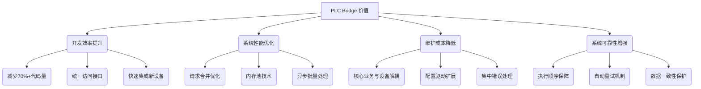

## 一、为什么你需要 PLC Bridge？解决工业自动化中的核心痛点

在工业自动化开发中，直接读写 PLC 看起来是最直接的方式，但随着系统复杂度增加，这种方式会带来一系列严重问题。TouchSocketPro.PlcBridges 正是为解决这些核心痛点而生。

## 二、直接读写 PLC 的五大痛点

### 2.1 多设备协同的复杂性噩梦

当系统需要连接多个 PLC 设备时：
```csharp
// 伪代码示例：直接连接多个 PLC
var plc1 = new SiemensPLC("192.168.1.10");
var plc2 = new OmronPLC("192.168.1.11");
var plc3 = new ModbusPLC("192.168.1.12");

// 写入数据需要分别处理每个设备
await plc1.WriteRegister(0, value1);
await plc2.WriteRegister(5, value2);
await plc3.WriteCoil(10, true);
```

**痛点分析**：
- 需要了解每个 PLC 的特定协议和地址映射
- 错误处理逻辑重复且复杂
- 设备间的数据依赖难以管理

### 2.2 性能瓶颈：高频读写效率低下

当需要频繁读写时：
```csharp
// 伪代码示例：直接读写大量数据点
for (int i = 0; i < 100; i++)
{
    var value = await plc.ReadRegister(i);
    ProcessData(value);
}
```

**痛点分析**：
- 每次读写都需要建立/断开连接
- 小数据包导致网络带宽浪费
- 无法合并相邻地址的读写请求

### 2.3 数据类型转换的繁琐工作

处理不同数据类型时：

```csharp
// 伪代码示例：手动处理数据类型转换
var bytes = await plc.ReadBytes(0, 4);
float temperature = BitConverter.ToSingle(bytes, 0);

var intBytes = await plc.ReadBytes(4, 2);
int pressure = BitConverter.ToInt16(intBytes, 0);
```

**痛点分析**：
- 需要手动处理字节序（大端/小端）
- 复杂类型（浮点数、结构体）转换代码冗长
- 容易因类型处理错误导致数据错误

### 2.4 系统扩展的困难

当需要添加新设备时：

```csharp
// 伪代码示例：添加新设备需要重构代码
// 原有代码
if (deviceType == "Siemens")
{
    // Siemens 特定逻辑
}
else if (deviceType == "Omron")
{
    // Omron 特定逻辑
}

// 添加 Modbus 支持
else if (deviceType == "Modbus")
{
    // 新增 Modbus 逻辑
}
```

**痛点分析**：
- 每次添加新设备类型都需要修改核心逻辑
- 系统变得臃肿难以维护
- 测试覆盖率难以保证

### 2.5 实时性难以保障

```csharp
// 伪代码示例：直接读写无法保证实时性
var task1 = ReadSensorData();
var task2 = WriteControlSignal();

await Task.WhenAll(task1, task2); // 无法控制执行顺序
```

**痛点分析**：
- 无法保证关键指令的执行顺序
- 缺乏优先级管理机制
- 并发操作可能导致资源冲突

## 三、PLC Bridge如何解决这些痛点

### 3.1 统一访问接口（解决多设备协同问题）

```csharp
// 使用 PLC Bridge 统一访问不同设备
var plcOperator = plcBridge.CreateOperator<short>();

// 无论底层是什么PLC设备，使用相同API
await plcOperator.WriteAsync(new WritableValue<short>(0, 100));
var result = await plcOperator.ReadAsync(new ReadableValue<short>(0, 1));
```

**优势**：
- 统一接口简化开发
- 设备更换无需修改业务代码
- 支持热插拔添加/移除设备

### 3.2 智能请求合并（解决性能瓶颈）

```csharp
// PLC Bridge 自动合并相邻请求
var writableValues = new WritableValueCollection<short>(
    new WritableValue<short>(0, 100),    // 地址0
    new WritableValue<short>(1, 200),    // 地址1（相邻）
    new WritableValue<short>(5, 300)     // 地址5（间隔=4）
);

// 实际只产生1次通信（地址0-5批量写入）
await plcOperator.WriteAsync(writableValues);
```

**优势**：
- 减少70-90%的通信次数
- 最大程度利用网络带宽
- 通过 MaxGap 参数精细控制合并策略

### 3.3. 自动类型转换（解决数据类型问题）

```csharp
// PLC Bridge 自动处理类型转换
float[] temperatures = {23.5f, 24.1f, 22.8f};

// 自动转换为字节流写入
await plcOperator.WriteAsync(new WritableValue<float>(0, temperatures));

// 自动转换回原始类型
var result = await plcOperator.ReadAsync(new ReadableValue<float>(0, 3));
```

**优势**：
- 支持所有非托管类型
- 自动处理字节序转换
- 复杂结构体一键序列化

### 3.4 设备抽象层（解决扩展性问题）

```csharp
// 添加新PLC设备只需实现驱动器接口
public class CustomPlcDrive : IPlcDrive<short>
{
    // 实现驱动器接口
}

// 注册到PLC Bridge
plcBridge.AddDriveAsync(new CustomPlcDrive(/* 配置 */));
```

**优势**：
- 新设备支持不影响业务逻辑
- 插件式架构便于扩展
- 核心系统保持稳定

### 3.5 执行控制（解决实时性问题）

```csharp
// 通过分组控制执行顺序
var criticalDrive = new MemoryPlcDrive<short>(
    new PlcDriveOption { Group = "Critical" });

var normalDrive = new MemoryPlcDrive<short>(
    new PlcDriveOption { Group = "Normal" });

// Critical组任务优先执行且串行处理
```

**优势**：
- 分组控制关键任务执行顺序
- 支持任务优先级管理
- 内置超时和重试机制

## 四、PLC Bridge 的独特价值

### 4.1 架构优化前后对比

| **场景** | **直接读写 PLC** | **使用 PLC Bridge** |
|----------|------------------|---------------------|
| 多设备协同 | 每个设备独立处理 | 统一接口管理所有设备 |
| 高频数据采集 | 频繁小包通信，性能低下 | 智能合并请求，减少70%+通信量 |
| 系统扩展 | 修改核心代码，风险高 | 添加驱动器，业务零修改 |
| 实时控制 | 无执行顺序保障 | 分组控制关键任务 |
| 数据类型处理 | 手动转换，易出错 | 自动处理所有类型转换 |
| 错误处理 | 分散在各处 | 统一结果对象(Result) |

### 4.2 PLC Bridge 的核心价值矩阵



## 五、何时需要 PLC Bridge？

### 5.1 适用场景
1. **多PLC协同系统**：连接多种品牌/协议的PLC设备
2. **高频数据采集**：需要优化通信性能的场景
3. **大型SCADA系统**：需要统一设备管理接口
4. **关键过程控制**：需要保障执行顺序和实时性
5. **快速迭代项目**：需要灵活扩展设备支持

### 5.2 使用建议
- **简单系统**（单PLC，少量读写）：直接读写可能更简单
- **复杂系统**（多设备，高频读写）：PLC Bridge 是必备架构组件
- **关键任务系统**：PLC Bridge 提供必需的可靠性和实时性保障

## 六、结论

PLC Bridge 不是简单的通信封装，而是工业自动化领域的**架构解决方案**。它解决了直接读写 PLC 方式在复杂系统中暴露的核心痛点：

1. 通过**统一接口**消除多设备协同复杂度
2. 通过**智能合并**优化高频读写性能
3. 通过**自动转换**简化数据类型处理
4. 通过**抽象层**实现无缝系统扩展
5. 通过**执行控制**保障关键任务实时性

在工业4.0和IIoT时代，随着系统复杂度不断增加，PLC Bridge 已成为构建可靠、高效、可扩展工业自动化系统的**必备基础设施**。


