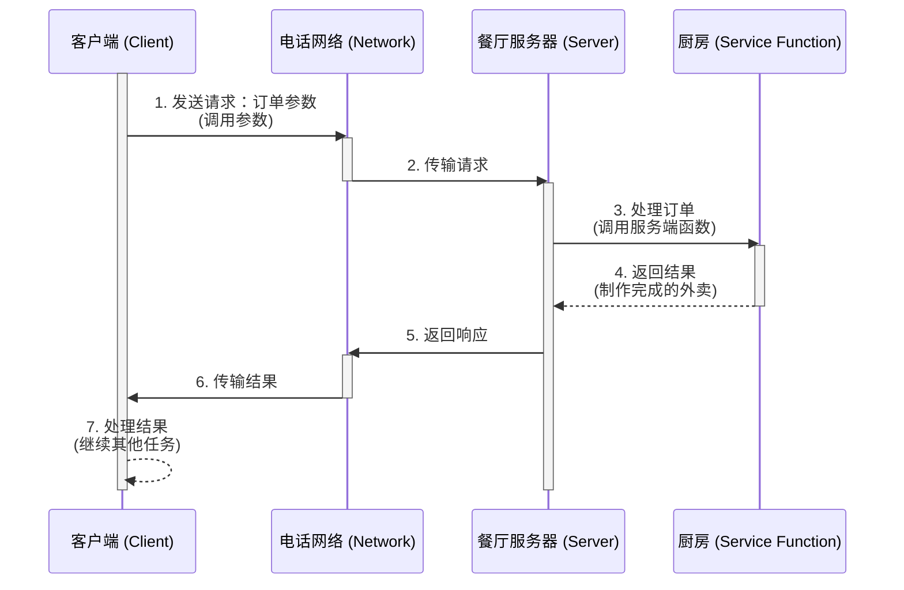
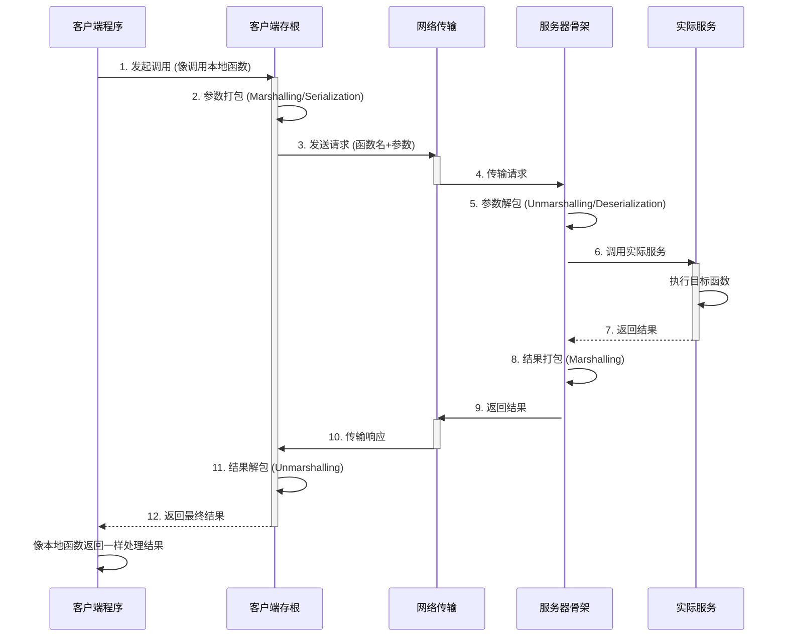

## 一、Rpc描述

Rpc（远程过程调用）​​ 是一种允许计算机程序调用另一台计算机（或同一台计算机的不同进程）上的子程序（服务）的技术，​​无需程序员显式处理网络通信细节​​。

简单来说，它的目标是让开发者像调用本地函数一样调用远程服务。

## 二、核心思想

- **​隐藏复杂性​** ​：RPC 抽象了底层的网络传输、数据序列化、错误处理等细节。

- **​像本地调用一样简单**​ ​：开发者只需关注业务逻辑，无需编写网络通信代码。

### 2.1 像本地调用一样使用远程服务

想象一下打电话点外卖：
1.  **你（客户端）**：拿起电话，告诉餐厅（服务器）你要什么（调用参数）。
2.  **电话网络（网络）**：你的请求被传输到餐厅。
3.  **餐厅（服务器）**：收到订单，厨房（服务端函数）开始制作。
4.  **电话网络（网络）**：做好的外卖（结果）被送回来。
5.  **你（客户端）**：收到外卖（结果），继续做自己的事。

RPC 的目标就是让你感觉“点外卖”这个动作（调用远程函数）就像从自己冰箱里拿东西（调用本地函数）一样简单直接，不用操心电话怎么接通、外卖员怎么送这些底层细节。

### 2.2 RPC 的工作原理（简化版）

1.  **客户端调用**：客户端程序像调用本地函数一样，调用一个看起来是本地函数的“存根”（Stub）。
2.  **参数打包**：客户端存根负责将调用的**函数名**、**参数**等信息打包（这个过程叫 **Marshalling** 或 **Serialization**），转换成适合网络传输的格式（如 JSON, XML, Protocol Buffers, Thrift 等）。
3.  **网络传输**：打包好的数据通过底层网络协议（通常是 TCP/IP）发送到远程服务器。
4.  **服务器接收**：服务器端的“骨架”（Skeleton）接收到网络请求。
5.  **参数解包**：服务器骨架将接收到的数据解包（**Unmarshalling** 或 **Deserialization**），还原成服务器程序能理解的形式（函数名、参数）。
6.  **实际执行**：服务器定位到真正的目标函数或方法，并用解包出来的参数执行它。
7.  **结果打包**：服务器将函数的执行**结果**（或错误信息）打包。
8.  **结果返回**：打包好的结果通过网络发送回客户端。
9.  **客户端接收**：客户端存根接收网络返回的数据。
10. **结果解包**：客户端存根解包数据，得到真正的结果（或错误）。
11. **返回结果**：客户端存根将结果返回给最初发起调用的客户端程序代码。对客户端代码来说，它感觉就像是本地函数返回了结果一样。

## 三、RPC 的关键特性/优点

1.  **透明性**：这是最大的优点！开发者主要关注业务逻辑（调什么函数、传什么参数、拿什么结果），无需深入处理网络连接、数据传输、序列化/反序列化等底层细节。这些由 RPC 框架自动处理。
2.  **抽象性**：将分布式系统中的服务调用抽象为简单的函数调用，简化了分布式程序的开发。
3.  **效率**：现代 RPC 框架（如 gRPC、DmtpRpc）通常使用高效的二进制序列化协议（如 Protobuf）和基于 HTTP/2 的传输，性能较高。
4.  **促进微服务架构**：RPC 是微服务之间进行通信的一种非常主流和自然的方式。

## 四、为什么使用TouchSocket的RPC框架？

`TouchSocket`的`Rpc`组件，是一个轻量级的`Rpc`平台，它提供了一套完整的`Rpc服务注册`、`调度`、`执行`以及`调用`规范。

目前已有4个`Rpc`框架：`DmtpRpc`、`WebApi`、`JsonRpc`、`XmlRpc`是基于`TouchSocket`的`Rpc`框架开发的。

一般来说，你可以基于此，开发出自己的`Rpc`框架。你只需要简单遵循几个规范，即可使用全部`Rpc`功能。

