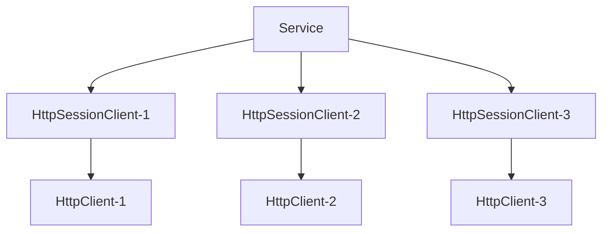

import Tabs from "@theme/Tabs";
import TabItem from "@theme/TabItem";

### 定义

命名空间：TouchSocket.Http <br/>
程序集：[TouchSocket.Http.dll](https://www.nuget.org/packages/TouchSocket.Http)


## 一、说明

**HttpService**是能够提供Http相关服务的基础类型。

## 二、产品特点

- 支持HTTPS。
- **多种数据接收模式**
- **多地址监听**（可以一次性监听多个IP及端口）

## 三、产品应用场景

- HTTP基础使用场景：可跨平台、跨语言使用。


## 四、服务器架构

服务器在收到新客户端连接时，会创建一个HttpSessionClient的派生类实例，与远程HttpClient对应，后续的数据通信均由此实例负责。




## 五、支持插件接口

声明自定义实例类，然后实现**IHttpPlugin**接口，即可实现下列事务的触发。或者继承自**HttpPluginBase**类，重写相应方法即可。

|  插件方法| 功能 |
| --- | --- |
| IHttpPlugin | 当收到所有Http请求时。|


## 六、创建HttpService

`HttpService`的创建，基本和`TcpService`一致，也可以通过继承实现，下列仅演示最简单实现。

`HttpService`的相关事务，会通过**插件**触发。

```csharp showLineNumbers
var service = new HttpService();
await service.SetupAsync(new TouchSocketConfig()//加载配置
     .SetListenIPHosts(7789)
     .ConfigureContainer(a =>
     {
         a.AddConsoleLogger();
     })
     .ConfigurePlugins(a =>
     {
         //此处添加插件逻辑，插件可以使用PluginBase类实现IHttpPlugin接口完成。
         //这里使用委托直接完成
         a.Add(typeof(IHttpPlugin), async (HttpContextEventArgs e) =>
         {
             var request = e.Context.Request;//http请求体
             var response = e.Context.Response;//http响应体

             //判断url
             if (request.UrlEquals("/say"))
             {
                 await response
                 .SetStatus(200, "success")
                 .SetContent("hello")
                 .AnswerAsync();
                 return;
             }

             //如果上述url没有处理，则转到下一插件处理
             await e.InvokeNext();
         });

         //default插件应该最后添加，其作用是
         //1、为找不到的路由返回404
         //2、处理header为Option的探视跨域请求。
         a.UseDefaultHttpServicePlugin();
     }));

await service.StartAsync();
```

:::tip 提示

`DefaultHttpServicePlugin`插件最好添加在插件中，如果没有添加的话，最好自己做好缺省路由配置。

:::  

## 七、获取请求

每个`HttpClient`连接建立时，系统除了会创建一个`HttpSessionClient`与之对应之外，还会创建一个`HttpContext`实例与之对应。
所以，对于一个连接而言，后续的所有`Http`交互，都会反复投递同一个`HttpContext`实例。

所以我们可以通过其`Request`与`Response`属性获取到本次Http的请求和即将响应的响应体。

```csharp showLineNumbers
var request = e.Context.Request;//http请求体
var response = e.Context.Response;//http响应体
```

### 7.1 获取Query参数

```csharp showLineNumbers
string value = e.Context.Request.Query["key"];
```

### 7.2 获取Header参数

```csharp showLineNumbers
string value = e.Context.Request.Headers["key"];
```

亦或者

```csharp showLineNumbers
string value = e.Context.Request.Headers[HttpHeaders.Cookie];
```

### 7.3 获取Form参数

```csharp showLineNumbers
string value = e.Context.Request.Forms["key"];
```

### 7.4 获取字符串Body内容

```csharp showLineNumbers
string bodyString = await e.Context.Request.GetBodyAsync();
```

### 7.5 获取小体量字节Body内容

```csharp showLineNumbers
ReadOnlyMemory<byte> content = await e.Context.Request.GetContentAsync();
```

### 7.6 持续读取Body内容

当数据太大时，可持续读取

```csharp showLineNumbers
while (true)
{
    var buffer = new byte[1024 * 64];

    using (var blockResult = await e.Context.Request.ReadAsync())
    {
        if (blockResult.IsCompleted)
        {
            break;
        }

        //这里可以一直处理读到的数据。
        blockResult.Memory.CopyTo(buffer);
    }
}
```

### 7.7 获取Body持续写入Stream中

当数据太大时，可持续读取数据直接到流容器中。

```csharp showLineNumbers
using (var stream = new MemoryStream())
{
    //
    await e.Context.Request.ReadCopyToAsync(stream);
}
```

### 7.8 获取Body小文件

当Body内容为小文件集合时，可以使用该功能。一般的强烈建议使用此处的**异步迭代器**，一般net5以上的都支持。

<Tabs
    defaultValue="tab1"
    values=
    {[
        { label: "同步迭代器",value: "tab1"},
        { label: "异步迭代器", value: "tab2" }
    ]}
>
<TabItem value="tab1">
```csharp showLineNumbers
//此操作会先接收全部数据，然后再分割数据。
//所以上传文件不宜过大，不然会内存溢出。
var multifileCollection = e.Context.Request.GetMultifileCollection();

foreach (var item in multifileCollection)
{
    var stringBuilder = new StringBuilder();
    stringBuilder.Append($"文件名={item.FileName}\t");
    stringBuilder.Append($"数据长度={item.Length}");
    client.Logger.Info(stringBuilder.ToString());
}
```
</TabItem>
<TabItem value="tab2">
```csharp showLineNumbers
//此操作会先接收全部数据，然后再分割数据。
//所以上传文件不宜过大，不然会内存溢出。
var multifileCollection = e.Context.Request.GetMultifileCollection();

//一般强烈建议使用此处的异步迭代器，一般net5以上的都支持
await foreach (var item in multifileCollection)
{
    var stringBuilder = new StringBuilder();
    stringBuilder.Append($"文件名={item.FileName}\t");
    stringBuilder.Append($"数据长度={item.Length}");
    client.Logger.Info(stringBuilder.ToString());
}
```
</TabItem>
</Tabs>

## 八、响应请求

### 8.1 响应Get请求

```csharp showLineNumbers
public class MyHttpPlug1 : PluginBase, IHttpPlugin
{
    public async Task OnHttpRequest(IHttpSessionClient client, HttpContextEventArgs e)
    {
        var request = e.Context.Request;//http请求体
        var response = e.Context.Response;//http响应体

        if (request.IsGet()&&request.UrlEquals("/success"))
        {
            //直接响应文字
           await response
                .SetStatus(200, "success")
                .FromText("Success")
                .AnswerAsync();//直接回应
            Console.WriteLine("处理/success");
            return;
        }

        //无法处理，调用下一个插件
        await e.InvokeNext();
    }
}
```

### 8.2 响应文件请求

```csharp showLineNumbers
public class MyHttpPlug2 : PluginBase, IHttpPlugin
{
    public async Task OnHttpRequest(IHttpSessionClient client, HttpContextEventArgs e)
    {
        var request = e.Context.Request;//http请求体
        var response = e.Context.Response;//http响应体
        if (request.IsGet() && request.UrlEquals("/file"))
        {
            try
            {
                //直接回应文件。

                var fileInfo = new FileInfo(@"D:\System\Windows.iso");
                var fileName = fileInfo.Name;//可以重新制定文件名称，届时，header中会添加Content-Disposition内容
                var maxSpeed = 1024 * 1024;//最大传输速度
                var bufferLength = 1024 * 64;//一般该值越大，效率越高，但同时内存占用也更大
                var autoGzip = true;//自动判断是否应用gzip压缩。

                await response
                    .SetStatus()//必须要有状态
                    .FromFileAsync(fileInfo, e.Context.Request, fileName, maxSpeed, bufferLength, autoGzip);

                //或者直接使用HttpContext
                //await e.Context.FromFileAsync(fileInfo, fileName, maxSpeed, bufferLength, autoGzip);
            }
            catch (Exception ex)
            {
                await response.SetStatus(403, "error")
                      .FromText(ex.Message)
                      .AnswerAsync();
            }

            return;
        }
        await e.InvokeNext();
    }
}
```

:::caution 注意

当响应的文件，希望浏览器直接显示时（例如：html，js，css），不应该指定文件名，不然浏览器会调用下载保存操作，而非直接显示。

:::  

:::tip 提示

在响应文件时，传入请求的`request`，主要是当请求包含断点续传时，能成功续传。所以，应当应可能的满足该功能。

:::  

:::tip 提示

该操作支持大型文件，也支持断点续传、支持迅雷加速等。

:::  


### 8.3 响应页面请求

```csharp showLineNumbers
public class MyHttpPlug3 : PluginBase, IHttpPlugin
{
    public async Task OnHttpRequest(IHttpSessionClient client, HttpContextEventArgs e)
    {
        var request = e.Context.Request;//http请求体
        var response = e.Context.Response;//http响应体
        if (request.IsGet() && request.UrlEquals("/html"))
        {
            //构建html
            var sb = new StringBuilder();
            sb.Append("<!DOCTYPE html>");
            sb.Append("<html lang=\"zh\">");
            sb.Append("<head>");
            sb.Append("    <meta charset=\"UTF-8\">");
            sb.Append("    <title>TouchSocket绚丽展示</title>");
            sb.Append("    <style>");
            sb.Append("        body {");
            sb.Append("            font-family: Arial, sans-serif;");
            sb.Append("            background-color: #f0f0f0;");
            sb.Append("            display: flex;");
            sb.Append("            justify-content: center;");
            sb.Append("            align-items: center;");
            sb.Append("            height: 100vh;");
            sb.Append("            margin: 0;");
            sb.Append("            padding: 0;");
            sb.Append("            color: transparent;");
            sb.Append("        }");
            sb.Append("        h1 {");
            sb.Append("            font-size: 48px;");
            sb.Append("            letter-spacing: 2px;");
            sb.Append("            background-image: linear-gradient(to right, #ff8a00, #ffcd38);");
            sb.Append("            -webkit-background-clip: text;");
            sb.Append("            background-clip: text;");
            sb.Append("            font-weight: bold;");
            sb.Append("        }");
            sb.Append("    </style>");
            sb.Append("</head>");
            sb.Append("<body>");
            sb.Append("    <h1>TouchSocket</h1>");
            sb.Append("</body>");
            sb.Append("</html>");

            //回应html
            await response
                 .SetStatus()//必须要有状态
                 .SetContentTypeByExtension(".html")
                 .SetContent(sb.ToString())
                 .AnswerAsync();
            return;
        }

        await e.InvokeNext();
    }
}
```


## 九、创建加密Ssl的HttpsService

Https服务器，和http服务器几乎一样，只不过增加了一个Ssl的配置。

```csharp showLineNumbers
.SetServiceSslOption(new ServiceSslOption() 
{ 
    Certificate = new X509Certificate2("Socket.pfx", "Socket"), 
    SslProtocols = SslProtocols.Tls12 
})
```


[本文示例Demo](https://gitee.com/RRQM_Home/TouchSocket/tree/master/examples/Http)