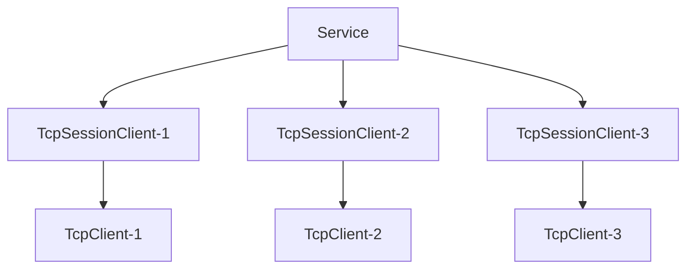

import Tag from "@site/src/components/Tag.js";

### 定义

命名空间：TouchSocket.Sockets <br/>
程序集：[TouchSocket.dll](https://www.nuget.org/packages/TouchSocket)

## 一、说明

TcpService是Tcp系服务器基类，它不参与实际的数据交互，只是配置、激活、管理、注销、重建**SessionClient**类实例。而**SessionClient**是当**TcpClient（客户端）**成功连接服务器以后，由服务器新建的一个实例类，后续的所有通信，也都是通过该实例完成的。

## 二、特点

- 简单易用。
- IOCP多线程。
- 内存池支持
- 高性能（实测服务器单客户端单线程，每秒可接收200w条8字节的信息，接收数据流量可达3GB/s）。
- **多地址监听**（可以一次性监听多个IP及端口）
- 适配器预处理，一键式解决**分包**、**粘包**、对象解析(如HTTP，Json)等。
- 超简单的同步发送、异步发送、接收等操作。
- 基于委托、[插件](./pluginsmanager.mdx)驱动，让每一步都能执行AOP。

### 2.1 吞吐量性能测试

如下图所示，使用最简单数据接收，不做任何处理。数据吞吐量可达3Gb。 [测试Demo示例](https://gitee.com/RRQM_Home/TouchSocket/tree/master/performancetest/Tcp/TcpFlowStressTestingConsoleApp)


### 2.2 连接性能测试

如下图所示，使用最简单连接测试，不做任何处理。建立1000本地连接仅需0.1秒。 [测试Demo示例](https://gitee.com/RRQM_Home/TouchSocket/tree/master/performancetest/Tcp/TcpConnectStressTestingConsoleApp)


## 三、产品应用场景

- 所有Tcp基础使用场景：可跨平台、跨语言使用。
- 自定义协议解析场景：可解析任意数据格式的TCP数据报文。

## 四、服务器架构

服务器在收到**新客户端连接**时，会创建一个SessionClient的派生类实例，与客户端TcpClient一一对应，后续的数据通信均由此实例负责。

SessionClient在Service里面以字典映射。ID为键，SessionClient本身为值。



## 五、可配置项

<details>
<summary>可配置项</summary>
<div>

#### SetMaxPackageSize
数据包最大值（单位：byte），默认1024×1024×10。该值会在适当时间，直接作用DataHandlingAdapter.MaxPackageSize。 

#### SetGetDefaultNewId
配置初始Id的分配策略。

#### SetListenIPHosts
设置统一的监听IP和端口号组，可以一次性设置多个地址。 

#### SetListenOptions
设置独立的监听IP和端口号，可以独立控制当前地址监听的个性化配置。 

#### SetServerName
服务器标识名称，无实际使用意义。

#### SetBacklogProperty
Tcp半连接挂起连接队列的最大长度。默认为30 

#### SetMaxCount
最大可连接数，默认为10000 

#### SetServiceSslOption
Ssl配置，为Null时则不启用。 

#### UseNoDelay
设置Socket的NoDelay属性，默认false。 

#### UseReuseAddress
启用端口复用。该配置可在服务器、或客户端在监听端口时，运行监听同一个端口。可以一定程度缓解端口来不及释放的问题。

#### SetSendTimeout
设置发送超时时间，默认0ms，即禁用该配置。

</div>
</details>


## 六、支持插件

|  插件方法| 功能 |
| --- | --- |
| ITcpConnectingPlugin | 此时Socket实际上已经完成连接，但是并没有启动接收，然后触发。 |
| ITcpConnectedPlugin | 同意连接，且成功启动接收后触发 |
| ITcpClosingPlugin | 当客户端主动调用Close时触发 |
| ITcpClosedPlugin | 当客户端断开连接后触发 |
| ITcpReceivingPlugin | 在收到原始数据时触发，所有的数据均在ByteBlock里面。 |
| ITcpReceivedPlugin | 在收到适配器数据时触发，根据适配器类型，数据可能在ByteBlock或者IRequestInfo里面。 |
| ITcpSendingPlugin | 当即将发送数据时，调用该方法在适配器之后，接下来即会发送数据。 |
| IIdChangedPlugin | 当SessionClient的Id发生改变时触发。 |

## 七、创建TcpService

### 7.1 简单创建

直接初始化TcpService，会使用默认的**SessionClient**。
简单的处理逻辑可通过**Connecting**、**Connected**、**Received**等委托直接实现。

代码如下：

```csharp showLineNumbers
var service = new TcpService();
service.Connecting = (client, e) => { return EasyTask.CompletedTask; };//有客户端正在连接
service.Connected = (client, e) => { return EasyTask.CompletedTask; };//有客户端成功连接
service.Closing = (client, e) => { return EasyTask.CompletedTask; };//有客户端正在断开连接，只有当主动断开时才有效。
service.Closed = (client, e) => { return EasyTask.CompletedTask; };//有客户端断开连接
service.Received = (client, e) =>
{
    //从客户端收到信息
    var mes = Encoding.UTF8.GetString(e.ByteBlock.Buffer, 0, e.ByteBlock.Len);//注意：数据长度是byteBlock.Len
    client.Logger.Info($"已从{client.Id}接收到信息：{mes}");

    client.Send(mes);//将收到的信息直接返回给发送方

    //client.Send("id",mes);//将收到的信息返回给特定ID的客户端

    //将收到的信息返回给在线的所有客户端。
    //注意：这里只是一个建议思路，实际上群发应该使用生产者消费者模式设计
    //var ids = service.GetIds();
    //foreach (var clientId in ids)
    //{
    //    if (clientId != client.Id)//不给自己发
    //    {
    //        service.Send(clientId, mes);
    //    }
    //}

    return EasyTask.CompletedTask;
};

await service.SetupAsync(new TouchSocketConfig()//载入配置
     .SetListenIPHosts("tcp://127.0.0.1:7789", 7790)//同时监听两个地址
     .ConfigureContainer(a =>//容器的配置顺序应该在最前面
     {
         a.AddConsoleLogger();//添加一个控制台日志注入（注意：在maui中控制台日志不可用）
     })
     .ConfigurePlugins(a =>
     {
         //a.Add();//此处可以添加插件
     }));

await service.StartAsync();//启动
```

:::info 温馨提示

Service.Start()方法并不会阻塞当前运行，所以当在控制台运行时，可能需要使用Console.ReadKey()等操作进行阻塞。

:::  

### 7.2 泛型创建

通过泛型创建服务器，可以实现很多有意思，且能**重写**一些有用的功能。下面就演示，如何通过泛型创建服务器。

代码如下：

（1）建立SessionClient继承类。

```csharp showLineNumbers
public sealed class MySessionClient : TcpSessionClient
{
    protected override async Task OnTcpReceived(ReceivedDataEventArgs e)
    {
        //此处逻辑单线程处理。

        //此处处理数据，功能相当于Received委托。
        var mes = Encoding.UTF8.GetString(e.ByteBlock.Buffer, 0, e.ByteBlock.Len);
        Console.WriteLine($"已接收到信息：{mes}");
        
        await base.OnTcpReceived(e);
    }
}
```

（2）建立TcpService继承类。实际上如果业务不涉及服务器配置的话，可以省略该步骤，使用**TcpService的泛型**直接创建。

```csharp showLineNumbers
public class MyService : TcpService<MySessionClient>
{
    protected override void LoadConfig(TouchSocketConfig config)
    {
        //此处加载配置，用户可以从配置中获取配置项。
        base.LoadConfig(config);
    }

    protected override MySessionClient NewClient()
    {
        return new MySessionClient();
    }

    protected override async Task OnTcpConnecting(MySessionClient socketClient, ConnectingEventArgs e)
    {
        //此处逻辑会多线程处理。

        //e.Id:对新连接的客户端进行ID初始化，默认情况下是按照设定的规则随机分配的。
        //但是按照需求，您可以自定义设置，例如设置为其IP地址。但是需要注意的是id必须在生命周期内唯一。

        //e.IsPermitOperation:指示是否允许该客户端链接。

        await base.OnTcpConnecting(socketClient, e);
    }
}
```

（3）创建服务器（包含MyService）。

```csharp showLineNumbers
MyService service = new MyService();

await service.SetupAsync(new TouchSocketConfig()//载入配置     
     .SetListenIPHosts("tcp://127.0.0.1:7789")
     .ConfigureContainer(a =>//容器的配置顺序应该在最前面
     {
         a.AddConsoleLogger();//添加一个控制台日志注入（注意：在maui中控制台日志不可用）
     })
     .ConfigurePlugins(a =>
     {
         //a.Add();//此处可以添加插件
     }));

await service.StartAsync();//启动
```

:::tip 建议

由上述代码可以看出，通过继承，可以更加灵活的实现扩展。但实际上，很多业务我们希望大家能通过插件完成。

:::  

## 八、配置监听

所有配置监听的项，都是从`IPHost`类创建而来。

`IPHost`支持以下格式创建：

- 端口：直接按`int`入参，该操作一般在监听`Ipv4`时使用。
- IPv4：按"127.0.0.1:7789"入参。
- IPv6：按"[\*::\*]:7789"入参。

### 8.1 Config直接配置

服务器在配置监听时，有多种方式实现。其中最简单、最常见的配置方式就是通过Config直接配置。

```csharp showLineNumbers
TcpService service = new TcpService();

await service.SetupAsync(new TouchSocketConfig()//载入配置
     .SetListenIPHosts("tcp://127.0.0.1:7789", 7790));

await service.StartAsync();//启动
```

### 8.2 直接添加监听配置

直接添加监听配置是更加个性化的监听配置，它可以单独控制指定监听地址的具体配置，例如：是否启用Ssl加密、使用何种适配器等。

```csharp showLineNumbers
var service = new TcpService();

service.Setup(new TouchSocketConfig()//载入配置
    .SetListenOptions(option =>
    {
        option.Add(new TcpListenOption()
        {
            IpHost = "127.0.0.1:7789",
            Name = "server1",//名称用于区分监听
            ServiceSslOption = null,//可以针对当前监听，单独启用ssl加密
            Adapter = () => new NormalDataHandlingAdapter(),//可以单独对当前地址监听，配置适配器
                                                            //还有其他可配置项，都是单独对当前地址有效。
        });

        option.Add(new TcpListenOption()
        {
            IpHost = 7790,
            Name = "server2",//名称用于区分监听
            ServiceSslOption = null,//可以针对当前监听，单独启用ssl加密
            Adapter = () => new FixedHeaderPackageAdapter(),//可以单独对当前地址监听，配置适配器
                                                            //还有其他可配置项，都是单独对当前地址有效。
        });
    }));

service.Start();//启动
```

:::info 温馨提示

`SetListenIPHosts`可以和`SetListenOptions`可以同时使用，但是需要注意的是，Config的全局配置仅会对`SetListenIPHosts`单独生效的。`SetListenOptions`的地址配置均是单独配置的。

:::  


### 8.3 动态添加、移除监听配置

服务器支持在运行时，动态添加，和移除监听配置，这极大的为灵活监听提供了方便，并且还不影响现有连接。可以轻量级的实现Stop操作。

```csharp {5,16}
TcpService service = new TcpService();
await service.SetupAsync(new TouchSocketConfig());
await service.StartAsync();//启动

service.AddListen(new TcpListenOption()//在Service运行时，可以调用，直接添加监听
{
    IpHost = 7791,
    Name = "server3",//名称用于区分监听
    ServiceSslOption = null,//可以针对当前监听，单独启用ssl加密
    Adapter = () => new FixedHeaderPackageAdapter(),//可以单独对当前地址监听，配置适配器
                                                    //还有其他可配置项，都是单独对当前地址有效。
});

foreach (var item in service.Monitors)
{
    service.RemoveListen(item);//在Service运行时，可以调用，直接移除现有监听
}
```

## 九、接收数据

在TcpService中，接收数据的方式有很多种。多种方式可以组合使用。

### 9.1 Received委托处理

当使用TcpService（非泛型）创建服务器时，内部已经定义好了一个外置委托Received，可以通过该委托直接接收数据。

```csharp showLineNumbers
var service = new TcpService();
service.Received = (client, e) =>
{
    //从客户端收到信息
    var mes = Encoding.UTF8.GetString(e.ByteBlock.Buffer, 0, e.ByteBlock.Len);
    client.Logger.Info($"已从{client.Id}接收到信息：{mes}");
    return EasyTask.CompletedTask;
};

await service.SetupAsync(new TouchSocketConfig()//载入配置     
     .SetListenIPHosts("tcp://127.0.0.1:7789", 7790)//同时监听两个地址
     .ConfigureContainer(a =>//容器的配置顺序应该在最前面
     {
         a.AddConsoleLogger();//添加一个控制台日志注入（注意：在maui中控制台日志不可用）
     }));
await service.StartAsync();//启动
```

### 9.2 重写TcpSessionClient处理

正如6.2所示，可以直接在MySessionClient的重写**OnTcpReceived**中直接处理数据。

### 9.3 插件处理 <Tag>推荐</Tag>

按照TouchSocket的设计理念，使用插件处理数据，是一项非常简单，且高度解耦的方式。步骤如下：

（1）声明插件

插件可以先继承`PluginBase`，然后再实现需要的功能插件接口，可以按需选择泛型或者非泛型实现。

如果已经有继承类，直接实现`IPlugin`接口即可。

```csharp showLineNumbers
public class MyPlugin : PluginBase, ITcpReceivedPlugin
{
    public Task OnTcpReceived(ITcpSession client, ReceivedDataEventArgs e)
    {
        //这里处理数据接收
        //根据适配器类型，e.ByteBlock与e.RequestInfo会呈现不同的值，具体看文档=》适配器部分。
        ByteBlock byteBlock = e.ByteBlock;
        IRequestInfo requestInfo = e.RequestInfo;

        //e.Handled = true;//表示该数据已经被本插件处理，无需再投递到其他插件。

        return e.InvokeNext();//如果本插件无法处理当前数据，请将数据转至下一个插件。
    }
}
```

（2）创建使用插件处理的服务器

```csharp {10}
var service = new TcpService();
await service.SetupAsync(new TouchSocketConfig()
     .SetListenIPHosts(7789)
     .ConfigureContainer(a =>
     {
         a.AddConsoleLogger();
     })
     .ConfigurePlugins(a =>
     {
         a.Add<MyPlugin>();
     }));
await service.StartAsync();
```

:::danger 注意

当接收数据时，ByteBlock与RequestInfo的值会根据适配器类型不同而不同。并且，当数据存于ByteBlock时，其实际的数据长度是ByteBlock.Length(Len)。而不是ByteBlock.Buffer.Length

:::  


### 9.4 异步阻塞接收 <Tag>推荐</Tag>

异步阻塞接收，即使用`await`的方式接收数据。其特点是能在代码上下文中，直接获取到收到的数据。

只是在服务器使用异步阻塞时，建议直接在`Connected`触发时相关使用。

下列将以插件为例：

```csharp showLineNumbers
class TcpServiceReceiveAsyncPlugin : PluginBase, ITcpConnectedPlugin<ITcpSessionClient>
{
    public async Task OnTcpConnected(ITcpSessionClient client, ConnectedEventArgs e)
    {
        //receiver可以复用，不需要每次接收都新建
        using (var receiver = client.CreateReceiver())
        {
            while (true)
            {
                //receiverResult必须释放
                using (var receiverResult = await receiver.ReadAsync(CancellationToken.None))
                {
                    //收到的数据，此处的数据会根据适配器投递不同的数据。
                    var byteBlock = receiverResult.ByteBlock;
                    var requestInfo=receiverResult.RequestInfo;

                    if (receiverResult.IsCompleted)
                    {
                        //断开连接了
                        Console.WriteLine($"断开信息：{receiverResult.Message}");
                        return;
                    }

                    //如果数据是从ByteBlock投递
                    if (byteBlock!=null)
                    {
                        Console.WriteLine(Encoding.UTF8.GetString(byteBlock.Buffer, 0, byteBlock.Len));
                    }

                    //如果是适配器信息，则可以直接处理requestInfo;
                }
            }
        }
    }
}
```

:::tip 提示

异步阻塞接收，在等待接收数据时，不会阻塞线程资源，所以即使大量使用，也不会影响性能。

:::  

## 十、发送数据

按照架构图，每个客户端成功连接后，**服务器**都会创建一个派生自**SessionClient**的实例，通过**该实例**即可将数据发送至**客户端**。

### 10.1 如何获取TcpSessionClient？

（1）直接获取所有在线客户端

通过`service.Clients`属性，获取当前在线的所有客户端。

```csharp showLineNumbers
foreach (var sessionClient in service.Clients)
{

}
```

:::caution 注意

由于`TcpSessionClient`的生命周期是由框架控制的，所以最好尽量不要直接引用该实例，可以引用`TcpSessionClient.Id`，然后再通过服务器查找。

:::  

（2）通过Id获取

先调用`service.GetIds`方法，获取当前在线的所有客户端的Id，然后选择需要的Id，通过TryGetClient方法，获取到想要的客户端。

```csharp showLineNumbers
var ids = service.GetIds();
if (service.TryGetClient(ids.First(), out var sessionClient))
{
}
```

### 10.2 发送

【同步发送】

SessionClient已经内置了三种同步发送方法，直接调用就可以发送，如果发送失败，则会立即抛出异常。
```csharp showLineNumbers
public virtual void Send(byte[] buffer);
public virtual void Send(ByteBlock byteBlock);
public virtual void Send(byte[] buffer, int offset, int length);
```

【异步发送】

TcpClient已经内置了三种异步发送方法，直接调用就可以发送。如果发送失败，await就会触发异常。

```csharp showLineNumbers
public virtual Task SendAsync(byte[] buffer);
public virtual Task SendAsync(ByteBlock byteBlock);
public virtual Task SendAsync(byte[] buffer, int offset, int length);
```

:::tip 提示

通过上述方法发送的数据，都会经过**适配器**，如果想要直接发送，请使用**DefaultSend**。

:::  

### 10.3 通过TcpService发送

通过Id发送数据。

```csharp showLineNumbers
public virtual void Send(string id, ByteBlock byteBlock);
public virtual void Send(string id, byte[] buffer, int offset, int length);
public virtual void Send(string id, byte[] buffer);
public virtual Task SendAsync(string id, ByteBlock byteBlock);
public virtual Task SendAsync(string id, byte[] buffer, int offset, int length);
public virtual Task SendAsync(string id, byte[] buffer);
```

:::tip 提示

框架不仅内置了`Send`字节的发送，也扩展了字符串等常见数据的发送。而且还包括了`TrySend`等不会抛出异常的发送方法。

:::  

[本文示例Demo](https://gitee.com/RRQM_Home/TouchSocket/tree/master/examples/Tcp)

